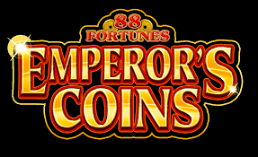
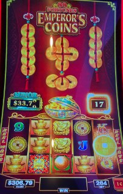
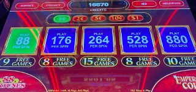

## Thumbnail

## Gameplay Images

### Image 1

### Image 2

**Description:** Free game COUNTER # is 17

### Image 3

**Description:** Free game COUNTER shown for each bet level

## How The Advantage Works

88 Fortunes Emperor's Coins features a **must-hit-by free games counter**:

**Mechanic:**
- Counter starts at <strong>8</strong>
- Counter must trigger by <strong>18</strong>
- Gold coin symbols land on reel 5 → Counter increases
- Counter glows at <strong>15+</strong>

---

## PLAY WHEN

<strong>Primary Requirement:</strong>
- Free games counter: ≥ <strong>15</strong>

**Counter Location:**
- Above 5th reel (right side)
- Also visible on bet panel

**How to Check:**
- Look at bet panel to see counter for each bet level
- Check all denominations

| Counter | State | Action |
|---------|-------|--------|
| 8–13 | ❌ Cold | Walk away |
| 14 | ⚠️ Early | Risky play |
| 15+ | ✅ **Play** | Counter glows |
| 18 | 🎰 Trigger | Must hit |

---

## DO NOT PLAY WHEN

- Counter below <strong>15</strong>
- Counter at 13–14 (some APs play here, but not recommended)
- Free games just triggered (counter resets to 8)

---

## STOP WHEN

- Free games trigger
- Counter resets to <strong>8</strong>

---

## COMMON MISTAKES

- Playing at 13–14 (consensus is wait for 15)
- Not checking all denominations
- Not finding counter on bet panel
- Underestimating volatility (coin collection can be slow)

---

## Additional Notes

**Volatility Warning:**
- Extremely volatile game
- Coin collection can be frustratingly slow
- Can cut into bankroll without landing coins on higher bets

**Expected Value:**
- Bonus pays ~<strong>40x</strong> bet on average
- Bonus can pay well even on lower bets

**Trigger Behavior:**
- Usually triggers at <strong>18</strong>
- Can sometimes activate earlier (random)
- Counter glows at <strong>15+</strong>

**Denominations:**
- Multiple denominations available
- Check each one separately