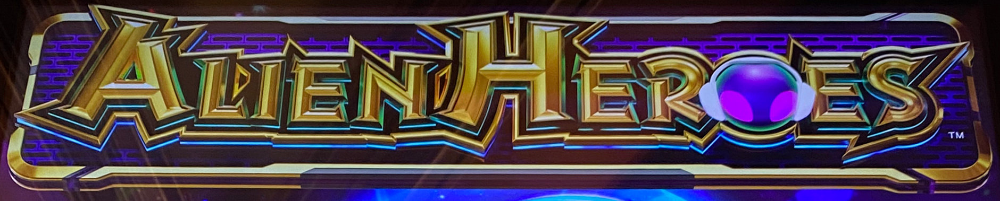
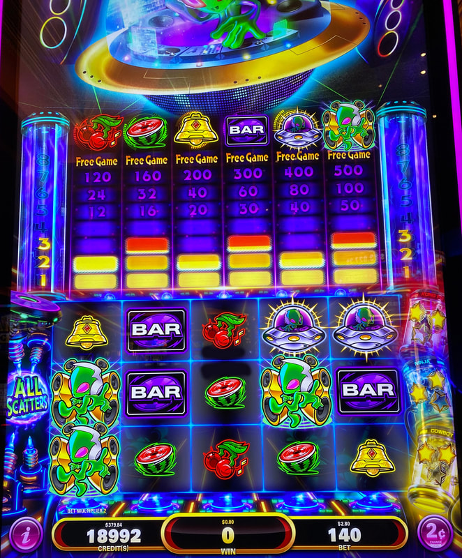
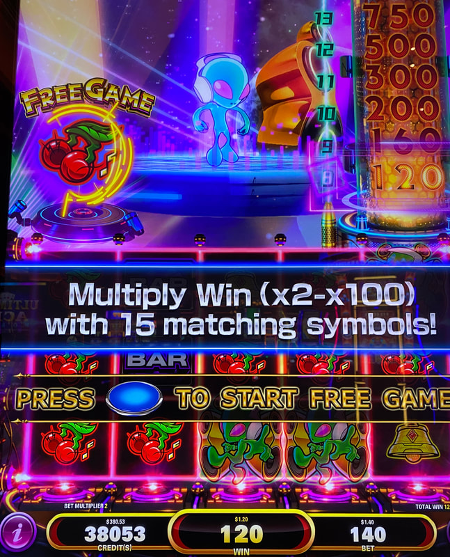

## Thumbnail

## Gameplay Images

### Image 1

### Image 2

### Image 3

**Description:** The Free Games round can swing big — it’s super volatile! Each extra matching symbol boosts your payout per spin. Fill the whole screen, and you’ll get a random multiplier added to your win.

## How The Advantage Works

Alien Heroes features **scatter-based wins** with no paylines:

**Mechanic:**
- Every symbol is a scatter (no paylines)
- <strong>5+</strong> matching symbols anywhere → Win
- <strong>8</strong> matching symbols → Triggers free games
- Stars land randomly and fill containers (right side)
- <strong>3</strong> stars in container → Hero Feature activates next spin

**Three Hero Containers:**
| Hero | Feature Effect |
|------|----------------|
| Kung Fu | Merges 4 positions into 2x2 reels (upper left + bottom right) |
| Ninja | Random symbol appears in 6 positions |
| Cowboy | Locks most common symbol, respins other reels |

---

## ACCUMULATION STATE

| Container Status | State | Action |
|------------------|-------|--------|
| 0–1 stars each | ❌ Cold | Walk away |
| Mixed stars | ❌ Risky | Walk away |
| 2 stars in ALL 3 | ✅ **Play** | Good value |
| Active hero feature | ✅ **Play** | Flames visible on container |

---

## PLAY WHEN (ANY ONE)

**Option A — All Containers Ready:**
- All <strong>3</strong> containers have <strong>2</strong> stars each
- Kung Fu: 2 stars ✓
- Ninja: 2 stars ✓
- Cowboy: 2 stars ✓

**Option B — Active Hero Feature:**
- Alien with **flames** visible on top of any container

---

## DO NOT PLAY WHEN

- Any container has fewer than <strong>2</strong> stars
- No active hero features
- Just triggered a hero feature (re-evaluate)

---

## STOP WHEN

- Any hero feature triggers
- Free games bonus completes
- Re-evaluate star counts

---

## COMMON MISTAKES

- Playing with uneven star counts (need 2 in ALL containers)
- Thinking glowing meters above reels matter (they reset every spin)
- Expecting wins during base game (nearly 0% return in base)
- Not recognizing active hero feature (flames on container)

---

## Additional Notes

**Base Game Reality:**
- Almost impossible to win during base game
- 5–6 matching symbols pay less than bet cost
- 7 matching symbols barely pays anything
- Nearly ALL return comes from free games feature

**Free Games Feature:**
- Hold & spin to collect 15 of same symbol
- Starts with 4 free games (+1 symbols can land)
- Spins do NOT reset when symbols land
- Fill screen (15 symbols) → Multiplier feature (2x–100x)

**Hero Feature Details:**
- 3 stars = Hero Feature triggers **next spin**
- Does NOT guarantee free games, just better chance
- Only 1 star can land per spin

**Glowing Meters:**
- Show symbols from PREVIOUS spin only
- Reset every spin
- NO advantage—ignore them