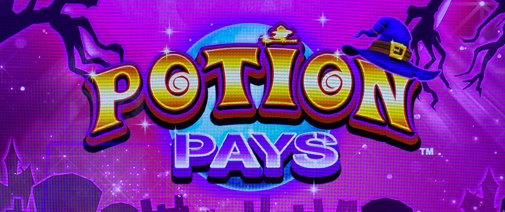
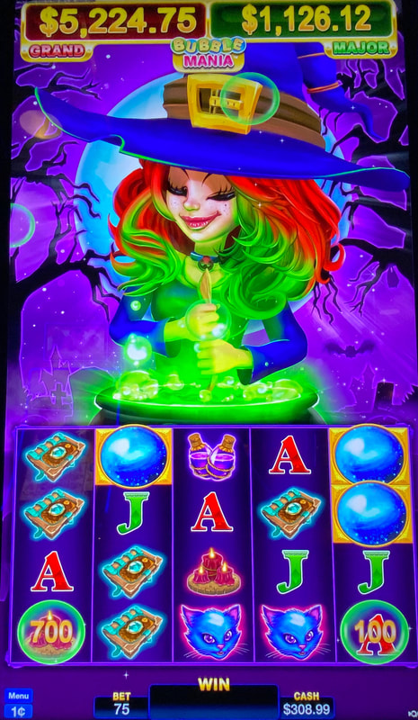
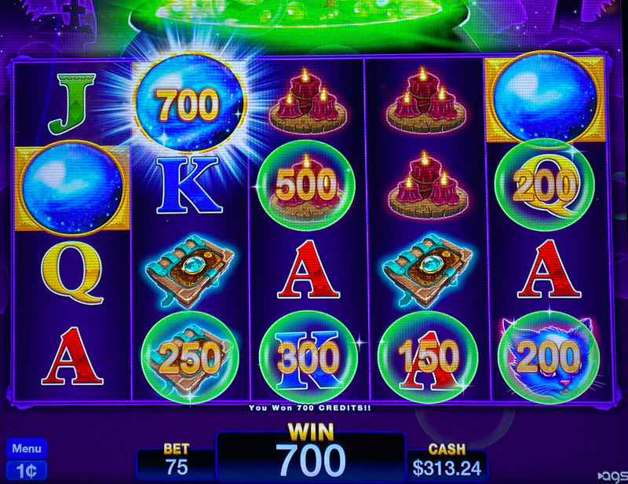
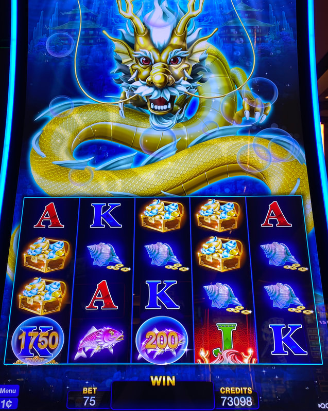
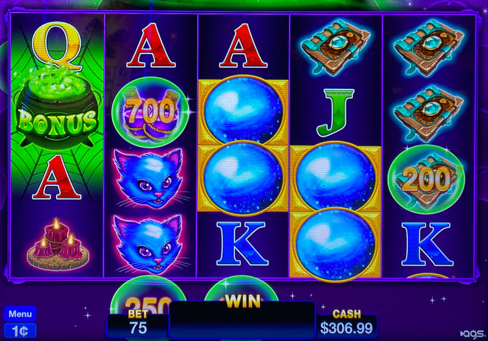
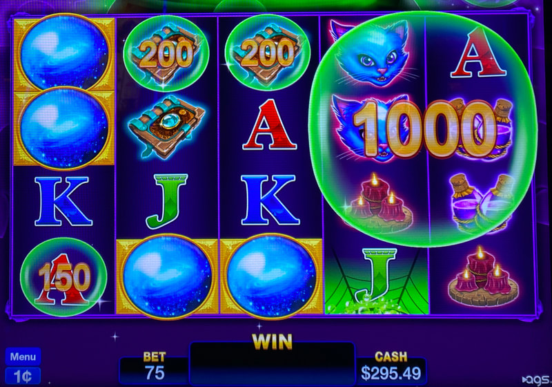
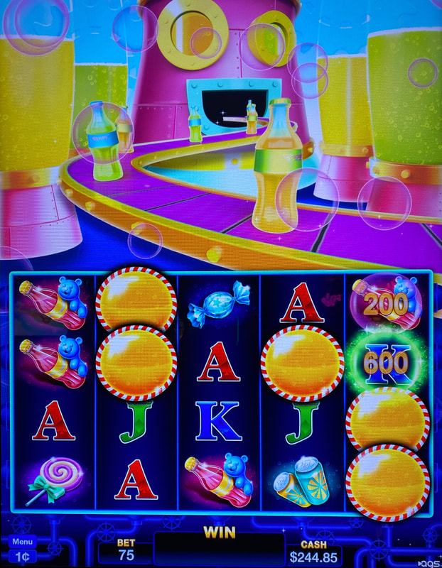

## Thumbnail

## Gameplay Images

### Image 1

### Image 2

**Description:** This is a solid play with the total value of both bubbles at $8, which is 10.6x the value of the bet.

### Image 3

**Description:** Landing a bubble on top of the crystal ball symbol awards the credit value inside the bubble. Bubbles often come in clumps like you see on the bottom row.

### Image 4

**Description:** This is an excellent play on the Hai Long version with the total bubble values worth 26x the bet.

### Image 5

**Description:** Bubbles can appear below the bottom row, moving up the next spin. If the credit value on an upcoming bubble is obscured like this, I recommend just playing anyway to see what it is.

### Image 6

**Description:** Giant bubbles like these are always worth playing, as you have more opportunities to trigger them (and you can trigger them more than once).

### Image 7

**Description:** On Fizzy Frenzy, be on the lookout for green glowing bubbles like the one in the fifth reel—these move around randomly until triggered.

## How The Advantage Works

Bubble Mania (Potion Pays / Hai Long / Fizzy Frenzy) features **persistent bubbles** with credit values:

**Mechanic:**
- Bubbles with credit values appear on reels
- Each spin → Bubbles move **up one row**
- Bubble lands on special symbol → Win credit value
- Bubbles can be triggered **multiple times** (don't disappear)

---

## PLAY WHEN (ANY ONE)

⚠️ **CRITICAL:** Do NOT count bubbles on top row—they leave next spin.

**Option A — Total Value:**
- Total bubble credit value ≥ <strong>5x</strong> bet size
- Example: $3.75 bet → Need $18.75+ in bubble values

**Option B — Giant Bubbles:**
- Any giant bubble (2+ reels wide)
- Play regardless of credit value
- Giant bubbles = 2, 3, or 4 reels wide

**Option C — Hidden Bubbles:**
- Bubbles visible below bottom row
- Credit value obscured → Play anyway to see value

**Bubble Position Check:**
| Row | Counts Toward Total? |
|-----|---------------------|
| Top row | ❌ No (exits next spin) |
| Middle rows | ✅ Yes |
| Bottom row | ✅ Yes |
| Below bottom | ✅ Yes (check for incoming) |

---

## DO NOT PLAY WHEN

- Total bubble value below <strong>5x</strong> bet (no giant bubbles)
- Only bubbles on top row
- No bubbles visible

---

## STOP WHEN

- All bubbles move off top of screen
- No valuable bubbles remaining below bottom row

---

## COMMON MISTAKES

- Counting top row bubbles (they're gone next spin)
- Not checking below bottom row for incoming bubbles
- Missing giant bubbles (always play regardless of value)
- Not using free check method (tap bet level)

---

## Additional Notes

**Game Variants:**
- Potion Pays (sassy witch) ✅
- Hai Long (underwater dragon) ✅
- Fizzy Frenzy (soda/candy factory) ✅

**Fizzy Frenzy Special:**
- Green glowing bubbles move randomly until triggered

**Giant Bubble Behavior:**
- Can appear in base game (unlike Cash Burst)
- 2, 3, or 4 reels wide
- More opportunities to trigger
- Can be triggered multiple times

**Bubble Patterns:**
- Tend to appear in big spurts
- Game goes cold between spurts
- Can appear below bottom row

**Free Check Method:**
- Tap bet level on touchscreen
- No money or bet required

**RTP:** 85.2% – 95.62%

**Investment:**
- Limited investment per play
- Mostly small losses with occasional big wins