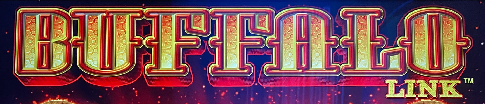
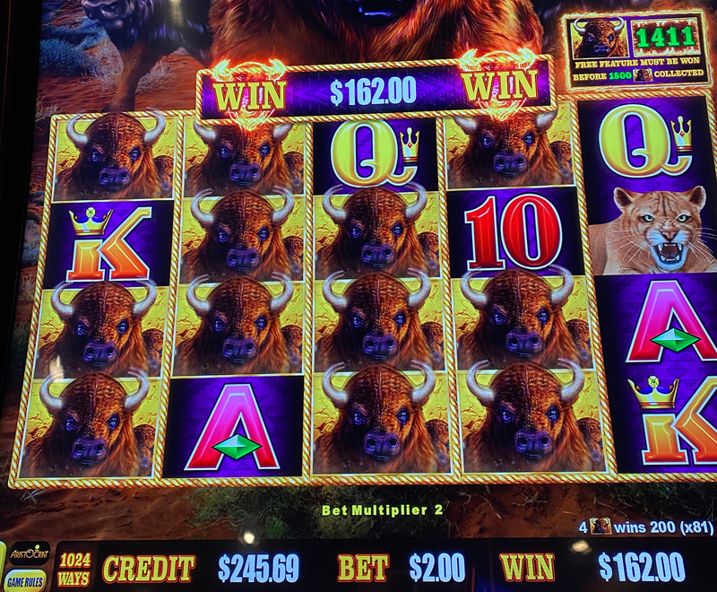

## Thumbnail

## Gameplay Images

### Image 1

### Image 2

**Description:** The free feature triggers at a random point between 100 and 1800, so it is rare to find the counter this high.

### Image 3

**Description:** Line hits can occasionally pay out handsomely, even on lower bets.

## How The Advantage Works

Buffalo Link features a must-hit-by counter that:
- Starts at <strong>100</strong>
- Must trigger before reaching <strong>1800</strong>
- Accumulates approximately <strong>1.7</strong> buffalo heads per spin

The feature triggers randomly between 100–1800, awarding either:
- **Hold & Spin feature** (more consistent payouts)
- **8 Free Games feature** (high variance, potential for retriggers)

---

## PLAY WHEN

<strong>Counter Requirements:</strong>
- Counter ≥ <strong>1610</strong>
- Counter displayed in **green text** above the 5th reel

<strong>Location:</strong>
- Check the counter above the **fifth reel**
- Use $1 bill trick to check all bet levels without spinning

⚠️ **IMPORTANT:** This threshold is conservative. Some APs play at 1350+, but data supports 1610+ for consistent profitability.

---

## DO NOT PLAY WHEN

- Counter below <strong>1610</strong>
- You are chasing losses from a previous session
- Counter is between 1000–1600 (common trap for inexperienced players)
- You cannot afford the variance (this game is extremely volatile)

---

## STOP WHEN

- Hold & Spin feature triggers (counter resets to 100)
- Free Games feature triggers (counter resets to 100)
- Bankroll loss exceeds your predetermined limit

---

## COMMON MISTAKES

- Playing at counters below 1610 expecting profitability
- Chasing the Grand jackpot (requires filling all 20 positions—extremely rare)
- Getting excited at 19/20 buffalos (common tease pattern)
- Basing play decisions on Major jackpot size (jackpot hits too rarely to matter)
- Continuing after feature triggers (counter resets)

---

## Additional Notes

**Checking Multiple Bet Levels (Free):**
1. Insert a $1 bill or ticket under $1
2. Screen defaults to lowest bet for that denomination
3. Touch the 200 credits button to see that bet level's counter
4. Hit "Return to Game" when prompted for insufficient funds
5. Repeat for all bet levels

**If you hear a clinking sound:** Previous player did a "lucky chance spin" and lost. Pay for one spin at the lowest bet, then continue checking.

**Feature Details:**
- Hold & Spin: Need 20 buffalos to win Grand jackpot
- Free Games: Can retrigger to 100+ spins; may trigger Hold & Spin multiple times during free games

**Game RTP:** 92.54% – 95%

**Availability:** Extremely common—most casinos have multiple machines.

⚠️ **Volatility Warning:** This game has a notorious reputation. Large losses are common even on high-counter plays. Only play with adequate bankroll.