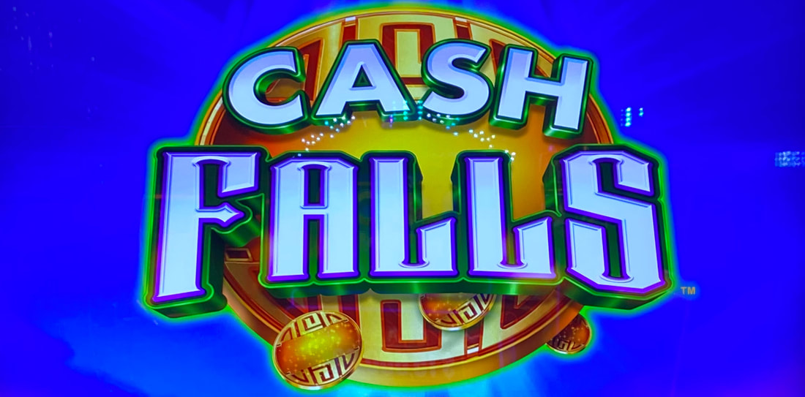
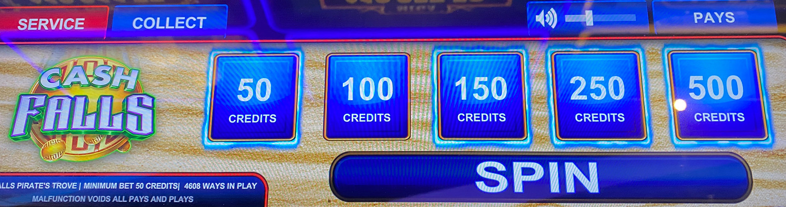
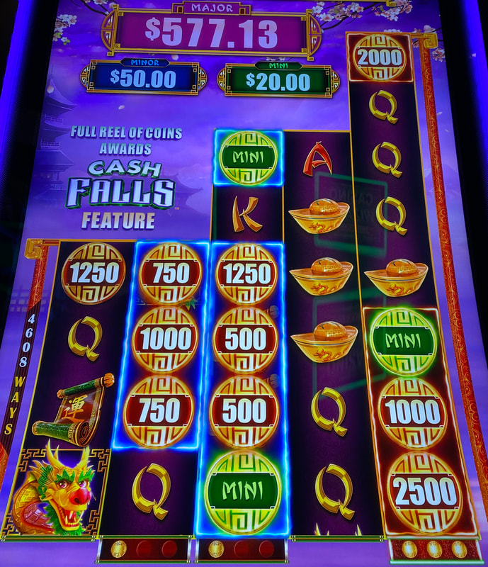
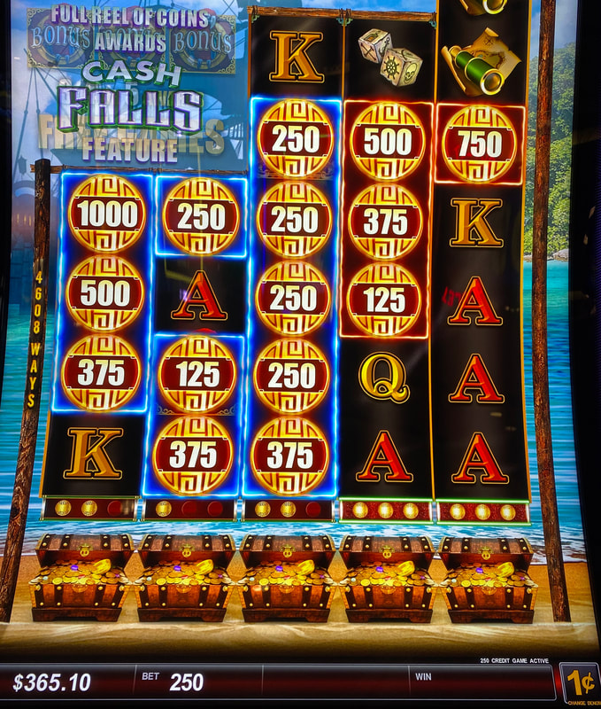
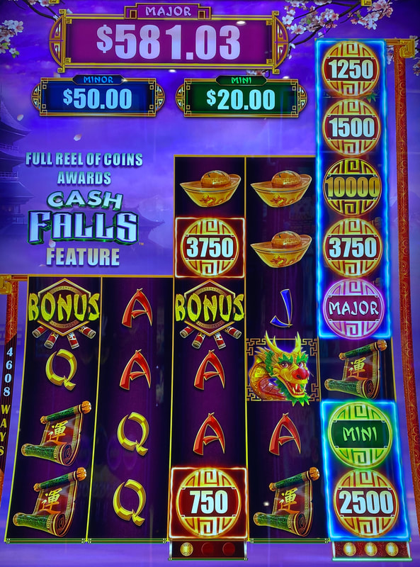
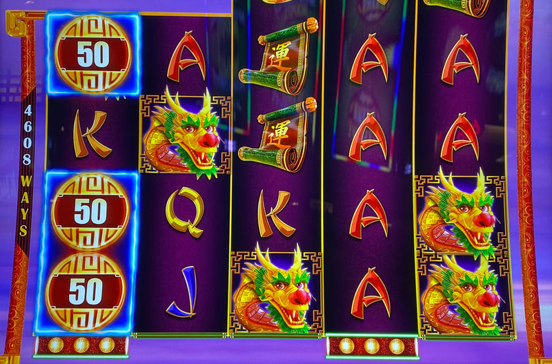
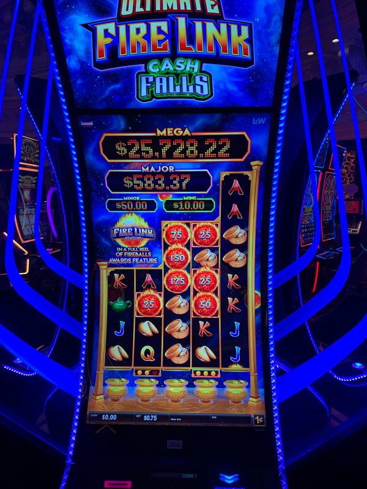

## Thumbnail

## Gameplay Images

### Image 1

### Image 2

**Description:** *The bet pad will have glowing blue outlines around the bet levels that contain reels that are one coin away.

### Image 3

**Description:** This is a solid play with two reels that are one coin away.

### Image 4

**Description:** Having three reels that are one coin away is always a play.

### Image 5

**Description:** I had three chances to land one more coin to fill reel five, where I would have won $791. Unfortunately, it didn’t work out (which is often the case with this game).

### Image 6

**Description:** First and second reels that are one coin away like this are rarely worth playing.

### Image 7

**Description:** That’s a newer version that is a little different. The fire link balls are valued at roughly 35x, so you can be a bit more aggressive chasing those.

## How The Advantage Works

Cash Falls features **coin collection** on each reel:

**Mechanic:**
- Coins with credit prizes land in reels
- Coin landing → Spin counter appears (starts at <strong>3</strong>)
- New coin in same reel → Counter resets to <strong>3</strong>
- Fill entire reel before counter hits 0 → **Win all coin values**

---

## ACCUMULATION STATE

| Reel Status | State | Action |
|-------------|-------|--------|
| Reel 3, 4, or 5 is 1 away | ✅ Play | Trigger likely |
| Reels 1 AND 2 both 1 away | ✅ Play | Trigger likely |
| Only reel 1 or 2 is 1 away | ❌ Skip | Not enough value |
| Any reel 2+ coins away | ❌ Skip | Too risky |

---

## PLAY WHEN (ANY ONE)

**Option A — Simple (Recommended):**
- Reel <strong>3</strong>, <strong>4</strong>, or <strong>5</strong> is <strong>1</strong> coin away from full

**Option B — Combined Reels 1+2:**
- Reel <strong>1</strong> is <strong>1</strong> coin away **AND**
- Reel <strong>2</strong> is <strong>1</strong> coin away

**Option C — Advanced (Value-Based):**
- Add up all coin values in reels that are <strong>1</strong> coin away
- Total ≥ <strong>6x</strong> bet size → Play

**Option D — Aggressive (2 Coins Away):**
- Total coin value ≥ <strong>25x</strong> bet size → Play
- Only for reels <strong>2</strong> coins away

**How to Check Quickly:**
- Look at bet pad for **glowing blue outlines**
- Blue outline = that bet level has a reel 1 coin away

---

## DO NOT PLAY WHEN

- Only reel <strong>1</strong> or reel <strong>2</strong> alone is 1 away
- Reels need <strong>3+</strong> coins to fill (even with big values)
- Total coin value below <strong>6x</strong> bet
- Spin counter already at <strong>1</strong> (limited chances)

---

## STOP WHEN

- Reel fills and awards prizes
- Spin counter reaches <strong>0</strong>
- All playable reels expire

---

## COMMON MISTAKES

- Playing single reel 1 or 2 that's one away (not enough value)
- Chasing reels needing 3+ coins (rarely works out)
- Not checking the bet pad for blue outlines
- Missing that you triggered a different reel accidentally
- Not checking all denominations

---

## Additional Notes

**Game Characteristics:**
- Low hit rate on filling reels
- Coins block line hits (main payout comes from fills)
- Losses are capped (you know spins remaining)
- Very popular game—widely available

**Quick Check Method:**
- Bet pad shows glowing blue outline on bet levels with 1-away reels
- Check all denominations for plays

**Realistic Expectations:**
- Most plays won't trigger the coins
- Occasional big wins cover losses over time
- Can accidentally trigger different reel than intended