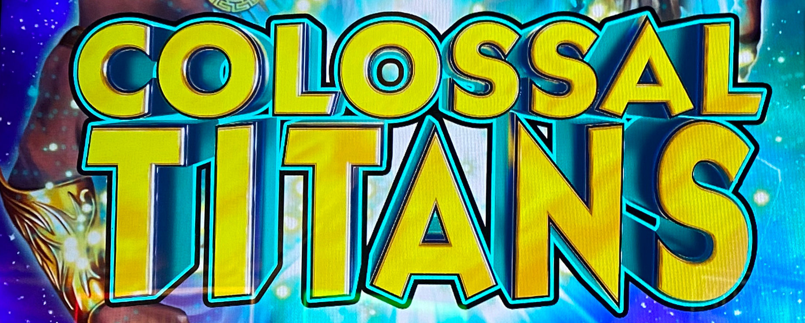
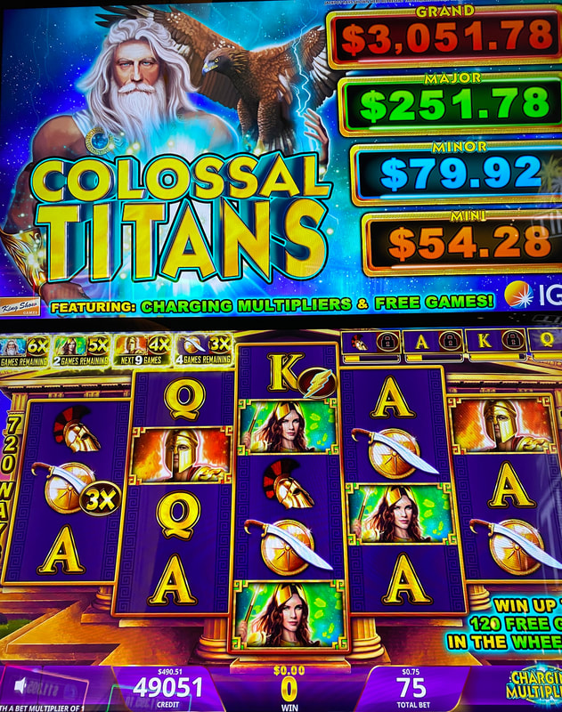
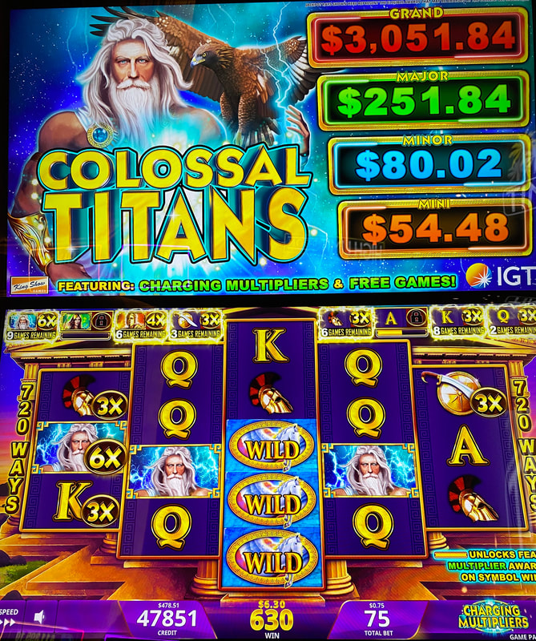
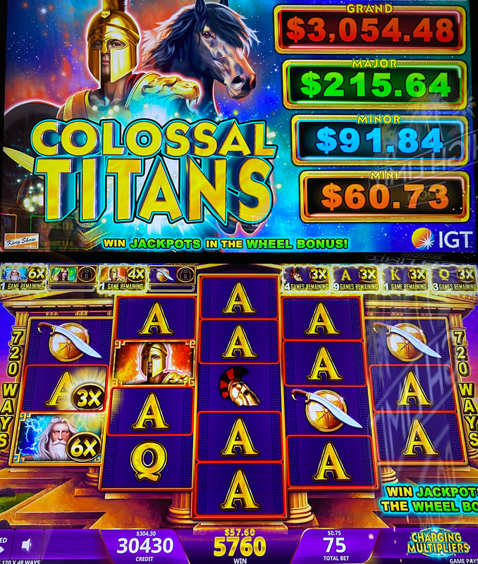

## Thumbnail

## Gameplay Images

### Image 1

### Image 2

**Description:** The lightning bolt sub-symbol landed in reel three and randomly charged some of the meters above. This is an excellent play with the multipliers totaling 18x.

### Image 3

**Description:** The Zeus symbol had a 6x multiplier applied to it.

### Image 4

**Description:** Like most IGT games, the free spins bonus is difficult to trigger but usually pays well.

## How The Advantage Works

Colossal Titans features **eight meters** above the reels for each symbol:

**Mechanic:**
- Lightning bolt lands on reel 3 → Randomly fills meter(s)
- Meter fills completely → Activates multiplier for <strong>9</strong> spins
- Multiplier applies to all line hits with that symbol
- Winning line hit → Resets spins remaining to <strong>9</strong>

**Multiplier Values (Left to Right):**
| Position | Multiplier |
|----------|------------|
| 1st symbol | 6x |
| 2nd symbol | 5x |
| 3rd symbol | 4x |
| 4th–8th symbols | 3x each |

---

## PLAY WHEN

<strong>Primary Requirement:</strong>
- Active multipliers total ≥ <strong>12x</strong>
- Only count multipliers with <strong>1+</strong> spins remaining

**Aggressive Play:**
- Total slightly below 12x BUT
- Meters ~<strong>75%</strong> full (will activate soon)

| Active Multiplier Total | Action |
|------------------------|--------|
| Below 12x (no near-full meters) | ❌ Walk away |
| Below 12x (75%+ meters filling) | ⚠️ Playable |
| 12x+ | ✅ **Play** |

---

## DO NOT PLAY WHEN

- Active multipliers below <strong>12x</strong> total
- No meters close to filling
- Perpetually chasing small multipliers (trap)

---

## STOP WHEN

- All active multipliers deplete (no spins remaining)
- Total active drops below <strong>12x</strong>

---

## COMMON MISTAKES

- Playing any active multiplier (need <strong>12x+</strong> total)
- Getting tricked into perpetually chasing small multipliers
- Not counting only multipliers with spins remaining
- Forgetting to check meter fill levels

---

## Additional Notes

**Lightning Bolt Behavior:**
- Lands frequently (multipliers activate quickly)
- Is a sub-symbol (doesn't block line hits)
- Can fill multiple meters at once

**Win Behavior:**
- Winning line hit with multiplier → Resets to 9 spins
- Multiple multipliers can stack on line hits

**Game Similarity:**
- Very similar to Lucky Buddha / Lucky Wealth Cat
- Most plays = small losses
- Occasional big multiplied line hit covers losses

**Progressive Jackpots:**
- Can be won during wheel bonus
- Not must-hit-by