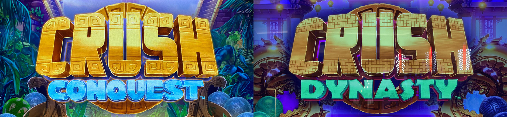
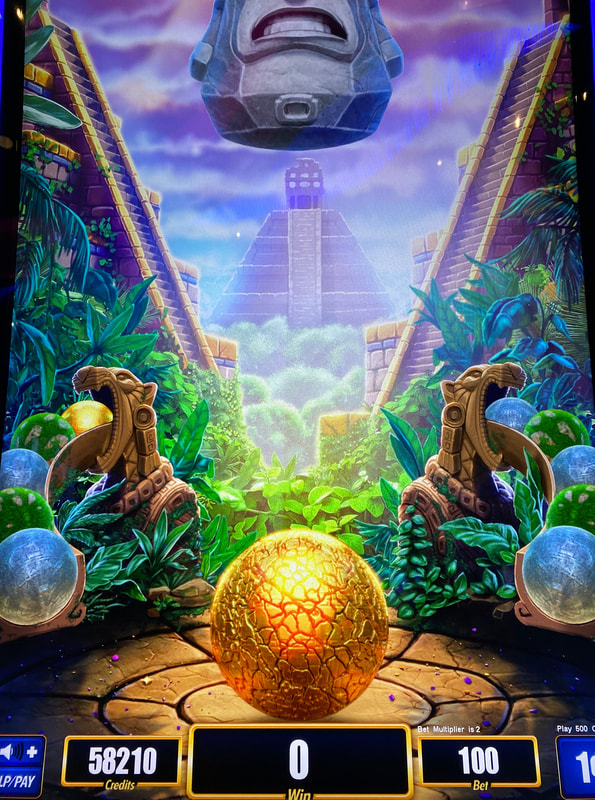
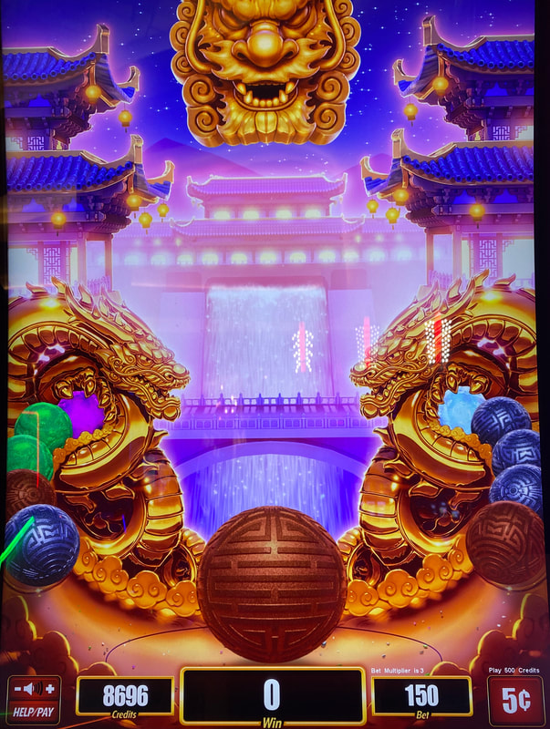

## Thumbnail

## Gameplay Images

### Image 1

### Image 2

**Description:** Boulders with a lot of cracks like this are not any more likely to break on the next spin.

### Image 3

**Description:** The pink boulder is the premium boulder in Crush Conquest. This is a solid play because it is within the first three positions of the queue.

### Image 4

**Description:** The white boulder (shown in the back of the queue on the right) is the premium boulder in Crush Dynasty. This one was a little too far back to chase after.

## How The Advantage Works

Crush Conquest / Crush Dynasty features **boulder crushing** (no reels):

**Mechanic:**
- Each spin = 1 hit to current boulder
- Boulder breaks after random number of hits → Reveals credit prize
- New boulder rolls in from queue (left or right, 50/50)
- Queue visible on both sides (5 boulders each)

**Premium Boulders (Worth Playing):**
| Game | Premium Boulder |
|------|-----------------|
| Crush Conquest | **Pink** |
| Crush Dynasty | **White** |

---

## PLAY WHEN

**Crush Conquest:**
- **Pink** boulder in front OR within first <strong>3</strong> positions of queue (left or right)

**Crush Dynasty:**
- **White** boulder in front OR within first <strong>3</strong> positions of queue (left or right)

| Position | Action |
|----------|--------|
| In front (being crushed) | ✅ **Play** |
| Position 1-3 in queue | ✅ **Play** |
| Position 4-5 in queue | ❌ Too far back |
| No premium visible | ❌ Walk away |

---

## DO NOT PLAY WHEN

- No premium boulder (pink/white) in front or first 3 queue positions
- Only common boulders visible
- Premium boulder is position 4+ in queue

---

## STOP WHEN

- Premium boulder breaks and reveals prize

---

## COMMON MISTAKES

- Thinking cracks = closer to breaking (NOT TRUE)
- Playing non-premium boulders (prizes too small)
- Chasing premium boulders too far back in queue
- Not understanding 50/50 left/right boulder selection

---

## Additional Notes

**Boulder Rankings (Common → Rare):**

*Crush Conquest:*
| Boulder | Rarity | Prize Potential |
|---------|--------|-----------------|
| Green (mossy) | Most common | Smallest |
| Silver | Common | Small |
| Gold | Uncommon | Medium |
| **Pink** | Rare | **Largest** |

*Crush Dynasty:*
| Boulder | Rarity | Prize Potential |
|---------|--------|-----------------|
| Brown | Most common | Smallest |
| Bluish grey | Common | Small |
| Green | Uncommon | Small |
| Purple | Rare | Medium |
| **White** | Rarest | **Largest** |

**Cracks Are Misleading:**
- Boulders develop cracks when hit
- Many cracks does NOT mean closer to breaking
- Breaking is completely random

**Bankroll Note:**
- ~<strong>300</strong> units should be plenty to trigger
- Less if boulder closer to front
- Game plays VERY fast (as fast as you can press spin)

**RTP Range:**
- 89% to 97% (compensates for fast gameplay)

**Special Features:**
- Rampage feature: Breaks up to <strong>26</strong> boulders in one hit each
- Progressive jackpots available after boulders break