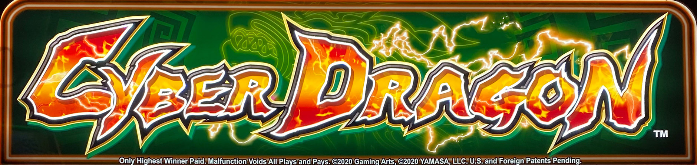
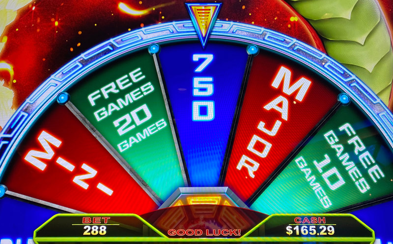
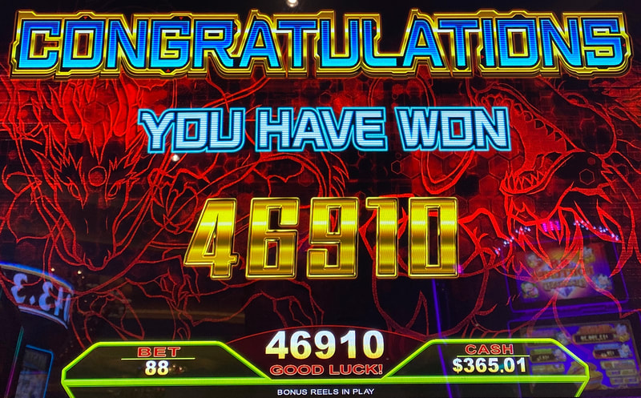

## Thumbnail

## Gameplay Images

### Image 1

### Image 2

**Description:** Seven of the eight segments are filled, which is a great situation. I would still play when it's 6 of 8, but be mindful that the game is extremely high volatility.

### Image 3

**Description:** Not all Wheel features will pay well. This game can have high volatility.

### Image 4

## How The Advantage Works

Cyber Dragon features a **yin-yang meter** with 8 segments above the reels:

**Mechanic:**
- Land 2 yin-yang symbols in correct positions → Fills 1 segment
- <strong>8</strong> segments filled → Bonus wheel spin
- Flames appear after <strong>5</strong> segments filled

---

## CYCLE STATE

| Segments Filled | State | Action |
|-----------------|-------|--------|
| 0–5 | ❌ Cold | Walk away |
| 6 | ⚠️ Risky | Playable but high variance |
| 7 | ✅ **Play** | Good value |
| 8 | 🎡 Bonus | Wheel spin triggers |

---

## PLAY WHEN

<strong>Primary Requirement:</strong>
- Segments filled: <strong>7</strong> of 8

**Aggressive Play (Higher Variance):**
- Segments filled: <strong>6</strong> of 8
- Only if comfortable with high volatility

**How to Check (Free):**
- Tap menu icon (lower left)
- Use up/down arrows to cycle bet levels
- No ticket required

---

## DO NOT PLAY WHEN

- Fewer than <strong>6</strong> segments filled
- Flames showing but only 5 segments (flames ≠ playable)
- You cannot handle high variance losses
- Just triggered bonus wheel (segments reset)

---

## STOP WHEN

- Bonus wheel spins
- Segments reset to <strong>0</strong>

---

## COMMON MISTAKES

- Playing at 5 segments (too early, even with flames)
- Thinking flames mean it's playable (flames at 5, +EV at 7)
- Not checking rules screen for yin-yang landing positions
- Not using free check method (menu → arrows)

---

## Additional Notes

**Volatility Warning:**
- Extremely high variance
- Bonus wheel usually disappoints
- Occasional crazy big wins

**Segment Fill Mechanic:**
- Requires 2 yin-yang symbols per segment
- Symbols must land in specific positions
- Check rules screen to see required positions

**Free Check Method:**
1. Tap menu icon (lower left corner)
2. Use up/down arrows to cycle bet levels
3. View segment count without inserting ticket

**Common AP Opinions:**
- Some APs play at 5–6 segments (too aggressive)
- Recommended: Wait for <strong>7</strong> segments