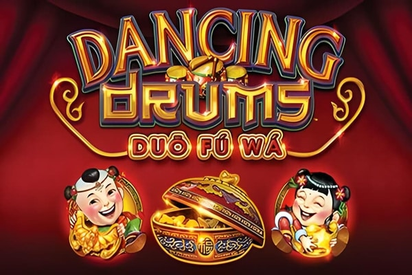

## Thumbnail

## Gameplay Images

### Image 1

## How The Advantage Works

Dancing Drums features **persistent fu bat symbols** displayed above the reels:

**Mechanic:**
- Fu bat lands on reel → Activates position above that reel
- Activations **persist across spins**
- Collect enough fu bats → Trigger bonus feature
- After feature → Fu bats **reset**

---

## CURRENT STATE

Check the fu bat display above the reels:

| Fu Bats Active | State | Action |
|----------------|-------|--------|
| 0–1 | ❄️ Cold | Walk away |
| 2 | 🟡 Warm | Play only if favorable positions |
| 3+ | 🔥 Hot | **Play** |

---

## PLAY WHEN

<strong>Primary Requirement:</strong>
- Fu bats active: ≥ <strong>3</strong> symbols lit above reels

<strong>Optimal Conditions:</strong>
- Fu bats distributed across **different reels** (increases coverage)
- More fu bats = better odds of quick trigger

<strong>Aggressive Play (Higher Variance):</strong>
- <strong>2</strong> fu bats in favorable positions
- Only if comfortable with extended play

⚠️ **IMPORTANT:** Fu bat activations are typically independent of bet size. Verify on specific version.

---

## DO NOT PLAY WHEN

- Fewer than <strong>2</strong> fu bats active
- Fu bats clustered on same reel (poor coverage)
- Feature just triggered (fu bats reset)
- You are chasing progressive jackpots (not must-hit-by)

---

## STOP WHEN

- Bonus feature triggers and completes
- Fu bats reset after feature
- Bankroll loss exceeds predetermined limit
- 50+ spins without additional fu bat activations

---

## COMMON MISTAKES

- Chasing progressive jackpots (Grand/Major/Minor/Mini are NOT must-hit-by)
- Playing immediately after feature triggers (fu bats reset)
- Not checking fu bat positions before sitting down
- Expecting fu bats to appear during bonus feature (they only appear in base game)
- Playing low fu bat counts hoping to "build up"

---

## Additional Notes

**Game Variants:**
- Dancing Drums Explosion (different mechanics)
- Other variants may have different rules—check help screens

**Volatility:**
- Base game has infrequent line hits
- Main value comes from bonus feature triggers
- Expect variance even with advantage

**Availability:**
- Extremely popular game
- Often find machines with multiple fu bats active
- Excellent game to check during casino rounds

**Fu Bat Behavior:**
- Only appear during base game
- Do NOT appear during bonus feature