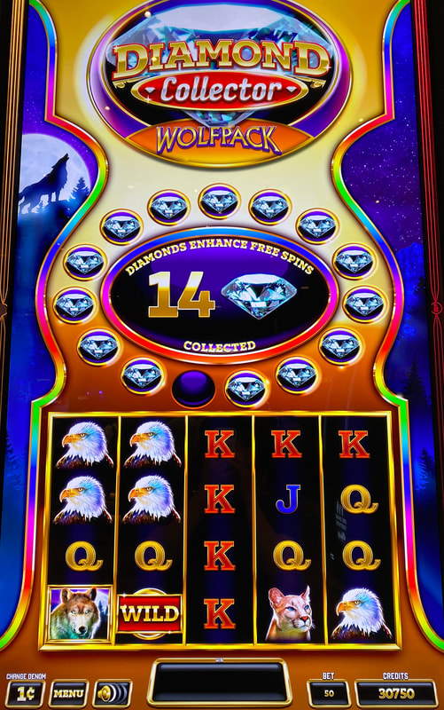
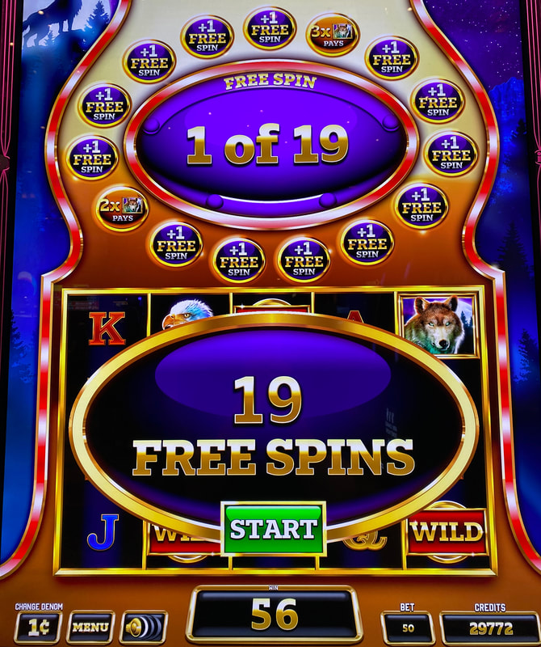

## Thumbnail

## Gameplay Images

### Image 1

### Image 2

**Description:** This is an excellent play with only one diamond needed to trigger the bonus.

### Image 3

**Description:** Once the free spins bonus is triggered, all of the collected diamonds reveal modifiers that enhance the bonus.

## How The Advantage Works

Diamond Collector (Wolfpack / Elite 7's) features **diamond collection** that triggers a free spins bonus:

**Mechanic:**
- Collect diamonds in spaces above reels
- <strong>15</strong> diamonds collected → Triggers free spins bonus
- Each diamond reveals a modifier during bonus
- Max <strong>5</strong> diamonds can land per spin

**Bonus Trigger Methods:**
1. Collect <strong>15</strong> diamonds
2. Land <strong>2</strong> scatter symbols on reels 2 and 4

---

## ACCUMULATION STATE

| Diamonds | State | Action |
|----------|-------|--------|
| 0–9 | ❌ Cold | Walk away |
| 10–11 | ⚠️ Risky | Only if high RTP known |
| 12+ | ✅ **Play** | Good value |
| 14 | 🔥 Excellent | 1 away from trigger |

---

## PLAY WHEN

<strong>Primary Requirement:</strong>
- Diamonds collected: ≥ <strong>12</strong>

**How to Check:**
- Look **directly on bet pad**
- Shows diamond count for each bet level

⚠️ **IMPORTANT:** Check all denominations—different bet levels have different counts.

---

## DO NOT PLAY WHEN

- Diamonds below <strong>12</strong>
- Unknown RTP setting and fewer than 12 diamonds
- Bonus just triggered (diamonds reset to 0)

---

## STOP WHEN

- Free spins bonus triggers
- Diamonds reset to <strong>0</strong>

---

## COMMON MISTAKES

- Playing at 10-11 diamonds without knowing RTP (too risky)
- Not checking the bet pad for diamond count
- Not checking all denominations
- Not understanding diamond collection slows down as spaces fill

---

## Additional Notes

**Game Variants:**
- Wolfpack ✅ (same strategy)
- Elite 7's ✅ (same strategy)

**Diamond Collection Difficulty:**
- Diamonds land in spaces **above** reels
- As spaces fill → Harder to land more diamonds
- Collection rate slows as you approach 15

**Bonus Modifiers:**
- Each diamond reveals a modifier
- Most common: +1 Free Spin (max <strong>13</strong> can appear)
- Beyond 13 diamonds: Other modifiers (multipliers, boosters)
- More diamonds = Better bonus payout

**RTP Warning:**
- RTP ranges from 85.28% to 94.26%
- Lower RTP = Play tighter (stick to 12+)
- Some APs play at 10-11 on higher RTP machines

**Quick Check:**
- Bet pad shows diamond count per bet level
- Check all bet levels before walking away