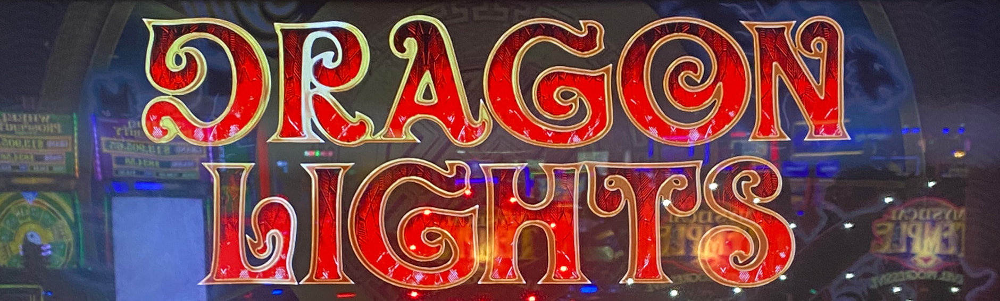
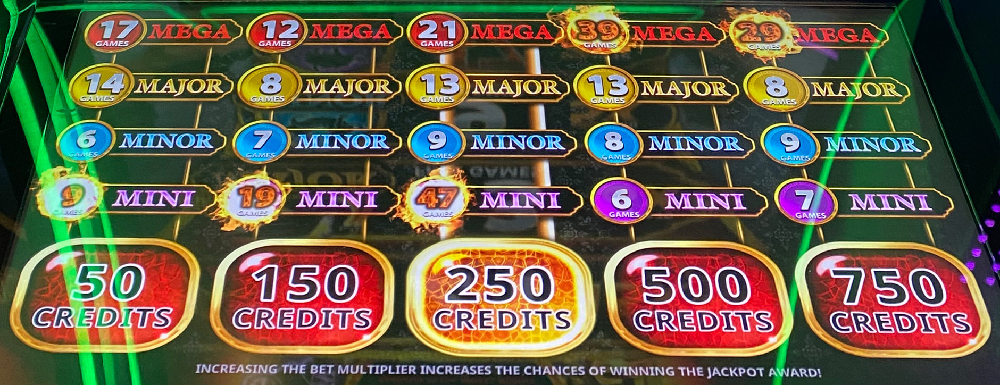
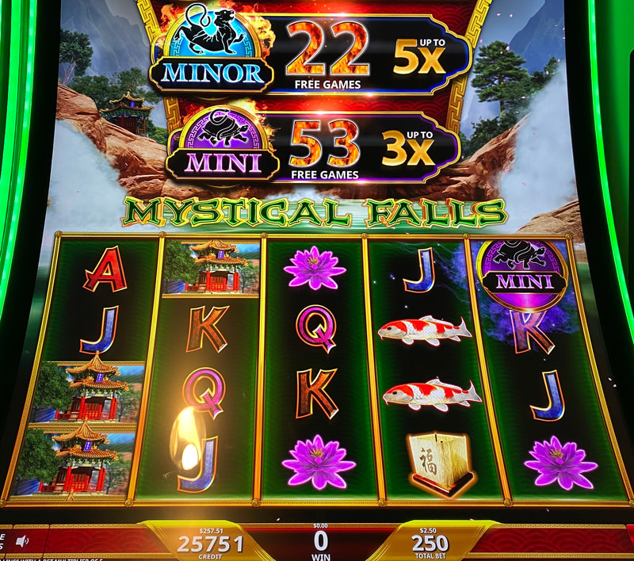
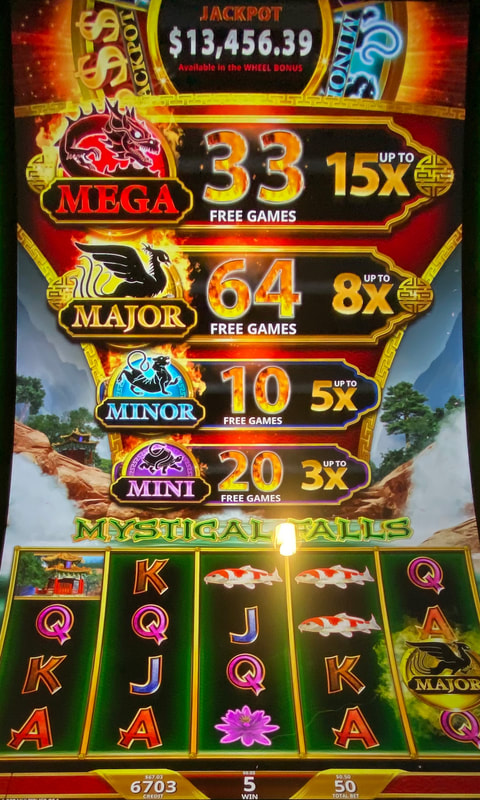
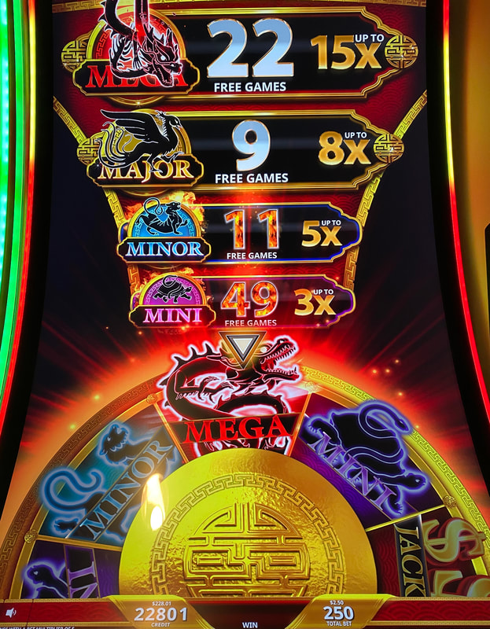
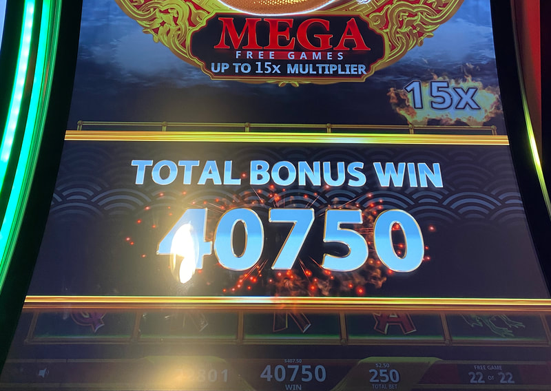

## Thumbnail

## Gameplay Images

### Image 1

### Image 2

**Description:** **You can look directly on the bet pad to see the meters on all bet levels.

### Image 3

**Description:** The average hit point of the mini is 8 free games, so it’s rare (but not unheard of) to run this high.

### Image 4

**Description:** The major at 64 free games is a solid (but still super volatile) play.

### Image 5

**Description:** Hitting the mega while chasing the mini.

### Image 6

**Description:** Even with only 22 free games, the mega paid out nicely for a $2.50 bet.

## How The Advantage Works

Dragon Lights (Fortune Skies / Mystical Falls / Secret Fortress) features **four progressive free games meters**:

**Mechanic:**
- Progressive symbols land in reel 5 → Free games meter increases
- ⚠️ **NOT must-hit-by** — Triggers randomly
- All meters capped at <strong>200</strong> games (but won't auto-trigger at cap)

**Meter Multipliers:**
| Progressive | Color | Max Multiplier |
|-------------|-------|----------------|
| Mini | 🟣 Purple | 3x |
| Minor | 🔵 Blue | 5x |
| Major | 🟡 Yellow | 8x |
| Mega | 🔴 Red | 15x |

---

## ⚠️ HIGH RISK WARNING

**This is an uncapped progressive — extremely dangerous.**
- NOT must-hit-by (can go far beyond playable numbers)
- Experienced APs with large bankrolls only
- Set strict loss limits before playing
- Flames on numbers do NOT mean +EV (flames appear at average hit point)

---

## PLAY WHEN

| Progressive | Color | Free Games | Action |
|-------------|-------|------------|--------|
| Mini | 🟣 Purple | ≥ <strong>25</strong> | ✅ Play |
| Minor | 🔵 Blue | ≥ <strong>37</strong> | ✅ Play |
| Major | 🟡 Yellow | ≥ <strong>56</strong> | ✅ Play (volatile) |
| Mega | 🔴 Red | ≥ <strong>86</strong> | ⚠️ Never chase directly |

**How to Check:**
- Look **directly on bet pad**
- Shows meters for all bet levels

---

## DO NOT PLAY WHEN

- Progressive below threshold numbers
- You have limited bankroll (new APs should avoid)
- You cannot handle potential $1,000+ loss
- Directly chasing the mega (too volatile)
- Flames are showing but numbers below thresholds

---

## STOP WHEN

- Free games progressive triggers
- Loss limit reached (set BEFORE playing)
- ⚠️ **IMPORTANT:** Walking away at loss limit is correct—chasing deeper is how APs get destroyed

---

## COMMON MISTAKES

- Playing when flames appear (flames ≠ +EV, just average hit point)
- Directly chasing the mega (never do this)
- Not setting loss limits before playing
- Thinking more money in = closer to hitting (false)
- Playing with insufficient bankroll
- Continuing past loss limit because "it's an even better play now"

---

## Additional Notes

**Mega Strategy:**
- Never chase mega directly
- Watch for high megas, then chase smaller progressives at playable numbers
- You might hit mega while chasing mini/minor/major

**Flames Warning:**
- Flames appear at **average hit point** (NOT when +EV)
- "Play when all flames showing" is terrible advice

**Game Variants:**
- Fortune Skies ✅
- Mystical Falls ✅
- Secret Fortress ✅
- All three use same strategy

**Progressive Jackpot:**
- Separate from free games meters
- Resets at $10,000
- Odds: 1 in 2,880,000

**RTP:** 85.9% – 95%

**Real-World Caution:**
- Players have lost $2,000+ chasing mini alone
- Players have played 12+ hours and lost thousands
- Bankroll management is critical
- If you hit loss limit, walk away—this is correct play