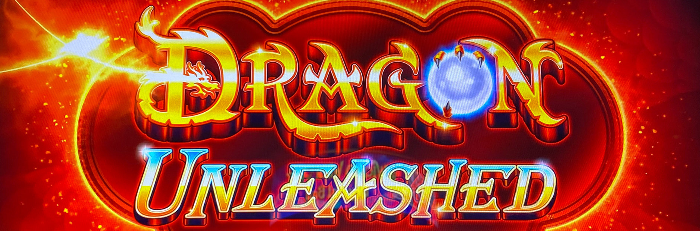
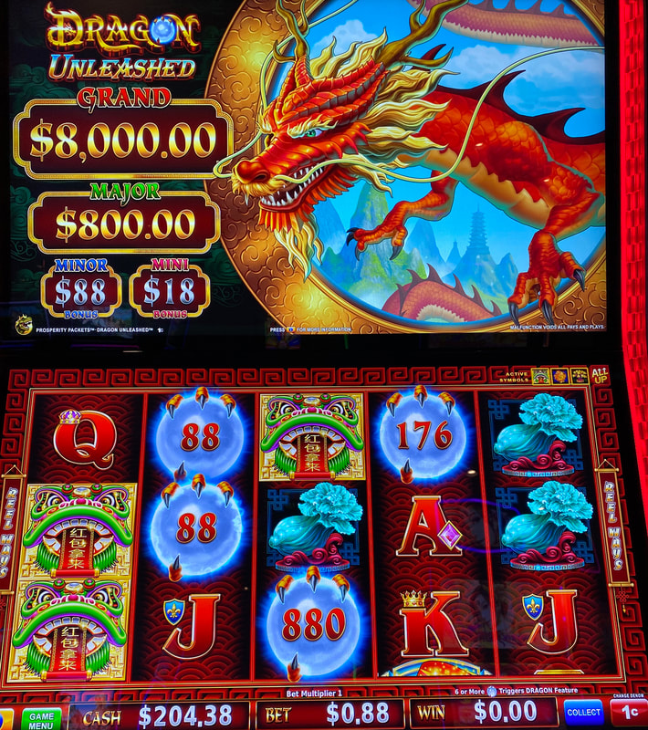
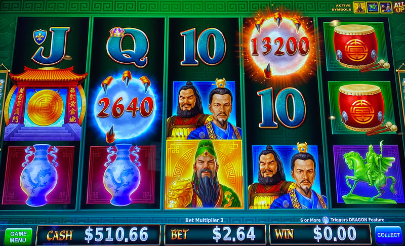
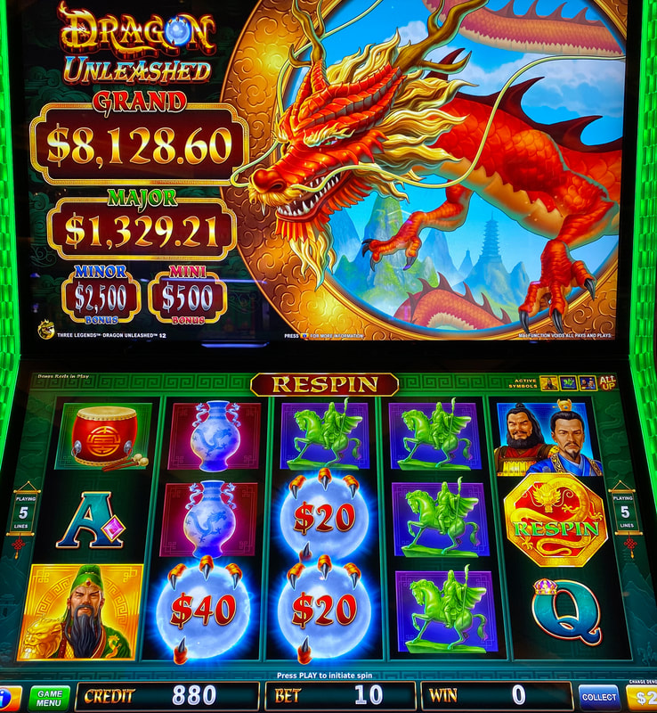
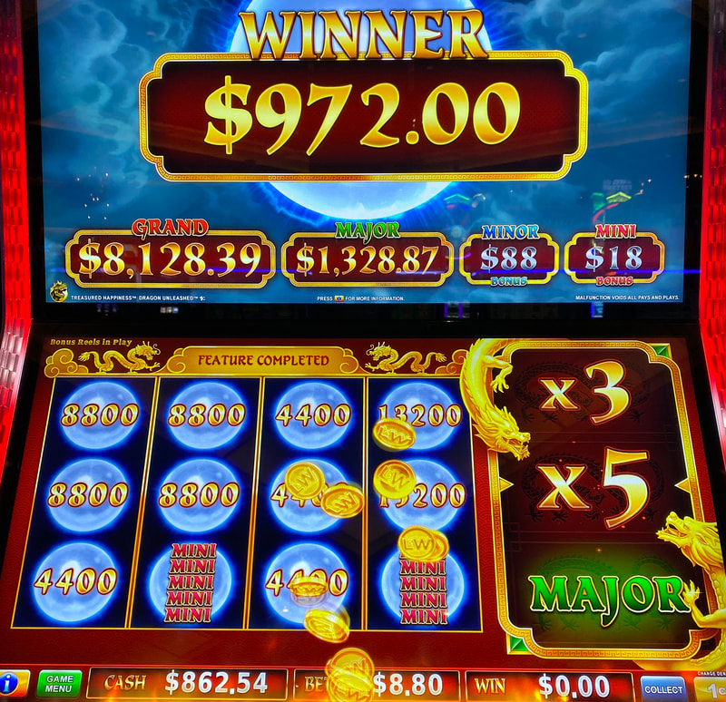
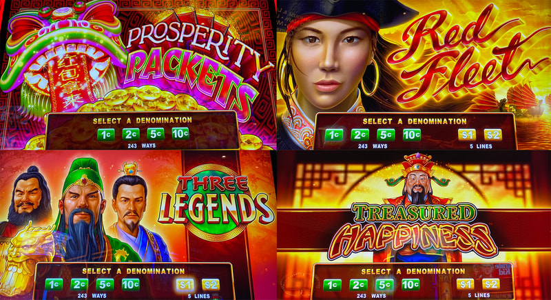

## Thumbnail

## Gameplay Images

### Image 1

### Image 2

### Image 3

**Description:** Orbs with large credit prizes, like the one in reel four, are less likely to come in large stacks.

### Image 4

**Description:** If a respin symbol lands in reel five, the reels with the orbs will lock in place and the other reels will spin again, giving you an additional chance to land the six orbs needed for the feature.

### Image 5

**Description:** During the hold & spin feature, filling all 12 positions will award a spin of the Dragon Unleashed reel, which can lead to big wins like this.

### Image 6

**Description:** Dragon Unleashed comes in a variety of themes, but they all play the same for advantage purposes.

## How The Advantage Works

Dragon Unleashed features **persistent orbs** that shift down each spin:

**Mechanic:**
- Orbs with credit prizes land on reels 1–4
- Each spin → Orbs shift **down one row**
- Land <strong>6</strong> orbs → Triggers hold & spin feature
- Orbs often land as connected stacks (up to 4 tall)

**Orb Values:**
- Credit prizes: 1x to 100x bet
- Mini, Minor, Major jackpots

---

## PLAY WHEN (ANY ONE)

**Option A — Basic (Recommended):**
- <strong>2+</strong> orbs in top row (reels 1–4)

**Option B — Mixed Position:**
- <strong>1</strong> orb in top row **AND**
- <strong>2+</strong> orbs in middle row

**Option C — Aggressive (Higher RTP):**
- Any orb in top row
- ❌ **EXCEPT:** 4-stack where bottom orb just exited (no more orbs coming from above)

**Orb Position Check:**
| Row | Orb Count | Action |
|-----|-----------|--------|
| Top | 2+ | ✅ **Play** |
| Top + Middle | 1 + 2+ | ✅ **Play** |
| Middle only | Any | ❌ Walk away |
| Bottom only | Any | ❌ Walk away |

⚠️ **NOTE:** Orbs only appear on reels <strong>1–4</strong> (not reel 5).

---

## DO NOT PLAY WHEN

- No orbs in top row
- Only orbs in middle/bottom rows
- 4-stack with bottom orb just shifted off screen
- Just triggered feature (orbs reset)

---

## STOP WHEN

- Hold & spin triggers (<strong>6</strong> orbs landed)
- All orbs shift off bottom of reels

---

## COMMON MISTAKES

- Counting orbs in reel 5 (orbs only appear reels 1–4)
- Playing when orbs only in middle/bottom rows
- Not recognizing 4-stack exhaustion pattern
- Not checking all denominations

---

## Additional Notes

**Volatility:**
- Low volatility game with big upside
- Small investment (few spins to see if feature triggers)
- Minimal losses per play

**Respin Mechanic:**
- Respin symbol lands in reel 5 → Reels with orbs lock
- Other reels spin again (free spin)
- Can't cash out during respin
- Can't find respins left behind

**Orb Stack Behavior:**
- Smaller credit prize orbs → Taller stacks (more lucrative for triggering)
- Large credit prize orbs → Usually single or short stacks

**Hold & Spin Feature:**
- Fill all <strong>12</strong> positions → Dragon Unleashed reel spin
- Dragon reel contains: Mini/Minor/Major/Grand jackpots, 20x–500x credits, or 2x–5x multiplier

**Denominations:**
- Multiple denominations available
- Check all bet levels for plays