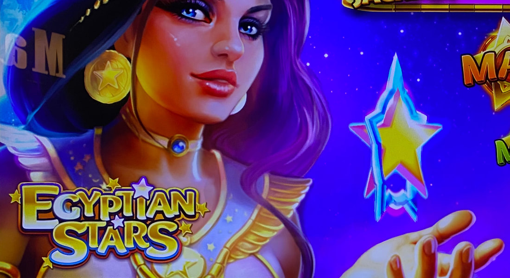
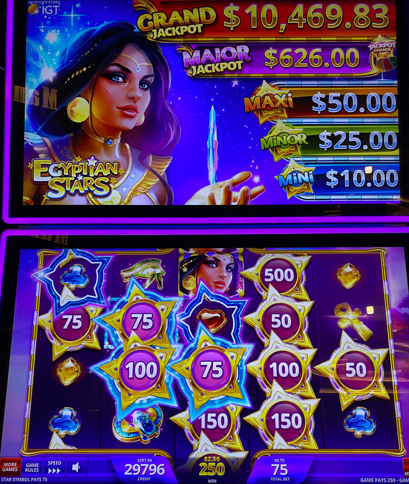
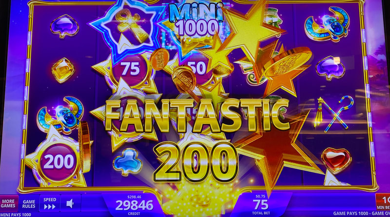

## Thumbnail

## Gameplay Images

### Image 1

### Image 2

**Description:** The blue star-shaped frames move up one position every spin. The frame in the upper left will move off screen next spin, so only play if there are frames below the top row.

### Image 3

**Description:** Landing a blue star-shaped frame on top of a jackpot symbol will award that prize. The $10 mini is a solid win on a $0.75 bet.

## How The Advantage Works

Egyptian Stars features **blue star frames that move UP**:

**Mechanic:**
- Blue star-shaped frames move UP one position every spin
- Frame lands on credit value → Player wins that prize
- Frame lands on jackpot symbol → Wins jackpot

**Frame Awards:**
| Lands On | Award |
|----------|-------|
| Credit value | That credit amount |
| Mini/Minor/Maxi | Jackpot prize |
| Jackpot Chance | Wheel spin (Major/Grand possible) |

---

## PLAY WHEN

<strong>Primary Requirement:</strong>
- <strong>2+</strong> blue star frames anywhere on reels
- NOT in top row (those leave next spin)

| Frame Position | Action |
|----------------|--------|
| Top row | ❌ Skip (leaves next spin) |
| Rows 2-4 (any reel) | ✅ **Play** |

**Note:** Reel position (1-5) doesn't matter here—frames award prizes, not wilds.

---

## DO NOT PLAY WHEN

- Fewer than <strong>2</strong> blue star frames
- All frames in top row only

---

## STOP WHEN

- All star frames move off the top row
- Watch for frame bursts from woman's hand star

---

## COMMON MISTAKES

- Only counting visible frames (check for bursts)
- Avoiding reels 4-5 like Ocean Magic (not needed here—all reels work)
- Playing single frames (need 2+)

---

## Additional Notes

**Different from Ocean Magic / DragonSphere:**
- Reels 4-5 are fine to play
- Frames award credit prizes, not wilds
- Reel position doesn't affect value

**Star Burst Feature:**
- Woman's hand star occasionally shoots frames
- Up to <strong>15</strong> frames at once
- Watch for these bursts