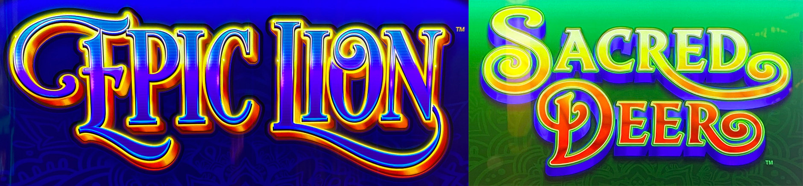
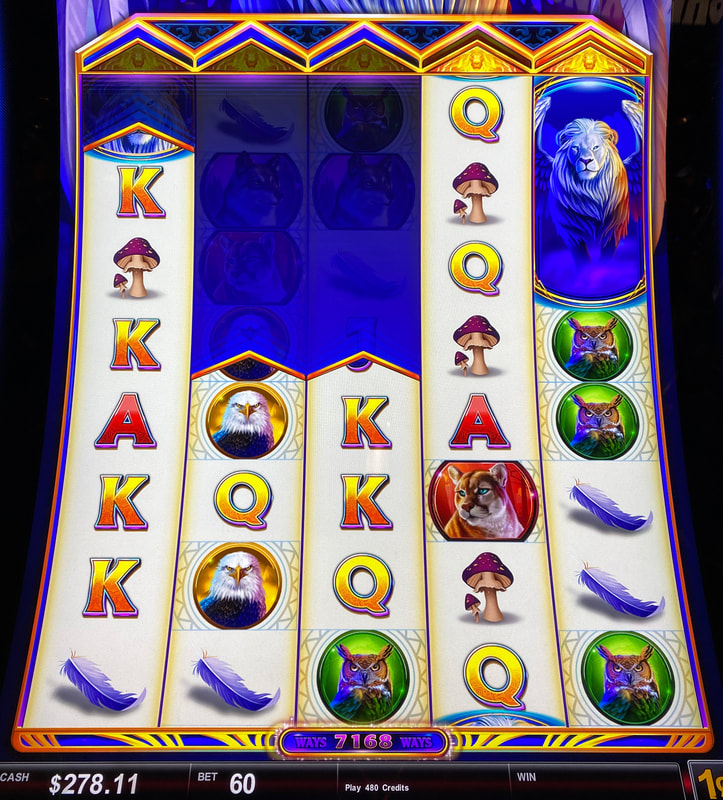
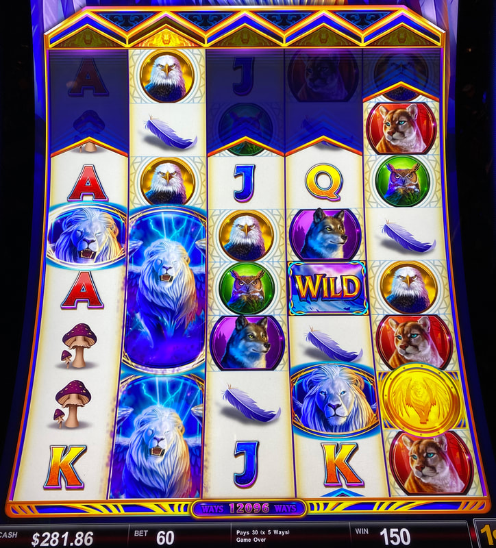
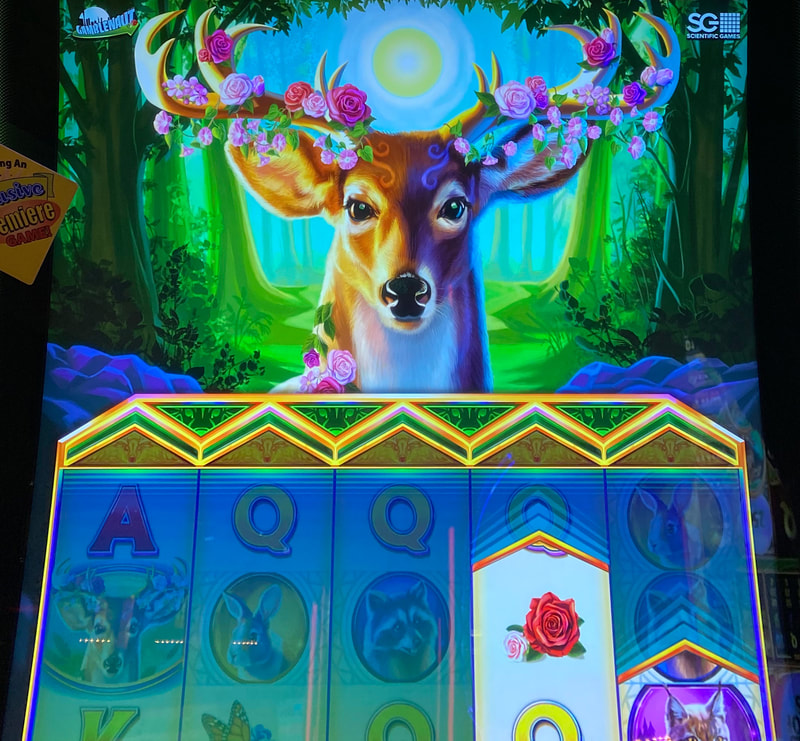

## Thumbnail

## Gameplay Images

### Image 1

### Image 2

### Image 3

### Image 4

**Description:** Sacred Deer plays the same as Epic Lion for advantage purposes.

## How The Advantage Works

Epic Lion / Sacred Deer features **expanding reel heights**:

**Mechanic:**
- Reels grow taller → More ways to win
- Full height = <strong>8</strong> symbols tall
- Full height reel → Stays 1 extra spin → Then resets to <strong>4</strong> symbols

**Reel Height Range:**
| Height | Symbols |
|--------|---------|
| Minimum | 4 |
| Maximum | 8 (full) |

**Critical Caveat:**
- Full-height reel resets UNLESS chevron above is GOLD-filled
- Empty chevron = Treat as 4 symbols (it will shrink)
- Ways display can be MISLEADING (doesn't account for reset)

---

## ⚠️ MARGINAL ADVANTAGE

**Not as strong as Hexbreak3r:**
- Only pays left-to-right (not both ways)
- Reel heights change quickly
- +EV state lasts only a few spins

---

## PLAY WHEN (ANY ONE)

**Option A — High Ways Count:**
- <strong>10,000+</strong> ways displayed
- **AND** chevrons filled on full-height reels

**Option B — Full Height Reel (1-3):**
- Any of first 3 reels at full height (<strong>8</strong> symbols)
- **AND** chevron above is GOLD-filled

**Option C — Tall Reels Setup:**
- First 3 reels ALL at <strong>7</strong> symbols tall

**How to Verify:**
| Indicator | Location |
|-----------|----------|
| Ways count | Below middle reel |
| Thick flashing line | 10,000+ ways |
| Gold-filled chevron | Above pyramid, above reel |

---

## DO NOT PLAY WHEN

- Ways below <strong>10,000</strong> (with empty chevrons)
- Full-height reels with EMPTY chevrons (will reset)
- First 3 reels below <strong>7</strong> symbols each

---

## STOP WHEN

- Reels shrink and ways drop below <strong>10,000</strong>

---

## COMMON MISTAKES

- Trusting ways display when chevrons are empty
- Not checking chevron fill state above full-height reels
- Expecting Hexbreak3r-level advantage (it's marginal)
- Playing too long after +EV window closes

---

## Additional Notes

**Real Value = Free Games Bonus:**
- Best when reels already tall (especially reels 1-3)
- Reels DON'T shrink during bonus
- Stay locked + use premium symbol reelset
- Handpays possible even on small bets

**After Free Games:**
- Reels reset to height BEFORE bonus triggered

**Ways Indicator Visual Cues:**
| Ways | Indicator Appearance |
|------|---------------------|
| 3,000+ | Flashing sparks |
| 5,000+ | Flashing outline |
| 10,000+ | **Thick flashing line** |

**Premium Symbols:**
- Epic Lion: Lion
- Sacred Deer: Deer
- Only need <strong>2</strong> matching for line hit

**Reel Height Mechanics:**
- Ways arrow symbol increases reel height (lands frequently)
- Full-height reel stays full if another arrow lands in it
- Suspense spin at full height for premium reelset chance

**Game Variants:**
- Epic Lion ✅
- Sacred Deer ✅ (same strategy)