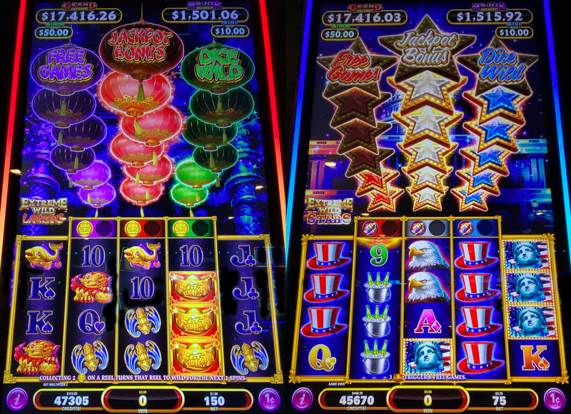
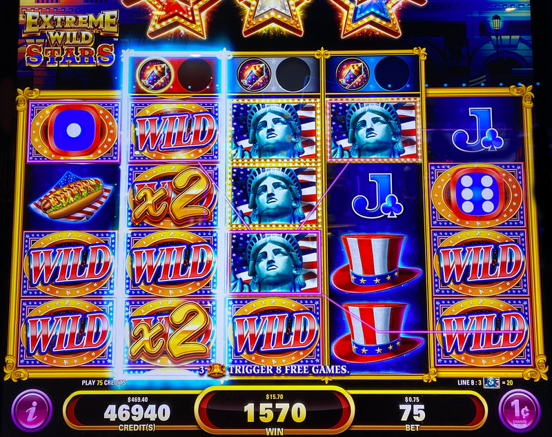
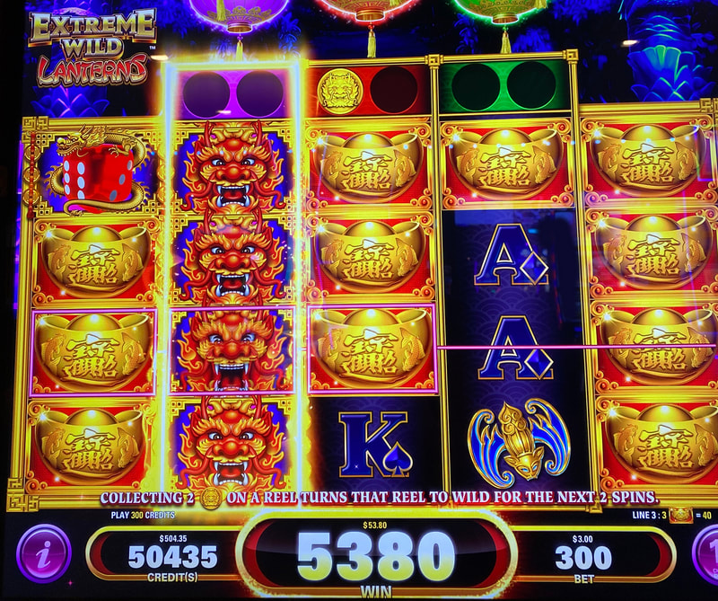
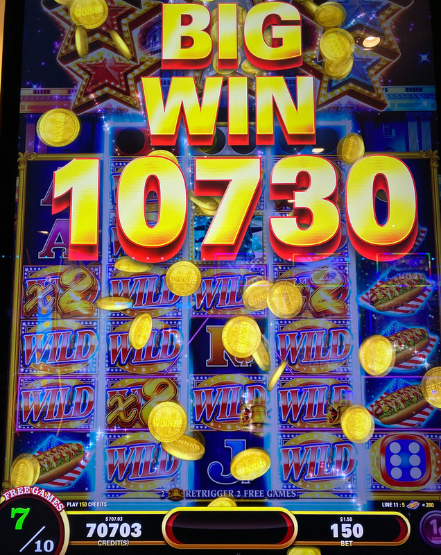

## Thumbnail

## Gameplay Images

### Image 1

### Image 2

**Description:** The built-up lanterns/stars above the reels are fake indicators that don’t offer any advantage.

### Image 3

### Image 4

**Description:** Expect to get a lot of dead spins interspersed with the occasional big line hit like this.

### Image 5

**Description:** The free games bonus is volatile but can pay very well.

## How The Advantage Works

Extreme Wild: Lanterns / Stars features **coin collection for wild reels**:

**Mechanic:**
- Coin holders above reels 2, 3, and 4
- <strong>2</strong> coins collected → Reel turns wild for <strong>2</strong> spins
- Active wild = Glowing border around reel

**Visual Indicators:**
| Indicator | Meaning |
|-----------|---------|
| Glowing border | Active wild reel |
| Coins above | Spins remaining (1 or 2) |
| Built-up lanterns/stars | **FAKE** - No advantage |

---

## ⚠️ IGNORE FAKE INDICATORS

**The lanterns/stars above reels are FAKE.**
- They do NOT indicate any advantage
- Only coin collection matters

---

## PLAY WHEN

**Basic Plays:**

**Option A — Active Wilds (Reels 2-3):**
- Active wild on reel 2 or 3
- Glowing border + coins above showing spins left

**Option B — Reel 4 Setup:**
- Active wild on reel 4 with <strong>2</strong> spins remaining
- AND <strong>1</strong> coin in reel 2 or 3
- Play 1 spin to see if second coin lands (if not, stop)

**Aggressive Play:**

**Option C — Coin Setup (Slightly +EV):**
- <strong>1</strong> coin above BOTH reels 2 AND 3
- Conservative: <strong>1</strong> coin above all 3 reels

| Setup | Risk Level | Action |
|-------|------------|--------|
| Active wild reel 2 or 3 | Low | ✅ **Play** |
| Reel 4 wild (2 spins) + coin in 2/3 | Medium | ✅ **1 spin** |
| 1 coin above reels 2 AND 3 | Higher | ✅ **Play** (aggressive) |
| 1 coin above all 3 reels | Medium | ✅ **Play** (conservative) |

---

## DO NOT PLAY WHEN

- No active wilds (no glowing borders)
- Only reel 4 wild without coins elsewhere
- Only 1 coin above single reel
- RTP below 90% (aggressive play may not be +EV)

---

## STOP WHEN

- Wild spins deplete (coins above reels empty)
- Reel 4 test spin fails to land second coin

---

## COMMON MISTAKES

- Playing because lanterns/stars are built up (FAKE indicators)
- Playing reel 4 wilds without coin setup elsewhere
- Playing on sub-90% RTP machines (aggressive plays may be -EV)

---

## Additional Notes

**High Volatility Game:**
- More volatile than Golden Egypt
- Massive line hits possible with premium stacks
- Free games: 5x to 100x range

**Premium Symbols:**
- Lanterns: Golden ingots
- Stars: Statue of Liberty
- Only <strong>2-of-a-kind</strong> needed for line hit

**Dice Feature:**
- Dice in reels 1 AND 5 → Random wilds (dice total)
- Wilds on wilds → Multipliers up to <strong>3x</strong>
- Dice symbols count as wilds too

**Coins vs Blockers:**
- Coins land ON TOP of symbols (not blockers)
- Dragons (Lanterns) / Rockets (Stars)

**RTP Range:**
- 86.93% to 94.2%
- Higher RTP = Aggressive plays more viable

**Game Variants:**
- Extreme Wild: Lanterns ✅
- Extreme Wild: Stars ✅ (same strategy)