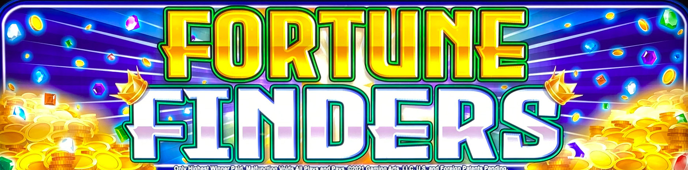
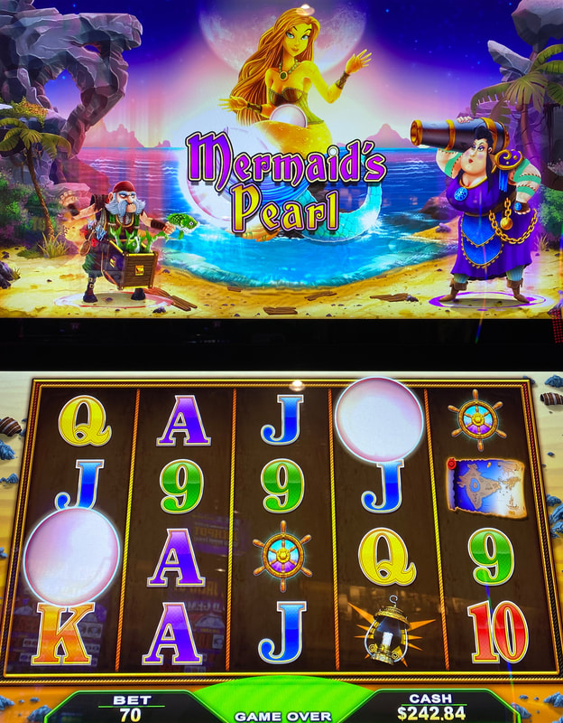
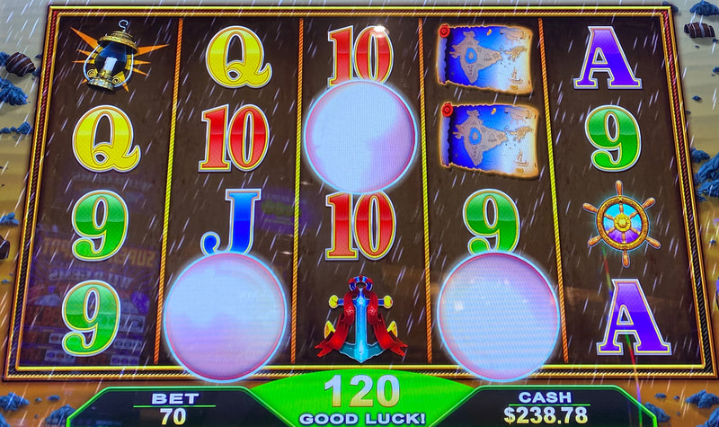
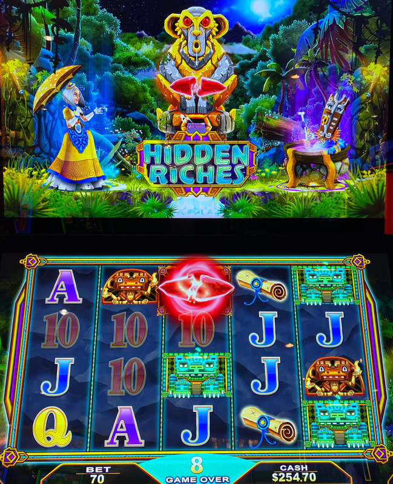

## Thumbnail

## Gameplay Images

### Image 1

### Image 2

**Description:** The free games bonus scatter symbols move down one row every spin.

### Image 3

**Description:** Landing three scatter symbols will trigger the free games bonus.

### Image 4

**Description:** In the Hidden Riches version, the scatter symbols are red crystals.

## How The Advantage Works

Fortune Finders (Mermaid's Pearl / Hidden Riches) features **persistent scatter symbols**:

**Mechanic:**
- <strong>3</strong> scatter symbols → Triggers free games bonus
- Scatter symbols are PERSISTENT
- Move DOWN one row every spin

**Scatter Symbols by Theme:**
| Theme | Scatter Symbol |
|-------|----------------|
| Mermaid's Pearl | White pearls |
| Hidden Riches | Red crystals |

---

## PLAY WHEN

<strong>Primary Requirement:</strong>
- <strong>2+</strong> scatter symbols anywhere on reels
- NOT on bottom row (those leave next spin)

| Scatter Position | Action |
|------------------|--------|
| Top/Middle rows | ✅ **Play** |
| Bottom row only | ❌ Skip (leaves next spin) |

---

## DO NOT PLAY WHEN

- Fewer than <strong>2</strong> scatter symbols visible
- All scatters on bottom row only

---

## STOP WHEN

- Free games bonus triggers (3 scatters landed)
- All scatters fall off bottom row

---

## COMMON MISTAKES

- Counting bottom row scatters (they leave next spin)
- Not checking all bet levels/denominations

---

## Additional Notes

**Free Check Method (Gaming Arts):**
1. Tap menu icon (lower left corner)
2. Use up/down arrows to cycle bet levels
3. No ticket required

**Check All Denominations:**
- Multiple bet levels usually available
- Check each for plays

**Game Variants:**
- Mermaid's Pearl ✅ (white pearls)
- Hidden Riches ✅ (red crystals)