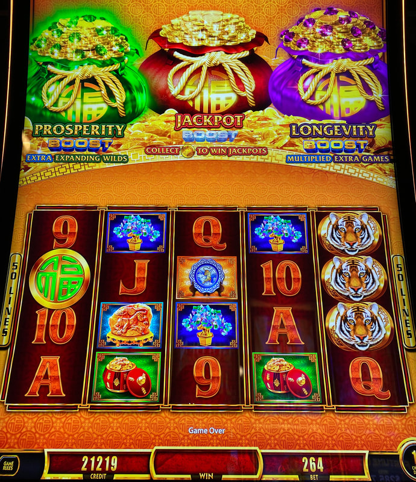
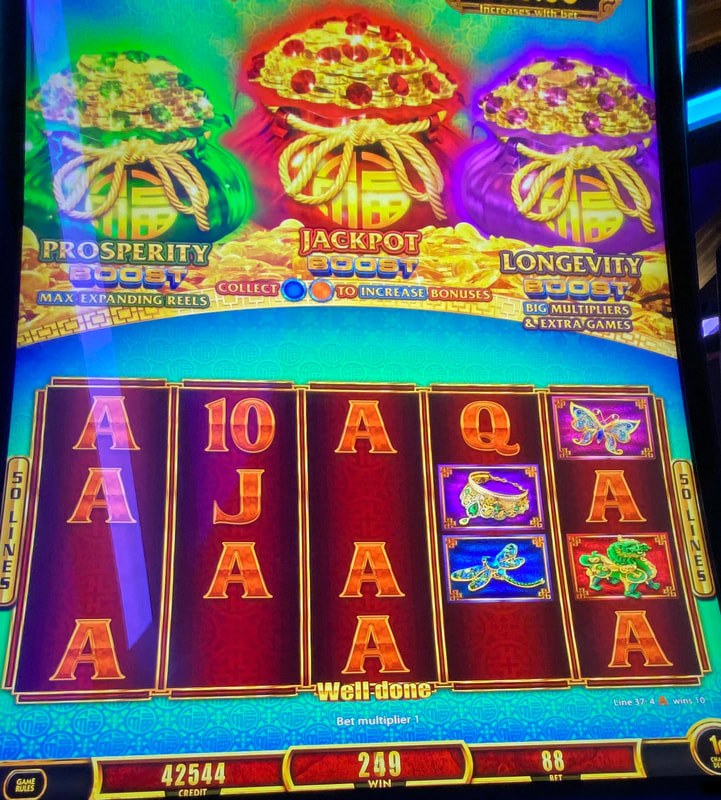
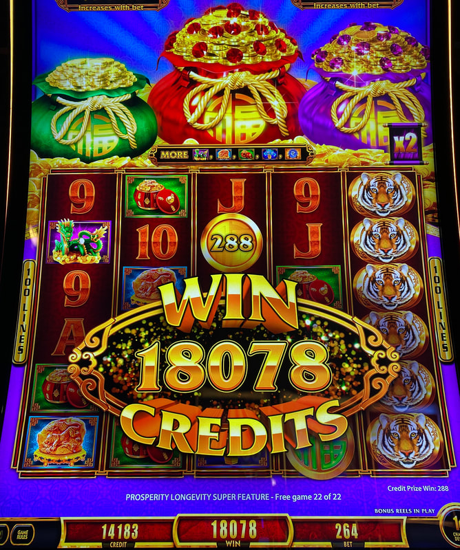
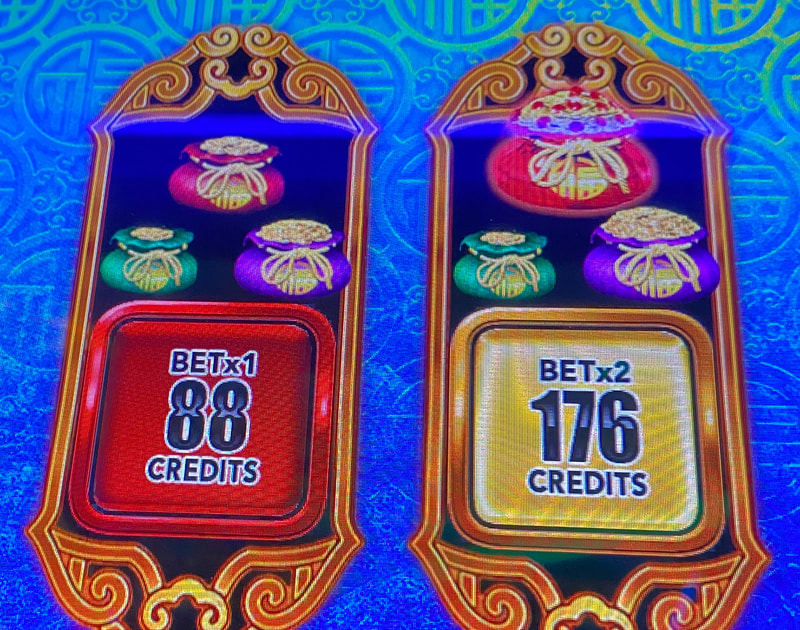

## Thumbnail

## Gameplay Images

### Image 1

### Image 2

**Description:** The red bag in the middle is a “level 4” bag, which is the largest size the bags grow to before they get jewels.

### Image 3

**Description:** Having all three bags with jewels like this is an excellent play (but still very high variance).

### Image 4

**Description:** It’s fairly common to trigger multiple bags at the same time, which makes the bonus even more lucrative.

### Image 5

**Description:** The boosted bonus usually pays very well, even if you just trigger one bag. The above is still a play after the bonus ends because there are still two bags with jewels.

### Image 6

**Description:** You can check this machine by looking directly on the bet pad. You can see the jewels in the red bag on the right.

## How The Advantage Works

Fu Dai Lian Lian: Boost Peacock / Boost Tiger features **three bags** that fill with coins:

**Mechanic:**
- Colored coins land → Corresponding bag fills
- Bags grow through 4 size levels
- Level 5 = **Jewels appear, bag glows**
- Jewels = Bonus is "boosted" with enhanced features
- ⚠️ **Bigger bags ≠ closer to triggering** (random chance on each coin)

**Bag Progression:**
| Level | Size | Status |
|-------|------|--------|
| 1–3 | Small | ❌ Not playable |
| 4 | Largest (no jewels) | ⚠️ Aggressive only |
| 5 | Glowing with jewels | ✅ **Playable** |

---

## ACCUMULATION STATE

| Bags with Jewels | State | Action |
|------------------|-------|--------|
| 0 | ❌ Cold | Walk away |
| 1 | ⚠️ Risky | Aggressive only (needs Level 4 bag) |
| 2+ | ✅ **Play** | Good value |
| 3 | 🔥 Excellent | Best possible setup |

---

## PLAY WHEN

<strong>Primary Requirement:</strong>
- <strong>2+</strong> bags with jewels (glowing)

**Aggressive Play (Higher Variance):**
- <strong>1</strong> bag with jewels **AND**
- <strong>1</strong> Level 4 bag (largest size without jewels)

**How to Check:**
- Look **directly on bet pad**
- Bags with jewels visible on bet pad
- If you see bags on bet pad, you have correct version

---

## DO NOT PLAY WHEN

- Fewer than <strong>2</strong> bags with jewels (unless aggressive setup)
- Playing Panda or Dragon versions (no advantage)
- Not seeing bags on bet pad (wrong version)
- You cannot handle high variance losses

---

## STOP WHEN

- Any bag bonus triggers
- Do NOT continue even if other bags still have jewels
- Re-evaluate after bonus completes

---

## COMMON MISTAKES

- Playing wrong Fu Dai Lian Lian version (must be Boost Peacock/Tiger)
- Thinking bigger bags = closer to triggering (false)
- Continuing after triggering one bag
- Playing with insufficient bankroll

---

## Additional Notes

**Correct Versions (Have Advantage):**
- Fu Dai Lian Lian: **Boost Peacock** ✅
- Fu Dai Lian Lian: **Boost Tiger** ✅
- Bags visible on bet pad = Correct version

**Wrong Versions (NO Advantage):**
- Fu Dai Lian Lian: Panda ❌
- Fu Dai Lian Lian: Dragon ❌

**Bonus Behavior:**
- Fairly common to trigger multiple bags at once
- Goal: Trigger both jeweled bags simultaneously
- If only one triggers, stop playing

**Volatility Warning:**
- High variance game
- Can take very long time to trigger
- Need large bankroll, especially on bigger bets
- Expect losses with occasional big wins

**Denominations:**
- Multiple denominations available
- Check all bet levels on bet pad