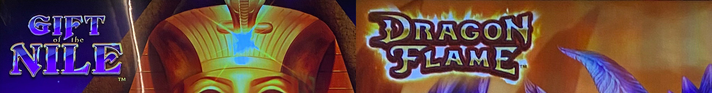
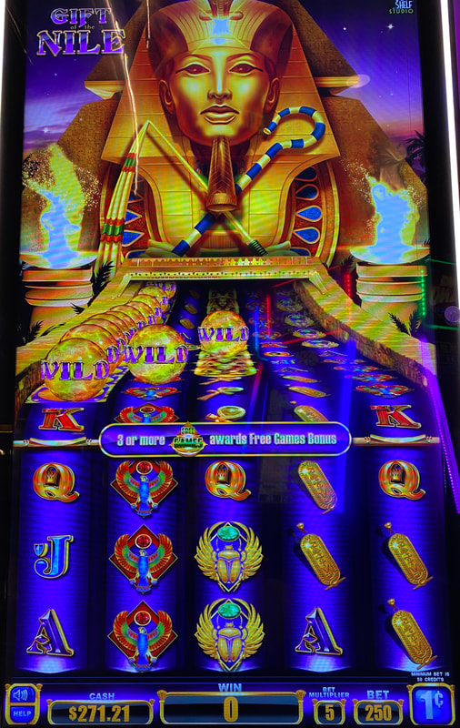
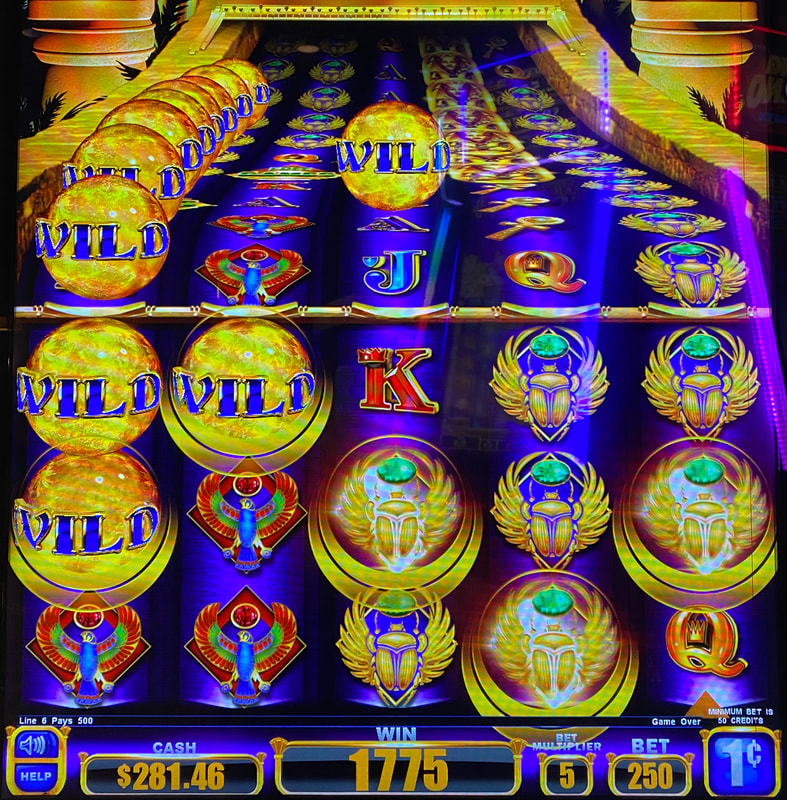
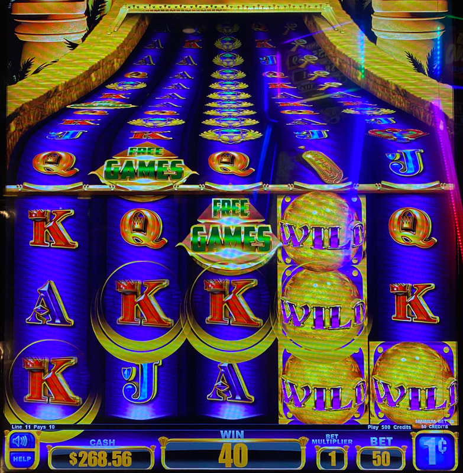
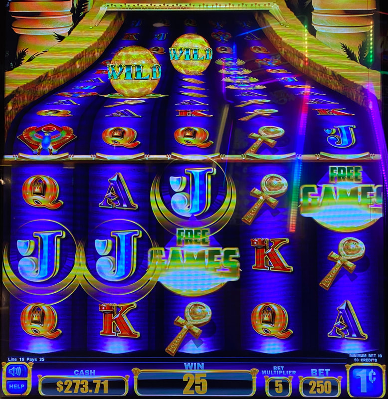
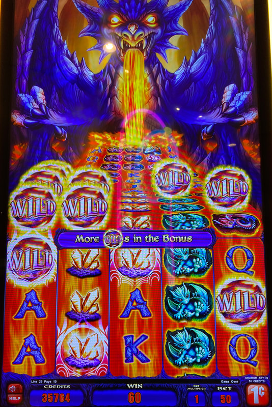

## Thumbnail

## Gameplay Images

### Image 1

### Image 2

**Description:** The stack of wilds in the upcoming queue above the first reel will enter into play within two spins.

### Image 3

**Description:** This is an excellent play. There are wilds in the active reel area within the first three reels, with more coming in the queue above.

### Image 4

**Description:** The free games bonus symbols are not persistent, so this is not a play.

### Image 5

**Description:** This is not a play. The two wilds in the upcoming queue are not on the same row and they are far enough back where it’s not worth the cost to bring them into play.

### Image 6

**Description:** **The Dragon Flame version plays the same for advantage purposes.

## How The Advantage Works

Gift of the Nile / Dragon Flame features **persistent wilds with visible queue**:

**Mechanic:**
- Wilds move DOWN one row every spin
- Queue visible ABOVE reels (see them coming)
- Wilds often appear in big stacks

**Important:**
- Only WILD symbols are persistent
- FREE GAMES symbols are NOT persistent (don't chase them)

---

## PLAY WHEN

**Focus on first 3 reels only.** The further back in queue, the more wilds needed:

**Active Reel Area (Top/Middle Rows):**
- <strong>1</strong> wild in reels 1-3 (top or middle row)
- <strong>1</strong> wild directly above reel (first queue position)

**Front Queue (First 3 Positions):**
- <strong>2</strong> wilds in first 3 queue positions (reels 1-3)

**Middle Queue:**
- <strong>2</strong> wilds on SAME row (reels 1-3)

**Back Queue:**
- <strong>3</strong> wilds on same row (reels 1-3)
- OR stack of <strong>3+</strong> wilds together (reels 1-3)

| Wild Location | Wilds Required | Action |
|---------------|----------------|--------|
| Active area (top/middle) | 1 | ✅ **Play** |
| Directly above reel | 1 | ✅ **Play** |
| Front 3 queue positions | 2 | ✅ **Play** |
| Middle queue (same row) | 2 | ✅ **Play** |
| Back queue (same row) | 3 | ✅ **Play** |
| Back queue (stack) | 3+ | ✅ **Play** |

---

## DO NOT PLAY WHEN

- Wilds only in reels 4-5
- Single wild far back in queue
- FREE GAMES symbols (not persistent!)
- Wilds not aligned or too few for queue position

---

## STOP WHEN

- All wilds move off bottom row
- Check queue for new wilds before leaving

---

## COMMON MISTAKES

- Chasing FREE GAMES symbols (NOT persistent)
- Playing wilds in reels 4-5 (little value)
- Not checking queue depth vs wild count
- Missing wilds that appear mid-queue

---

## Additional Notes

**Queue Behavior:**
- Wilds don't always come from very back
- Can randomly appear anywhere in queue
- More chances as symbols move forward

**Line Hit Quality:**
- 3-of-a-kind with premium symbols pays well
- Don't need 4-of-a-kind for decent money

**Free Games Bonus:**
- More wilds land during bonus
- BUT wilds don't transfer back to base game

**Game Variants:**
- Gift of the Nile ✅
- Dragon Flame ✅ (same strategy)