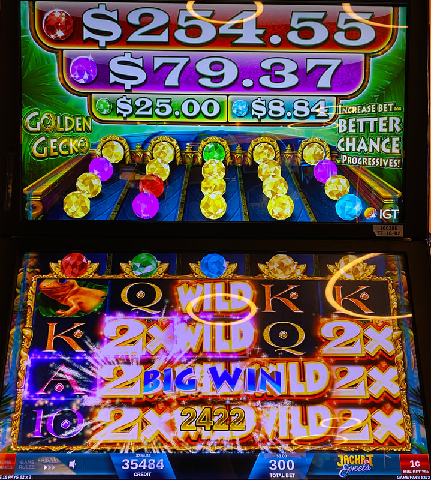
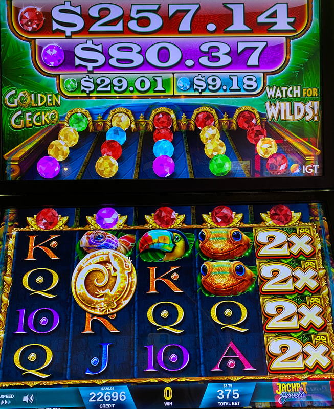

## Thumbnail

## Gameplay Images

### Image 1

### Image 2

**Description:** The gold jewels add multipliers to the wilds, but they are extremely common, and as such, are not worth chasing.

### Image 3

**Description:** This is an excellent (although still high variance) play, with four active red jewels.

## How The Advantage Works

Golden Gecko features **colored jewels with progressive jackpots**:

**Mechanic:**
- Jewel above each reel + 4 more in queue above
- Wild lands on reel → Jewel drops, next in queue replaces it
- Full reel of wilds + colored jewel → Progressive jackpot

**Jewel Types:**
| Jewel Color | Effect |
|-------------|--------|
| Gold | 2x-5x multiplier (COMMON - no advantage) |
| Blue | Blue progressive (small) |
| Green | Green progressive |
| Purple | Purple progressive |
| **Red** | **Red progressive (largest - ONLY worth chasing)** |

---

## ⚠️ HIGH VARIANCE PLAY

**Only chase RED jewels.**
- Won't win most times you play
- When you do win, covers losses + profit

---

## PLAY WHEN

**Red Jewels Only (by position):**

| Red Jewel Position | Count Required | Action |
|--------------------|----------------|--------|
| Active row (directly above reels) | <strong>3+</strong> | ✅ **Play** |
| Active + first queue row | <strong>5+</strong> | ✅ **Play** |
| Active + first 2 queue rows | <strong>7+</strong> | ✅ **Play** |

---

## DO NOT PLAY WHEN

- Fewer red jewels than threshold for position
- Only gold jewels (no advantage—extremely common)
- Only blue/green/purple jewels (not worth chasing)

---

## STOP WHEN

- Red progressive triggers
- Red jewels drop past active row without hitting

---

## COMMON MISTAKES

- Chasing gold jewels (extremely common, no advantage)
- Chasing smaller progressives (blue/green/purple)
- Not counting red jewels by queue position
- Playing without enough reds for queue depth

---

## Additional Notes

**Wild Frequency:**
- Wilds appear frequently
- Jewels drop quickly

**Screen Rumble:**
- Screen rumbles before full stack of wilds lands

**Progressive Frequency:**
- Progressives not huge
- Get awarded fairly frequently

**Bet Level Note:**
- Progressive jewels appear more frequently at higher bet levels