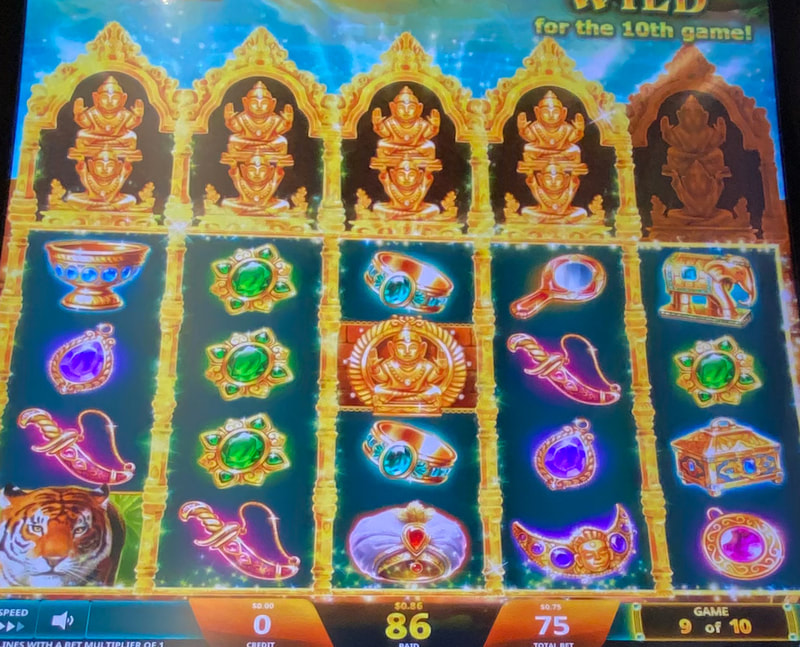
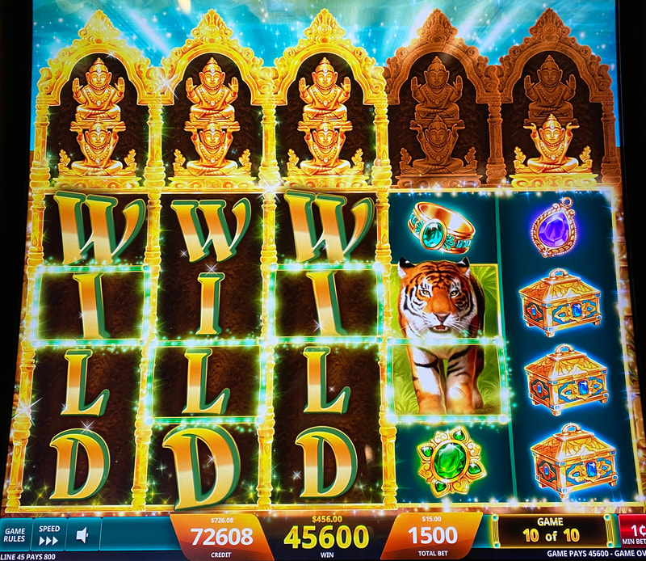

## Thumbnail


## Gameplay Images

### Image 1


### Image 2



**Description:** This is a walk-up play I found that someone had abandoned on spin 9 of 10.

### Image 3



### Image 4


**Description:** Plays like this present an excellent opportunity for a big win.

## How The Advantage Works

Golden Jungle Grand operates on a **10-game cycle** with buddha collection:

**Mechanic:**
- Buddha symbols collected above each reel (max 2 per reel)
- After spin 10 → Reels with 2 buddhas turn WILD
- Only 1 buddha can land per reel per spin
- Cycle resets after spin 10

**Goal:** Get 3+ of first 4 reels wild for good profit

---

## PLAY WHEN

### ❌ NEVER: Game 10 of 10

### ✅ ALWAYS: Two Full Reels in First Three (Any Spin 1-9)
```
2-2-0-0-0 | 2-0-2-0-0 | 0-2-2-0-0
```

---

### Game 9 of 10

**One full reel in first three:**
```
2-0-0-0-0 | 0-2-0-0-0 | 0-0-2-0-0
```

**Three buddhas in first four reels:**
```
1-1-1-0-0 | 1-1-0-1-0 | 1-0-1-1-0 | 0-1-1-1-0
```

---

### Game 8 of 10

**One full reel + one additional buddha in first three:**
```
2-1-0-0-0 | 2-0-1-0-0 | 1-2-0-0-0
0-2-1-0-0 | 1-0-2-0-0 | 0-1-2-0-0
```

**Three buddhas in first four reels:**
```
1-1-1-0-0 | 1-1-0-1-0 | 1-0-1-1-0 | 0-1-1-1-0
```

---

### Game 3–7 of 10

**One full reel + buddhas in other two (first three):**
```
2-1-1-0-0 | 1-2-1-0-0 | 1-1-2-0-0
```

**Three buddhas in first four reels:**
```
1-1-1-0-0 | 1-1-0-1-0 | 1-0-1-1-0 | 0-1-1-1-0
```

---

### Game 2 of 10

**One full reel in first three:**
```
2-0-0-0-0 | 0-2-0-0-0 | 0-0-2-0-0
```

**Two buddhas in first four reels:**
```
1-1-0-0-0 | 1-0-1-0-0 | 0-1-1-0-0 | 0-0-1-1-0
```

---

### Game 1 of 10

**Two buddhas in first three reels:**
```
1-1-0-0-0 | 1-0-1-0-0 | 0-1-1-0-0
```

---

## DO NOT PLAY WHEN

- Game <strong>10</strong> of 10 (NEVER)
- Buddha distribution doesn't match patterns above
- No buddhas in first three reels with many spins remaining

---

## STOP WHEN

- Spin 10 completes
- Wild reels trigger based on collected buddhas
- Cycle resets

---

## COMMON MISTAKES

- Playing game 10 of 10 (always skip)
- Expecting win with only 1-2 wild reels
- Not recognizing playable buddha patterns
- Playing weak distributions early in cycle

---

## Additional Notes

**Variance:**
- High variance "all or nothing" game
- Spin 10: Either shafted (1-2 wild reels) or killing (3-4 wild reels)
- Need 3+ of first 4 reels wild for good profit

**Payouts:**
- Full screen (blackout) of wilds = <strong>133.3x</strong> bet
- Free games bonus: Difficult to land, pays handsomely

**Strategy Logic:**
- Further into cycle = Less needed to cover investment
- First three reels most important (pays left to right)