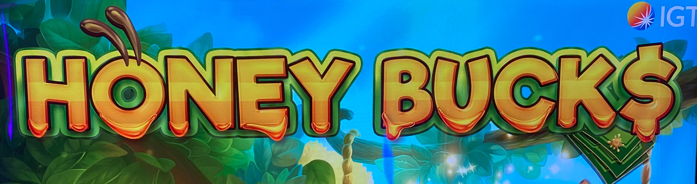
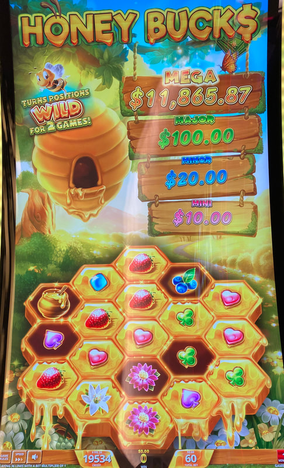
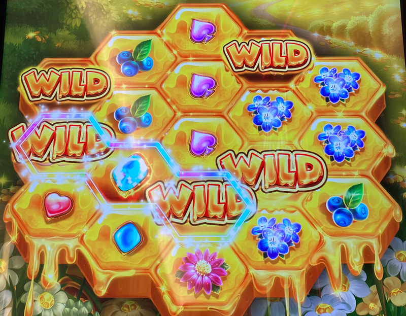
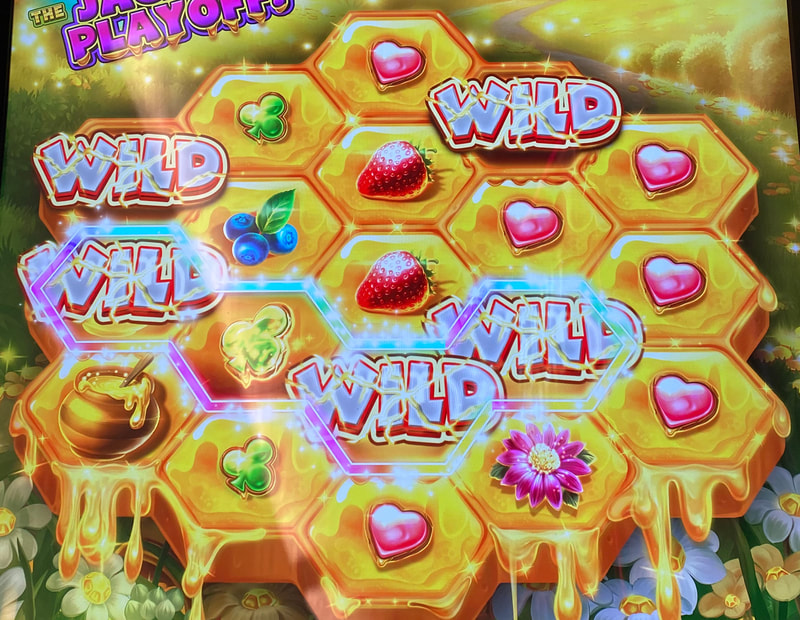

## Thumbnail

## Gameplay Images

### Image 1

### Image 2

**Description:** Five bees flew off the reels, leaving behind five empty spaces in the honeycomb. These spaces will be wild for the next two spins.

### Image 3

**Description:** This is what the empty spaces from the previous photo will look like after the next spin. Yellow wilds like these will be around for one more spin.

### Image 4

**Description:** Don’t play wilds that look like these—they will disappear on the next spin.

## How The Advantage Works

Honey Bucks features **persistent wilds** from bees leaving the honeycomb:

**Mechanic:**
- Up to 5 bees randomly fly from honeycomb → Leave empty space
- Empty space = WILD for next 2 spins
- Bees fly out every few spins

**Wild Appearance Stages:**
| Visual | Spins Remaining | Playable? |
|--------|-----------------|-----------|
| Empty space in honeycomb | 2 spins | ✅ Yes |
| Yellow "WILD" with honey dripping | 1 spin | ✅ Yes |
| Cracked wild | 0 (disappears next spin) | ❌ No |

---

## PLAY WHEN (ANY ONE)

**Option A — Two Wilds in First Three Reels:**
- <strong>2</strong> active wilds in reels 1-3
- Must be horizontally connected OR one gap apart

**Option B — Three Connected Wilds:**
- <strong>3</strong> horizontally connected active wilds
- Can be anywhere on reels

**Option C — Four Wilds:**
- <strong>4+</strong> active wilds in first three reels

| Wilds | Position | Action |
|-------|----------|--------|
| 2 connected/1-gap | Reels 1-3 | ✅ **Play** |
| 3 connected | Anywhere | ✅ **Play** |
| 4+ | Reels 1-3 | ✅ **Play** |

---

## DO NOT PLAY WHEN

- Wilds are cracked (disappear next spin)
- Only 1 wild in first three reels
- Wilds not horizontally aligned
- 2+ gap between wilds in reels 1-3

---

## STOP WHEN

- All active wilds crack and disappear
- No playable wild combinations remain

---

## COMMON MISTAKES

- Playing cracked wilds (they disappear next spin)
- Not recognizing wild stages (empty vs yellow vs cracked)
- Playing wilds that aren't horizontally connected/aligned
- Ignoring this game (most APs don't know about it)

---

## Additional Notes

**Hidden Gem:**
- Innocuous game most APs don't know about
- Common to find plays
- Quick in-and-out with few spins
- Great game to hustle

**Aggressive Play:**
- Wilds with 2 spins remaining can be played more aggressively
- Chance to combine with more wilds that appear next spin

**Wild Recognition:**
- Empty honeycomb space = 2 spins left
- Yellow "WILD" with honey = 1 spin left
- Cracked = IGNORE (gone next spin)