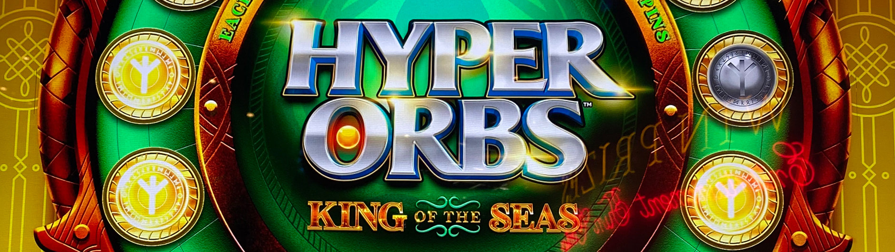
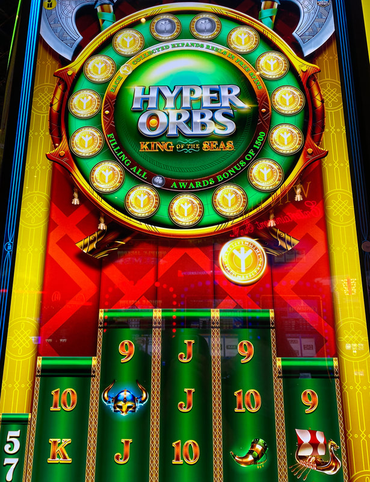
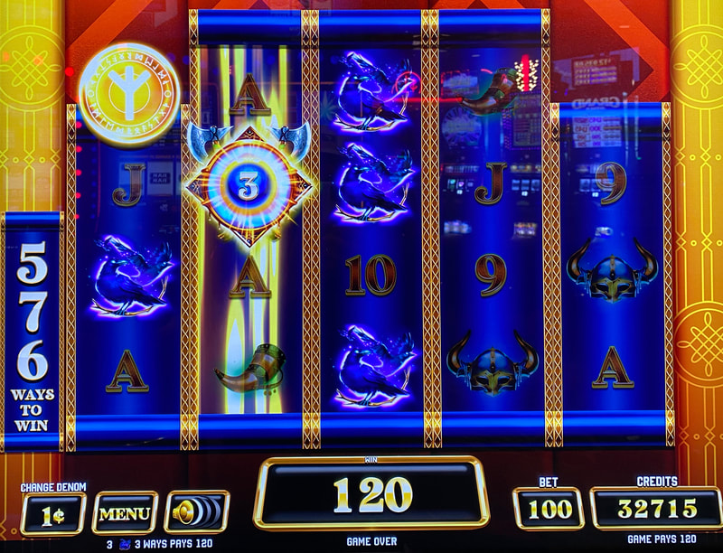
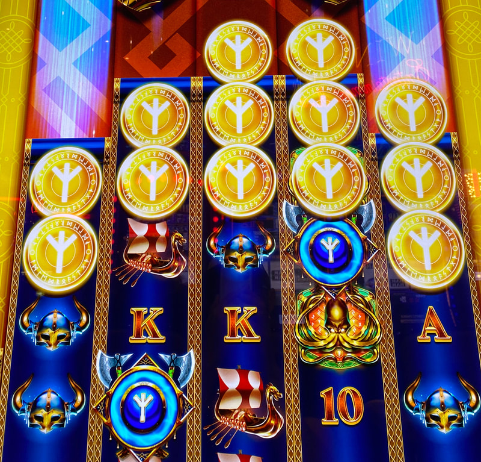

## Thumbnail

## Gameplay Images

### Image 1

### Image 2

**Description:** 13 of the 15 orbs needed to trigger the bonus have been collected already. This is an excellent play.

### Image 3

**Description:** This free spins scatter symbol will stick around for three more spins. Landing two of these will trigger the bonus, so always play if there is a number inside the symbol. It also functions as a wild.

### Image 4

## How The Advantage Works

Hyper Orbs (King of the Seas / Dragon Sense) features **orb collection** that triggers free spins:

**Mechanic:**
- Orbs land on reels → Collected (can also drop from above reels)
- <strong>15</strong> orbs collected → Triggers free spins bonus
- Each orb expands a random reel by 1 space during bonus
- Max reel expansion: <strong>3</strong> spaces per reel

**Bonus Trigger Methods:**
1. Collect <strong>15</strong> orbs
2. Land <strong>2</strong> scatter symbols on reels 2 and 4

---

## ACCUMULATION STATE

| Orbs | State | Action |
|------|-------|--------|
| 0–9 | ❌ Cold | Walk away |
| 10–11 | ⚠️ Risky | Only if high RTP known |
| 12+ | ✅ **Play** | Good value |
| 14 | 🔥 Excellent | 1 away from trigger |

---

## PLAY WHEN (ANY ONE)

**Option A — Orb Count:**
- Orbs collected: ≥ <strong>12</strong>

**Option B — Scatter Symbol:**
- Number symbol visible in reel 2 OR reel 4
- Number inside = spins it sticks around
- Also functions as wild
- Need 2 to trigger bonus

**How to Check:**
- Look **directly on bet pad**
- Shows orb count for each bet level

⚠️ **IMPORTANT:** Check all denominations—different bet levels have different counts.

---

## DO NOT PLAY WHEN

- Orbs below <strong>12</strong>
- Unknown RTP setting and fewer than 12 orbs
- Bonus just triggered (orbs reset to 0)

---

## STOP WHEN

- Free spins bonus triggers
- Orb count resets to <strong>0</strong>

---

## COMMON MISTAKES

- Playing at 10-11 orbs without knowing RTP (too risky)
- Not checking the bet pad for orb count
- Not checking all denominations
- Not recognizing numbered scatter symbols as plays

---

## Additional Notes

**Game Variants:**
- King of the Seas ✅ (same strategy)
- Dragon Sense ✅ (same strategy)

**Bonus Feature:**
- <strong>12</strong> free spins awarded
- Each collected orb expands random reel by 1 space
- More orbs = More ways to win
- Left reels expanding more valuable (pays left-to-right)
- Unlike Hexbreak3r: Does NOT pay right-to-left

**RTP Warning:**
- RTP ranges from 85.27% to 94.15%
- Lower RTP = Play tighter (stick to 12+)
- Some APs play at 10-11 on higher RTP machines

**Quick Check:**
- Bet pad shows orb count per bet level
- Check all bet levels before walking away