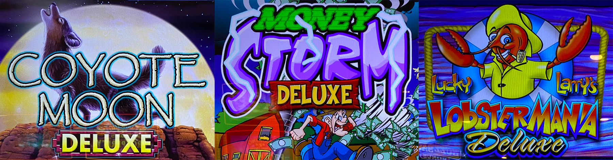
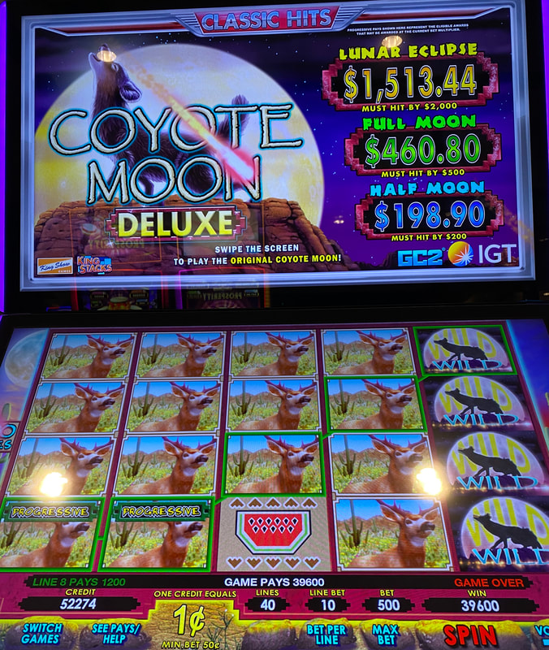
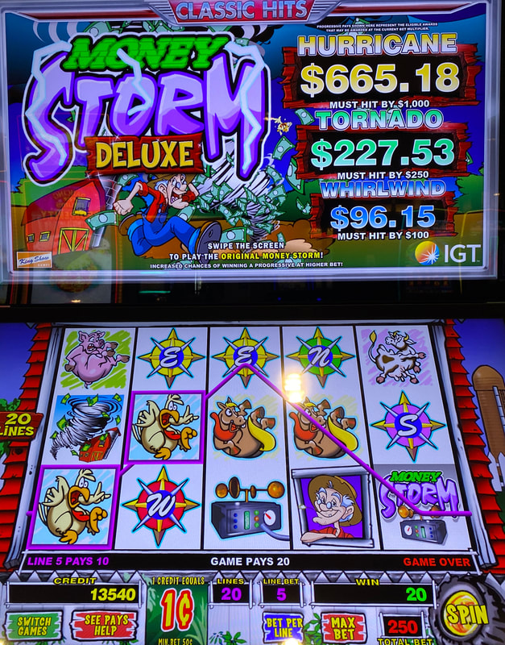
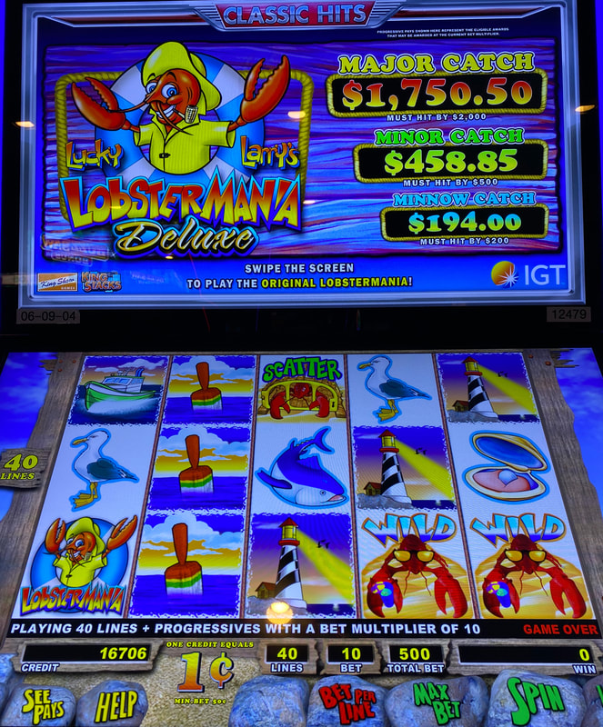
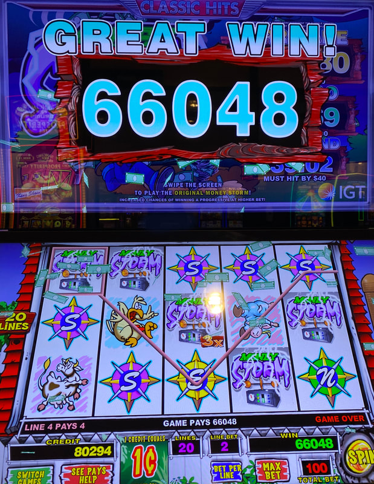

## Thumbnail

## Gameplay Images

### Image 1

### Image 2

**Description:** This was a nice $396 line hit while closing in on the bottom MHB.

### Image 3

**Description:** The meter on the bottom MHB is at 96.15%—anything 95% or above is playable.

### Image 4

**Description:** This was an awesome walk-up play with the bottom meter already at 97%.

### Image 5

**Description:** This extremely lucky 660x line hit occurred while I was chasing the $40 MHB.

## How The Advantage Works

IGT Classic Hits features **three must-hit-by progressives at five bet levels**:

**Games in Series:**
- Coyote Moon Deluxe
- Money Storm Deluxe
- Lucky Larry's Lobstermania Deluxe

**Progressive Tiers:**
| Tier | Size | Playable % |
|------|------|------------|
| Top (Large) | Lunar Eclipse / Hurricane / Major Catch | <strong>97%+</strong> |
| Middle (Medium) | Full Moon / Tornado / Minor Catch | <strong>96%+</strong> |
| Bottom (Small) | Half Moon / Whirlwind / Minnow Catch | <strong>95%+</strong> |

---

## PLAY WHEN

**Quick Reference (Percentage of MHB):**
| Progressive | Threshold |
|-------------|-----------|
| Top (Large) | <strong>97%+</strong> |
| Middle (Medium) | <strong>96%+</strong> |
| Bottom (Small) | <strong>95%+</strong> |

**Bottom (Small) Break-Even Points:**
| Bet | Play At |
|-----|---------|
| $0.50 | <strong>$19</strong> |
| $1.00 | <strong>$38</strong> |
| $1.50 | <strong>$57</strong> |
| $2.50 | <strong>$95</strong> |
| $5.00 | <strong>$190</strong> |

**Middle (Medium) Break-Even Points:**
| Bet | Play At |
|-----|---------|
| $0.50 | <strong>$48</strong> |
| $1.00 | <strong>$96</strong> |
| $1.50 | <strong>$144</strong> |
| $2.50 | <strong>$240</strong> |
| $5.00 | <strong>$480</strong> |

**Top (Large) Break-Even Points:**
| Bet | Play At |
|-----|---------|
| $0.50 | <strong>$194</strong> |
| $1.00 | <strong>$388</strong> |
| $1.50 | <strong>$582</strong> |
| $2.50 | <strong>$970</strong> |
| $5.00 | <strong>$1,940</strong> |

---

## DO NOT PLAY WHEN

- Progressive below percentage threshold for tier
- Top progressive at lower bet levels (poor hourly rate)

---

## STOP WHEN

- Targeted MHB jackpot triggers and resets

---

## COMMON MISTAKES

- Chasing top progressive at low bets (hours for small profit)
- Not checking all 5 bet levels
- Playing non-deluxe version (no MHBs)
- Not tapping "Bet Per Line" to check without money

---

## Additional Notes

**How to Check Without Money:**
- Tap "Bet Per Line" on touchscreen
- Cycles through all 5 bet levels
- No ticket required

**Quick Math for Bottom Progressive:**
- Take 10% of MHB → Cut in half → Subtract from MHB
- Example: $60 MHB → 10% = $6 → Half = $3 → Play at $57

**Hit Odds Per Spin:**
| Progressive | Odds |
|-------------|------|
| Bottom | 1 in 456 |
| Middle | 1 in 3,829 |
| Top | 1 in 58,257 |

**Top Progressive Warning:**
- Rarely worth chasing (locks you up for hours)
- Low profit especially at lower bets
- May be OK for card-building purposes

**Important Details:**
- Must play "Deluxe" version for MHBs
- Tap "Switch Games" if progressives not visible
- Progressives increase during free games too
- Usually hits near end, but can hit early

**RTP:**
- $0.50 bet: 91.420%
- $5.00 bet: 91.457%
- Difference negligible

**Game Variants:**
- Coyote Moon Deluxe ✅
- Money Storm Deluxe ✅ (loud—turn volume down)
- Lucky Larry's Lobstermania Deluxe ✅