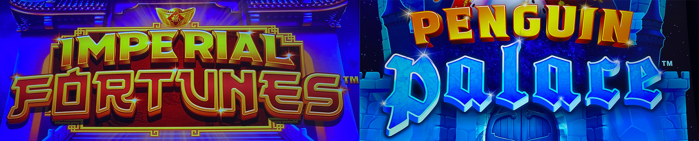
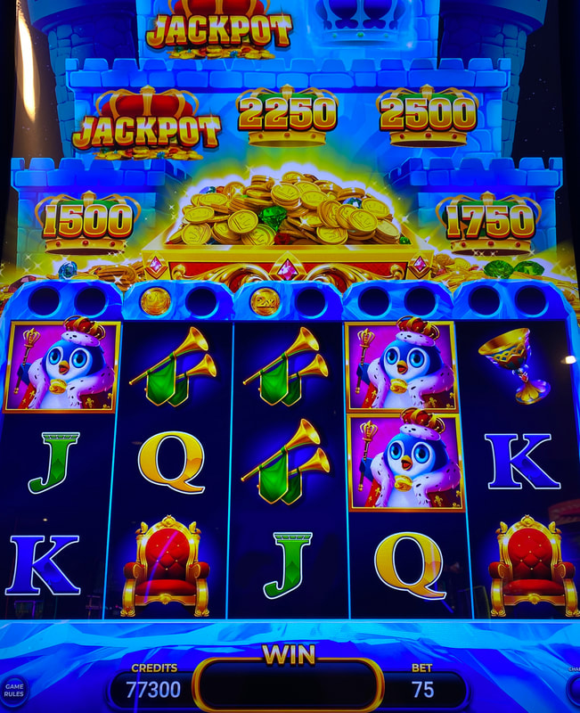
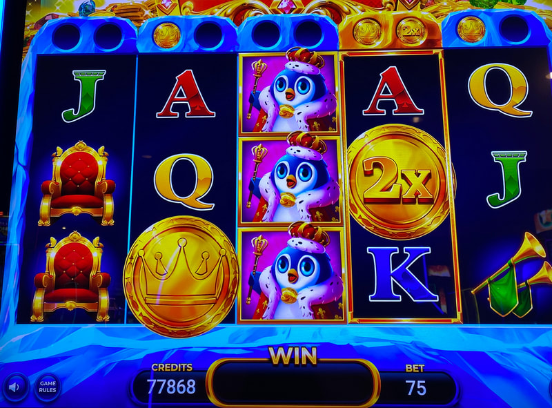
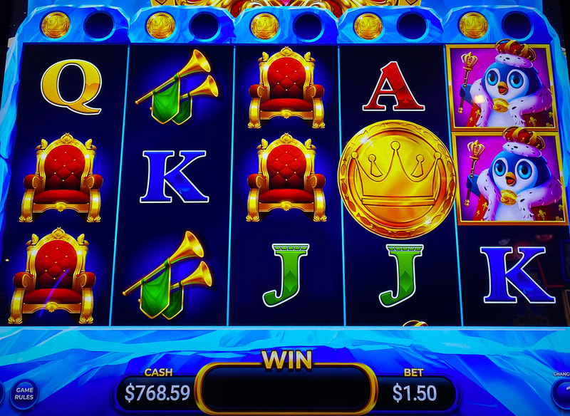
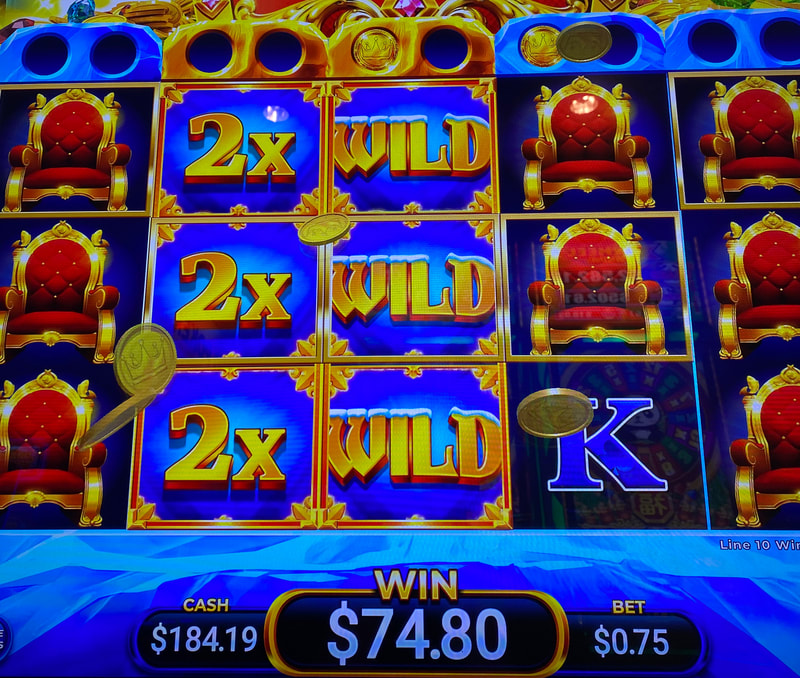
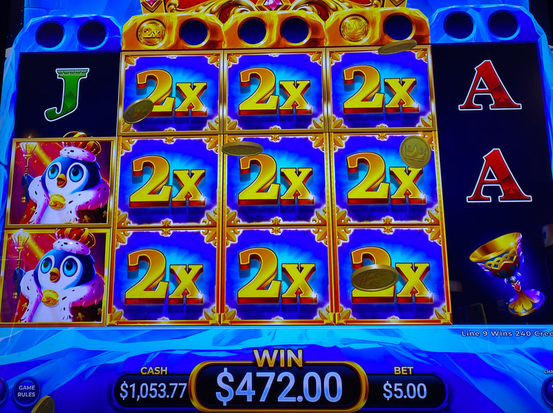
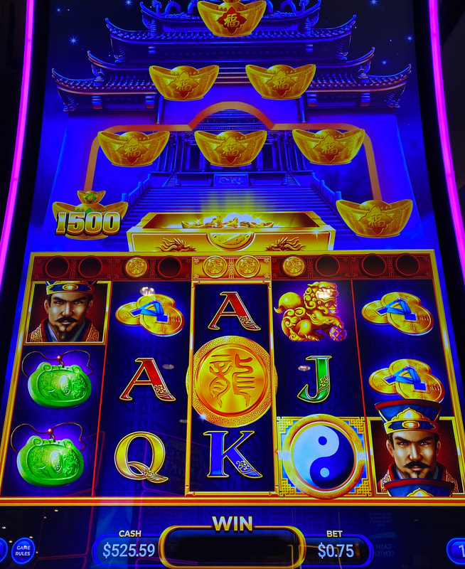

## Thumbnail

## Gameplay Images

### Image 1

### Image 2

**Description:** This is a solid play with a 2x coin collected about the third reel and another coin collected above the second reel.

### Image 3

**Description:** I would play a setup like this for one spin because of the active 2x coin above reel four.

### Image 4

**Description:** I would avoid setups like this in Red Silk/Aztec Chief, but this is a slightly +EV play due to the possibility of landing a 2x coin in one or more of the first three reels.

### Image 5

**Description:** This paid out nearly 100x due to the 2x coin in reel two. The middle reel will be wild for one more spin.

### Image 6

**Description:** You can get huge wins with the 2x multipliers.

### Image 7

**Description:** Imperial Fortunes is a clone of Penguin Palace.

## How The Advantage Works

Imperial Fortunes / Penguin Palace features **coin collection for wild reels with 2x multipliers**:

**Game Variants:**
- Imperial Fortunes
- Penguin Palace

**Mechanic:**
- Coin holders above each reel
- <strong>2</strong> coins collected → Reel turns wild for <strong>2</strong> spins
- Active wilds highlighted in gold
- Coins in holder show spins remaining

**Key Difference from Red Silk/Aztec Chief:**
- <strong>2x</strong> multiplier coins can land (reels 2-4)
- More lucrative AP game
- Play slightly looser than Red Silk

---

## PLAY WHEN (ANY ONE)

**Option A — Coins with 2x:**
- <strong>2</strong> coins collected in first 3 reels
- At least one must be a <strong>2x</strong> coin

**Option B — Four Coins Setup:**
- <strong>1</strong> coin in each of first 4 reels
- More aggressive play (usually need 2x to profit)

**Option C — Active Wilds (Reels 1-3):**
- Active wilds (gold highlight) in first 3 reels
- 1 or 2 coins showing spins remaining

**Option D — Active Wild (Reel 4):**
- Active wild in reel 4 with <strong>2x</strong> coins above

**Option E — Reel 4 Test Spin:**
- Reel 4 wild with <strong>2</strong> spins remaining
- AND <strong>2+</strong> coins in first 3 reels
- Play <strong>1</strong> spin for double wild chance
- Stop if no second coin lands

| Setup | Action |
|-------|--------|
| 2 coins (reels 1-3) with 2x | ✅ **Play** |
| 1 coin in each of reels 1-4 | ✅ **Play** (aggressive) |
| Active wilds in reels 1-3 | ✅ **Play** |
| Reel 4 wild with 2x coins | ✅ **Play** |
| Reel 4 wild (2 spins) + 2 coins | ✅ **1 spin test** |

---

## DO NOT PLAY WHEN

- Only coins without 2x multipliers (less profitable)
- Active wilds only in reels 4-5 without 2x
- Test spin fails to land second coin

---

## STOP WHEN

- Wild spins deplete (coin holders empty)
- Test spin fails to land second coin

---

## COMMON MISTAKES

- Playing like Red Silk (this game has 2x multipliers)
- Ignoring 2x coin opportunities
- Thinking pot display matters (entertainment only)

---

## Additional Notes

**Rumble Animation:**
- Pot of coins sometimes rumbles
- Randomly fills some coin holders

**Premium Symbols:**
- Only <strong>2</strong> emperor/penguin symbols needed for line hit
- Lower threshold than typical games

**Scatter Symbols:**
- Can land behind wild reels
- Still trigger bonus

**What to Ignore:**
- Growing pot of coins above reels (decoration only)
- Prize stacks above reels (no advantage)

**Free Check Method:**
- Tap bet level on main touchscreen
- No money required

**RTP Ranges:**
| Denomination | RTP Options |
|--------------|-------------|
| 1¢ / 2¢ | 86%, 88%, 90% |
| 5¢ / 10¢ | 88%, 90%, 92% |