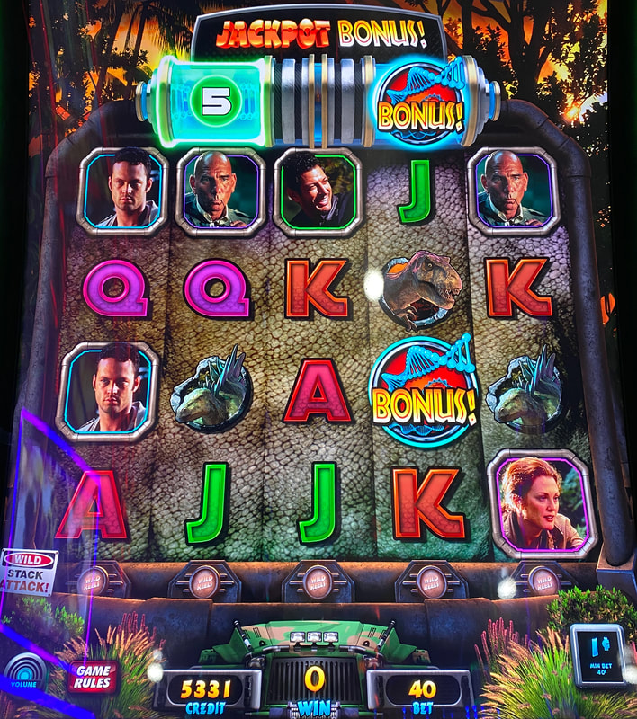
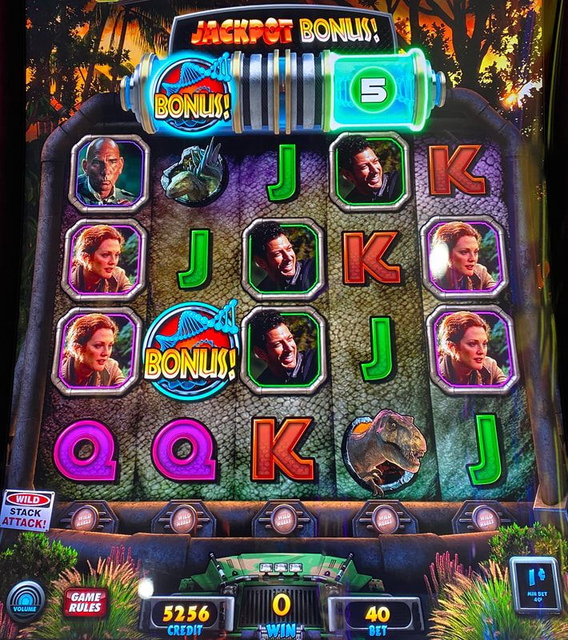

## Thumbnail

## Gameplay Images

### Image 1

### Image 2

**Description:** Even with five spins remaining on the counter above reel two, it can be difficult to land the second bonus symbol.

### Image 3

**Description:** The bonus symbol is much easier to land in reel four, so this is a much better play.

## How The Advantage Works

Jurassic Park Trilogy features a **bonus triggered by symbols in reels 2 and 4**:

**Mechanic:**
- Bonus symbol lands in reel 2 OR reel 4
- Player gets <strong>5</strong> spins to land symbol in the OTHER reel
- Both symbols present → Bonus triggers

**Critical Difference:**
| Reel | Symbol Frequency |
|------|------------------|
| Reel 2 | **Hard** to land |
| Reel 4 | **Easy** to land |

---

## PLAY WHEN

<strong>Primary Requirement:</strong>
- Bonus symbol **already in reel 2**
- Counter showing above reel 4

| Symbol Location | Counter Position | Action |
|-----------------|------------------|--------|
| Reel 2 | Above reel 4 | ✅ **Play** |
| Reel 4 | Above reel 2 | ❌ Skip |

---

## DO NOT PLAY WHEN

- Bonus symbol only in reel 4 (need to land in reel 2 = very hard)
- Counter at 0 or expired
- No bonus symbols visible

---

## STOP WHEN

- Bonus triggers (both symbols landed)
- Spin counter reaches 0

---

## COMMON MISTAKES

- Playing when symbol is in reel 4 only (reel 2 is hard to hit)
- Not knowing reel 4 lands more frequently
- Taking any play with spins remaining (wrong approach)

---

## Additional Notes

**Why Reel 2 vs Reel 4 Matters:**
- Reel 4 symbol lands more frequently
- Starting with reel 2 symbol = Good chance of bonus
- Starting with reel 4 symbol = Very difficult even with 5 spins
- Most APs don't know this difference

**Counter Reset:**
- Landing bonus symbol on reel with existing symbol
- Resets counter to <strong>5</strong> on the other reel

**Game Variants:**
- Several Jurassic Park Trilogy variations exist
- All function the same for advantage purposes