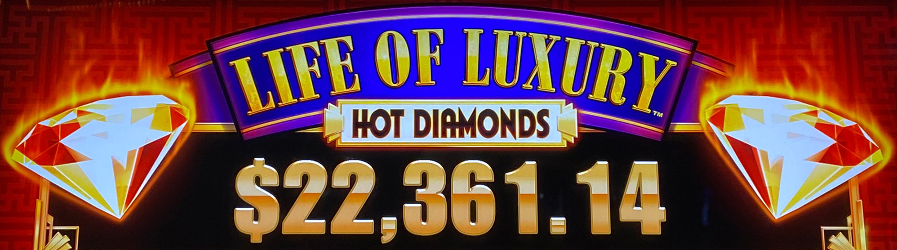
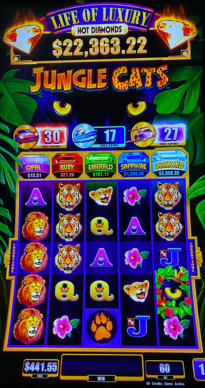
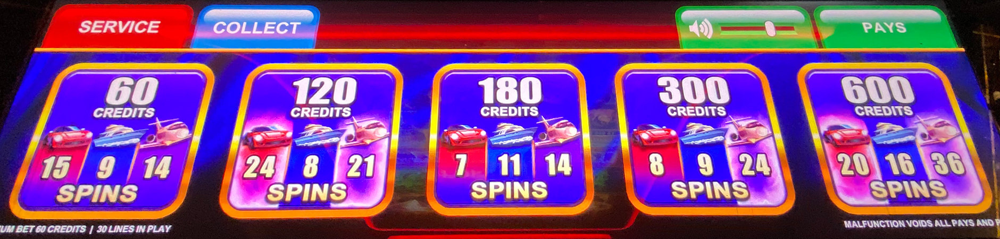

## Thumbnail

## Gameplay Images

### Image 1

### Image 2

**Description:** All of the themes in this series feature a car, a boat and a plane, regardless of whether it actually matches the setting of the game.

### Image 3

**Description:** You can look directly on the bet pad to see the number of free games on all bet levels.

## How The Advantage Works

Life of Luxury Hot Diamonds features **three progressive free games meters** (NOT must-hit-by):

**Meter Types:**
| Meter | Symbol | Luxury Zones | Reset Value |
|-------|--------|--------------|-------------|
| Car | Car | 1 (single) | ~10 |
| Boat | Boat | 2 (double) | ~10 |
| Plane | Plane | 3 (triple) | ~10 |

**Mechanic:**
- Symbol lands → Corresponding meter increases
- 3 scatter symbols → Spin wheel to determine which bonus
- Completely random when bonus triggers (NOT must-hit-by)

---

## ⚠️ BANKROLL WARNING

**This is NOT a must-hit-by game.**
- Completely random when bonus triggers
- Only for experienced APs with large bankrolls
- Most common way APs get destroyed

---

## PLAY WHEN

| Meter | Free Games Threshold |
|-------|---------------------|
| Car | ≥ <strong>40</strong> |
| Boat | ≥ <strong>50</strong> |
| Plane | ≥ <strong>65</strong> |

**How to Check:**
- Look directly on bet pad
- Shows free games count for all bet levels

---

## DO NOT PLAY WHEN

- Car below <strong>40</strong> free games
- Boat below <strong>50</strong> free games
- Plane below <strong>65</strong> free games
- Chasing gem progressives above reels (not worth it)
- You are a newer AP with limited bankroll

---

## STOP WHEN

- Free games bonus triggers (3 symbols, spin wheel)
- You hit your loss limit (set one before playing)

---

## COMMON MISTAKES

- Thinking more spins = closer to hitting (NOT TRUE)
- Chasing without adequate bankroll
- Chasing gem progressives (not worth it)
- Not setting a loss limit before playing

---

## Additional Notes

**Critical Bankroll Warning:**
- "On average" is key—you may not hit in average spins
- Digging deeper hole doesn't mean closer to hitting
- Set a budget you're comfortable losing
- If you don't hit, call it a loss and move on
- Bankroll management is crucially important

**Bonus Mechanic:**
- Land 3 symbols → Spin wheel
- Wheel determines: Car, Boat, or Plane free games
- Luxury Zone on middle row wins credit prizes/gems

**Luxury Zone Value:**
- Car: 1 zone (least valuable)
- Boat: 2 zones (medium)
- Plane: 3 zones (most valuable)

**Game Themes (All Same Strategy):**
- Far East Fortunes ✅
- Great Eagle ✅
- Jungle Cats ✅
- Mermaid's Gold ✅

**Don't Chase:**
- Gem progressives above reels (not worth it)