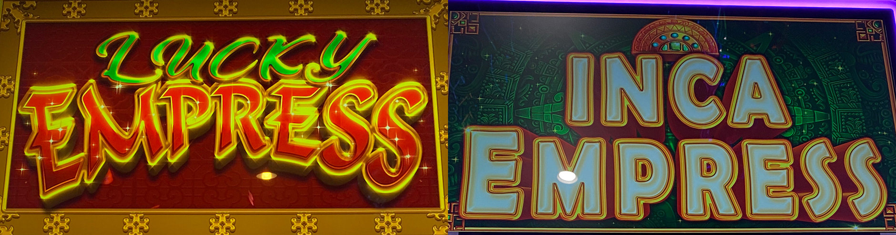
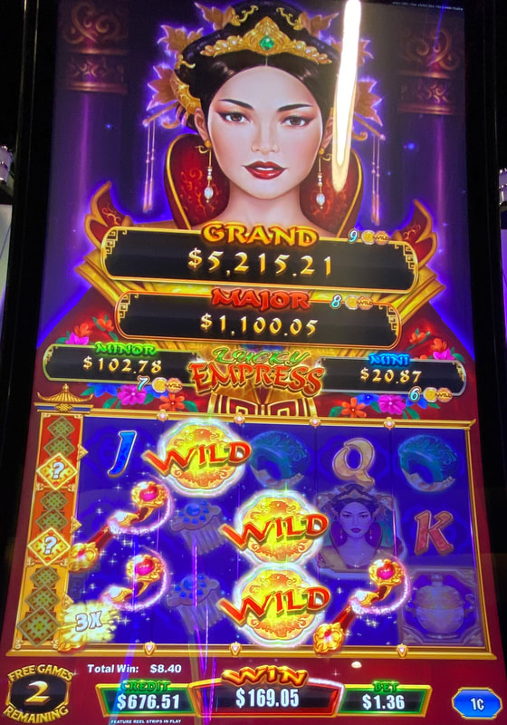
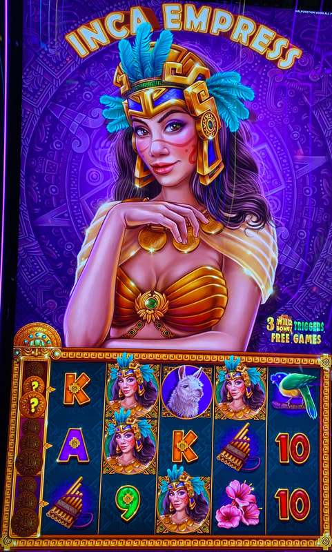

## Thumbnail

## Gameplay Images

### Image 1

### Image 2

**Description:** The free games feature can pay big even on small bets, but it can often disappoint as well.

### Image 3

**Description:** Never play in situations like this where the multipliers are not yet revealed.

## How The Advantage Works

Lucky Empress / Inca Empress features **persistent multipliers** on the left side of rows:

**Mechanic:**
- Tiles with ? land → Move to tile placeholders on left
- <strong>3</strong> tiles collected → Reveals multipliers (2x, 3x, 5x, 8x, 10x, or 12x)
- Bottom multiplier becomes **active** ("X NEXT PAY" shown)
- Line hit on that row → Multiplier applies and disappears
- Next multiplier in queue becomes active

**Tile Appearance:**
| Game | Tile Shape |
|------|------------|
| Lucky Empress | Diamond |
| Inca Empress | Circle |

---

## PLAY WHEN (ANY ONE)

**Option A — High Active Multiplier:**
- Active <strong>10x</strong> or <strong>12x</strong> multiplier

**Option B — Combined Active Multipliers:**
- Active multipliers totaling ≥ <strong>10x</strong>
- Examples: 5x + 5x = 10x | 8x + 3x = 11x

**Option C — Queue Setup:**
- <strong>10x</strong> or <strong>12x</strong> in upcoming queue
- Play through 5x or 8x in front to reach them

| Active Multiplier | Queue | Action |
|-------------------|-------|--------|
| 10x or 12x | Any | ✅ **Play** |
| 5x+5x or similar | Any | ✅ **Play** |
| 5x or 8x | 10x/12x behind | ✅ **Play** |
| Below 10x total | No 10x/12x queued | ❌ Skip |

---

## DO NOT PLAY WHEN

- Active multipliers total below <strong>10x</strong>
- No 10x/12x in queue
- Only question mark tiles (not revealed)
- 2x or 3x multipliers only

---

## STOP WHEN

- Multiplier triggers on line hit
- No <strong>10x+</strong> total remains active or queued

---

## COMMON MISTAKES

- Chasing question mark tiles (might reveal worthless 2x/3x)
- Perpetually chasing small multipliers (they come up frequently)
- Expecting every play to profit (most lose, big wins cover losses)
- Skipping this game entirely (solid play with right rules)

---

## Additional Notes

**High Variance Warning:**
- Lose money most of the time
- Line hits often pathetic ($0.10)
- 10x multiplier might only win $1
- Occasional $100+ wins cover losses

**Don't Chase:**
- Multipliers come up frequently
- Don't get tricked into perpetual chasing
- Question marks might be worthless 2x/3x

**Game Differences:**
| Feature | Lucky Empress | Inca Empress |
|---------|---------------|--------------|
| Progressives | Yes | No |
| Tile shape | Diamond | Circle |
| RTP | 85%–94% | 85%–96% |

Strategy is same for both versions.

**Many APs Skip This:**
- But it's solid if you follow rules
- Accept frequent losses
- Big wins make up for it