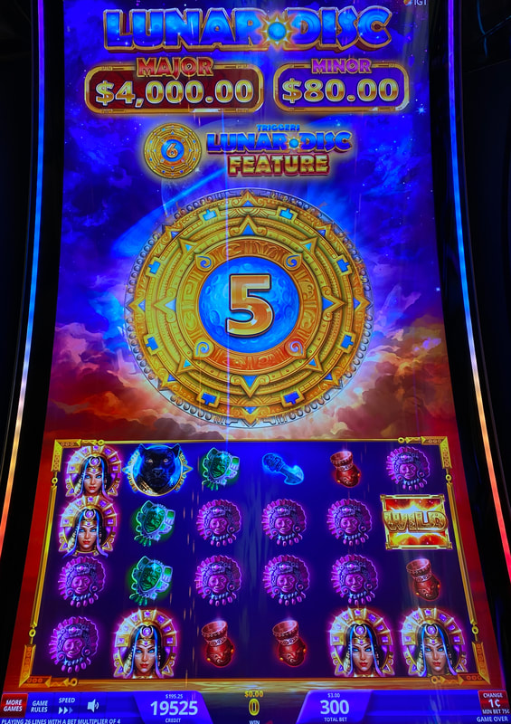
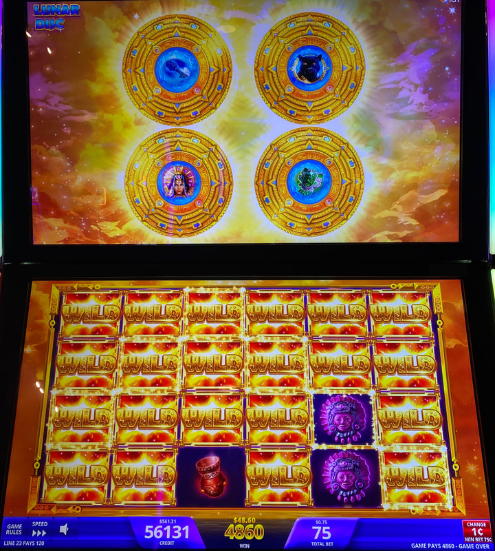
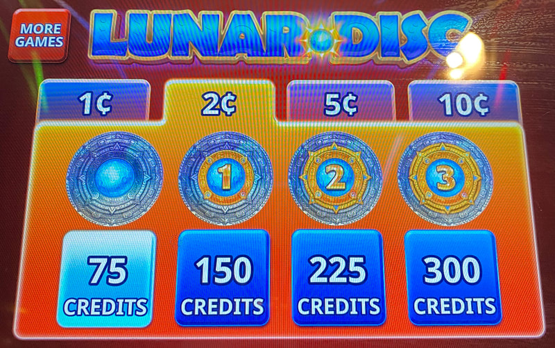
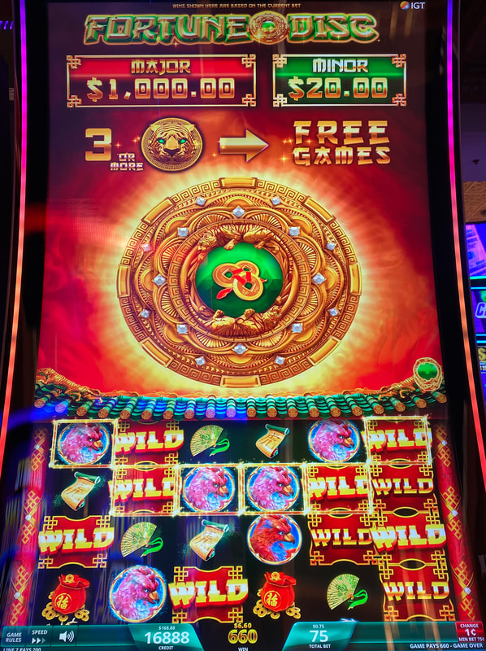

## Thumbnail

## Gameplay Images

### Image 1

### Image 2

**Description:** The disc counter is at five, so this is a solid play.

### Image 3

**Description:** Getting multiple discs active during the feature can lead to nice wins such as this.

### Image 4

### Image 5

**Description:** Fortune Disc is a less common clone of Lunar Disc.

## How The Advantage Works

Lunar Disc / Fortune Disc features **disc collection** that triggers a bonus:

**Mechanic:**
- Discs land on reels → Collected
- <strong>6</strong> discs collected → Triggers bonus
- Bonus: Random symbol turns WILD (all instances)
- If disc lands on disc → Additional disc added, spins again

**Bet Level Starting Discs:**
| Bet Level | Starting Discs |
|-----------|----------------|
| 75 credits | 0 |
| 300 credits | 3 |

---

## PLAY WHEN

<strong>Primary Requirement:</strong>
- Discs collected: <strong>5</strong>

**How to Check:**
- Look **directly on bet pad**

| Discs | Action |
|-------|--------|
| 0–4 | ❌ Walk away |
| 5 | ✅ **Play** |

---

## DO NOT PLAY WHEN

- Discs below <strong>5</strong>
- Just triggered bonus (discs reset)
- Playing at 4 discs (claimed +EV but unproven)

---

## STOP WHEN

- Disc bonus triggers
- Random symbol turns wild

---

## COMMON MISTAKES

- Playing at 4 discs (not confirmed +EV)
- Not checking bet pad for disc count
- Expecting every bonus to pay well (varies)
- Not checking all denominations

---

## Additional Notes

**Game Variants:**
- Lunar Disc ✅
- Fortune Disc ✅ (less common clone)

**Disc Accumulation:**
- Quick to accumulate
- Common for multiple discs to land at once
- Expect to hit feature quickly

**Bonus Mechanic:**
- Disc spins to select wild symbol
- If stops on disc → Adds another disc to board
- Can cascade up to 5+ discs = Huge payouts

**Marginal +EV Warning:**
- Even at 5 discs, may be marginal +EV
- Depends on machine's RTP setting
- Feature doesn't always pay well

**Denominations:**
- Check all bet levels for plays
- Different bet levels have different starting disc counts