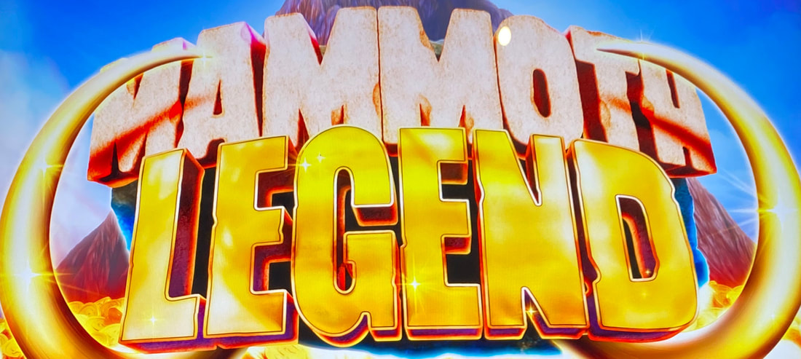
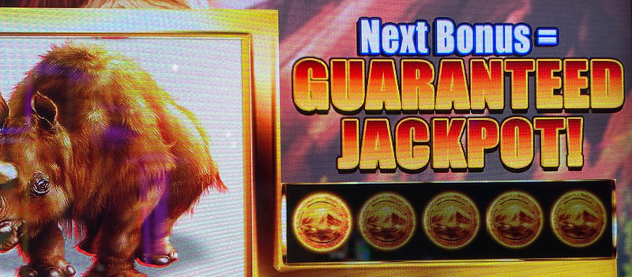
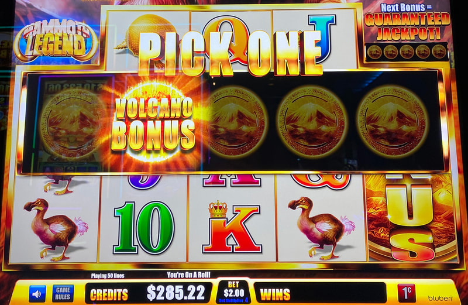
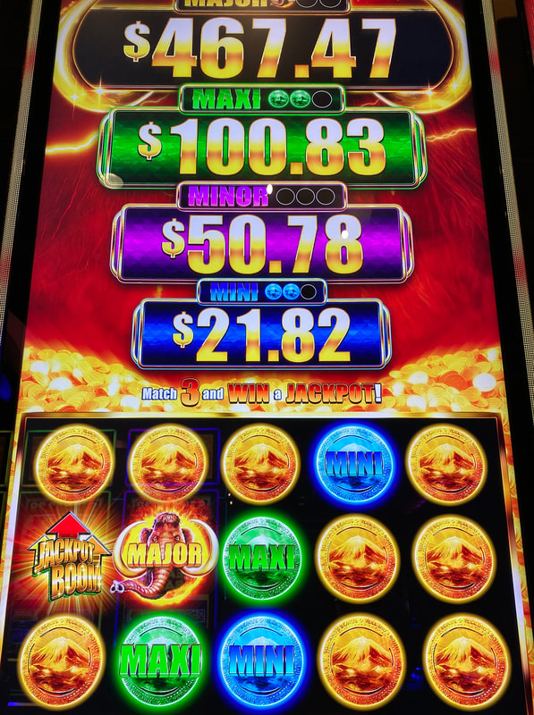
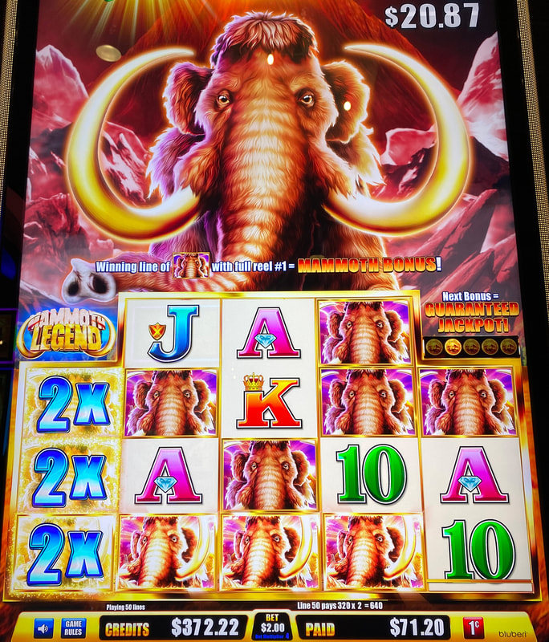

## Thumbnail

## Gameplay Images

### Image 1

### Image 2

**Description:** You are looking for one coin remaining directly above reel five.

### Image 3

**Description:** Once there is only one coin remaining, you are guaranteed to get the Volcano Bonus on your next pick.

### Image 4

**Description:** In the Volcano Bonus, you are guaranteed to win one of the jackpots. If you only get the mini, then you are likely to lose money on the play.

### Image 5

**Description:** The Mammoth Bonus can pay very well, especially if you get a multiplier.

## How The Advantage Works

Mammoth Legend features **coin elimination for guaranteed Volcano Bonus**:

**Mechanic:**
- Bonus symbol lands fully in reel 5 → Pick from 5 coins
- 1 coin = Volcano Bonus, 4 coins = Credit prizes
- Pick credit prize → That coin removed for next time
- <strong>1</strong> coin remaining → Guaranteed Volcano Bonus next pick

---

## ⚠️ RISKY / UNVERIFIED

**Play at your own risk.**
- Limited data to confirm +EV
- Other APs insist it's solid
- Extremely high variance possible
- Could be an AP trap

---

## PLAY WHEN

<strong>Primary Requirement:</strong>
- <strong>1</strong> coin remaining above reel 5
- Screen displays: **"Next Bonus = Guaranteed Jackpot!"**

| Coins Remaining | Action |
|-----------------|--------|
| 1 (Guaranteed Jackpot) | ✅ **Play** (risky) |
| 2+ | ❌ Skip |

---

## DO NOT PLAY WHEN

- More than 1 coin remaining
- No "Guaranteed Jackpot" message

---

## STOP WHEN

- Volcano Bonus triggers

---

## COMMON MISTAKES

- Playing with multiple coins remaining
- Not having adequate bankroll for variance
- Expecting guaranteed profit (can still lose with mini jackpot)

---

## Additional Notes

**Variance Warning (Real Example):**
- $1 bet, 1 coin remaining
- Lost $258 over 19 minutes before triggering
- Won only $15 on Volcano Bonus
- Total loss: $243 on a "playable" setup

**Other Opinions:**
- Some respected APs insist this is +EV with 1 coin
- May just be extremely high variance

**Other Features:**
- Also has Mammoth Bonus (hold & spin)
- Separate from Volcano Bonus