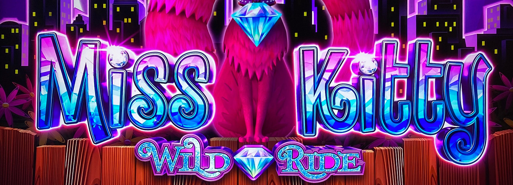
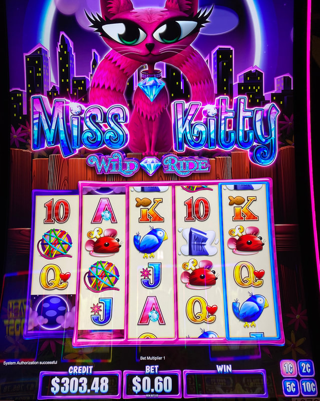
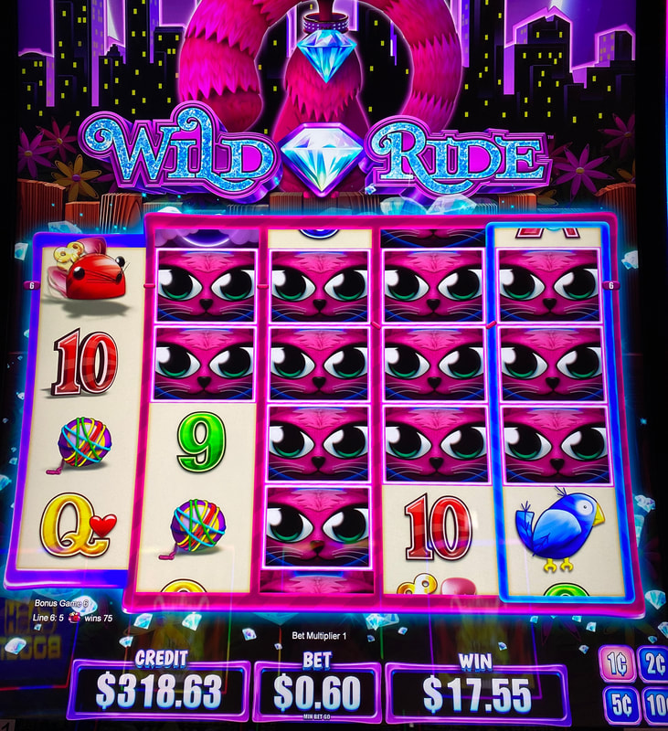

## Thumbnail

## Gameplay Images

### Image 1

### Image 2

**Description:** The Wild Ride Bonus is not active—do not play in this situation.

### Image 3

## How The Advantage Works

Miss Kitty Wild Ride / Zorro Wild Ride features the **Wild Ride Bonus**:

**Mechanic:**
- Wild symbols and multipliers stay for 1 additional spin
- Continues as long as wild/multiplier lands each spin
- No wild/multiplier → Reels shrink, feature ends
- Wild Ride Bonus triggers ~once every <strong>30</strong> spins

**Visual Indicators:**
| Game | Active Indicator |
|------|------------------|
| Miss Kitty Wild Ride | Larger reels + diamonds behind |
| Zorro Wild Ride | Larger reels + flames behind |

---

## PLAY WHEN

<strong>Primary Requirement:</strong>
- Wild Ride Bonus is **active**

**How to Identify:**
- Reels are **larger than normal**
- Special animation behind reels (diamonds or flames)

| Feature Status | Action |
|----------------|--------|
| Wild Ride Bonus active | ✅ **Play** |
| Normal reels (no bonus) | ❌ Walk away |

---

## DO NOT PLAY WHEN

- Normal sized reels (no Wild Ride Bonus)
- No diamonds (Miss Kitty) or flames (Zorro) behind reels

---

## STOP WHEN

- Reels shrink back to normal size
- No wild or multiplier landed on previous spin
- Feature ends

---

## COMMON MISTAKES

- Playing when Wild Ride Bonus is NOT active
- Not recognizing the larger reel visual indicator
- Not checking all denominations

---

## Additional Notes

**Low Cost Play:**
- Usually only a few spins investment
- Potential for huge wins with lined-up wilds/multipliers

**Game Differences (Don't Affect Strategy):**
| Feature | Miss Kitty | Zorro |
|---------|------------|-------|
| Multiplier location | Reel 5 only | Reels 2, 3, 4 |
| Persistent wilds | Reel 5 | Reels 2, 3, 4 |
| Animation | Diamonds | Flames |

**Strategy:** Always play when Wild Ride Bonus active (same for both versions)

**Denominations:**
- Multiple denominations available
- Check all for plays