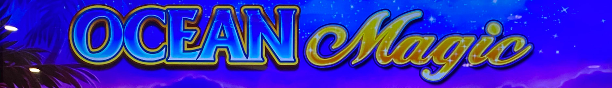
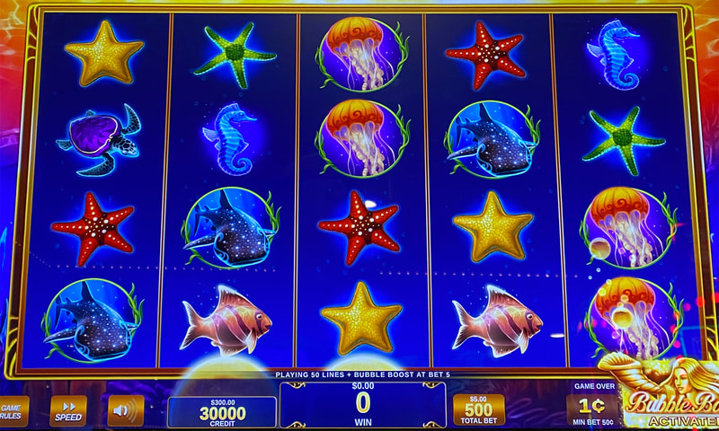
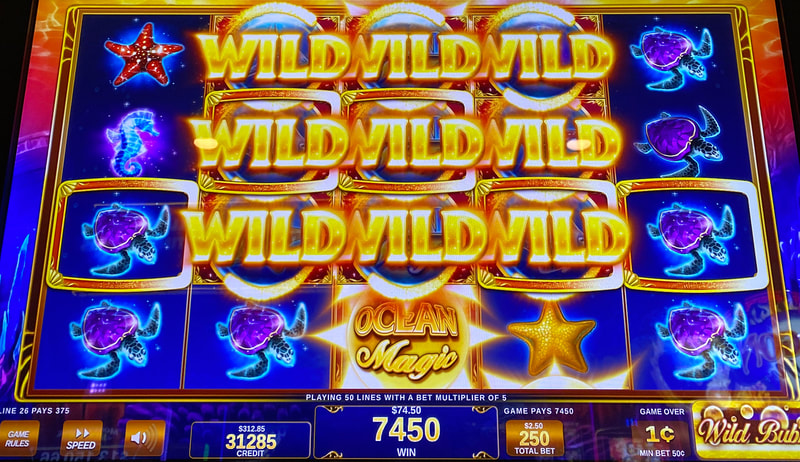
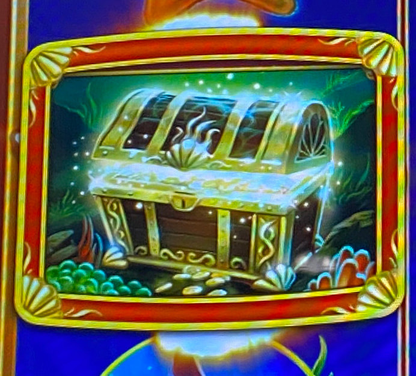
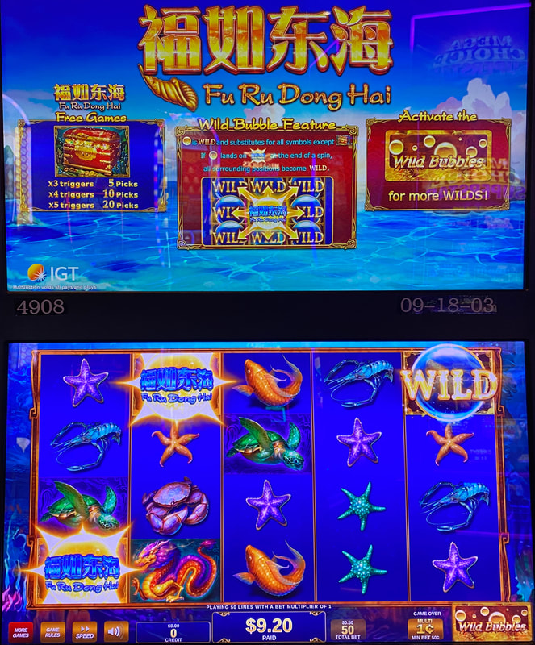

## Thumbnail

## Gameplay Images

### Image 1

### Image 2

**Description:** Having five wild bubbles on the same row is an amazing situation. Bubbles often come in big spurts like this.

### Image 3

### Image 4

### Image 5

### Image 6

**Description:** Fu Ru Dong Hai is an Asian-themed clone of Ocean Magic. It’s not nearly as common as the original Ocean Magic, but you can still find it in some casinos.

## How The Advantage Works

Ocean Magic / Fu Ru Dong Hai features **wild bubbles** that move up:

**Mechanic:**
- Wild bubbles move **up one row** every spin
- Bubble lands on Ocean Magic symbol → All surrounding symbols turn wild
- Bubbles exit screen from top row
- Same strategy for Regular and Bubble Boost modes

**Bubble Value by Position:**
| Reel | Value |
|------|-------|
| Reels 2-3 | Most valuable (more room to expand) |
| Reel 4 | Valuable |
| Reel 5 | Mostly worthless |

---

## PLAY WHEN

<strong>Primary Requirement:</strong>
- Wild bubbles in **reels 1-4** (any row)
- Include **sunrise bubbles** (below bottom row)

**Same Strategy for Both Modes:**
- Regular mode ✅
- Bubble Boost mode ✅

⚠️ **CRITICAL:** Check for sunrise bubbles below bottom row—often overlooked.

---

## DO NOT PLAY WHEN

- Bubbles only in reel 5 (mostly worthless)
- No bubbles visible (including sunrise position)
- All bubbles in top row only (exit next spin)

---

## STOP WHEN

- All bubbles move off screen
- ⚠️ **CHECK:** Sunrise bubbles below bottom row before leaving

---

## COMMON MISTAKES

- Missing sunrise bubbles below bottom row (most overlooked)
- Ignoring reel 4 bubbles (still valuable)
- Playing reel 5 bubbles alone (avoid this)
- Confusing expanded wilds with actual bubbles after expansion

---

## Additional Notes

**Sunrise Bubbles:**
- Located **below** bottom row
- Most important—often overlooked by players and hustlers
- Tend to come in spurts
- Always check before walking away

**Bubble Value Hierarchy:**
1. Reels 2-3, middle rows (most room to expand)
2. Reels 2-3, other rows
3. Reel 4
4. Reel 1
5. Reel 5 (avoid)

**Expanded Wild Confusion:**
- After bubble expands, hard to tell real bubbles from expanded wilds
- **Tip:** Switch bet level and switch back—expanded wilds disappear

**Bubble Boost Mode:**
- Costs 2x but bubbles come in streaks
- Foghorn more likely when bubbles already present
- Extra cost evens out with foghorn wins

**Hit Frequency:**
| Mode | Hit Frequency |
|------|---------------|
| Regular | 20.2% |
| Bubble Boost | 38.2% |

**RTP:** 86% to 96%

**Game Variants:**
- Ocean Magic ✅
- Fu Ru Dong Hai ✅ (Asian-themed clone)