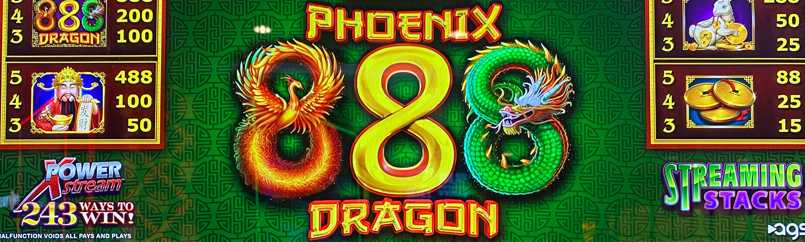
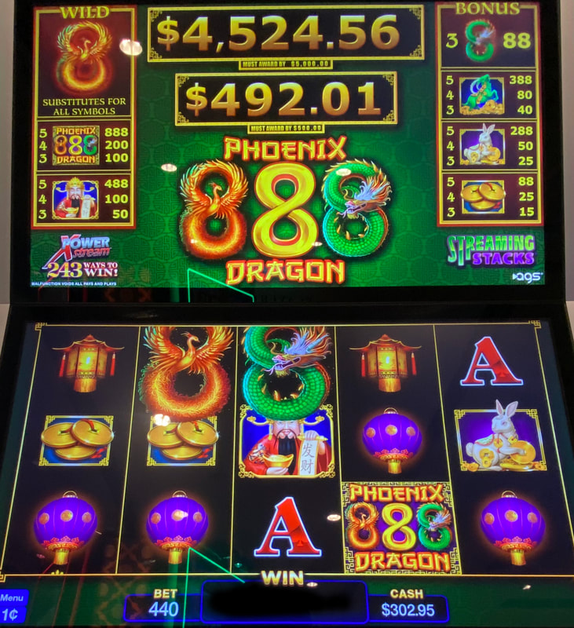
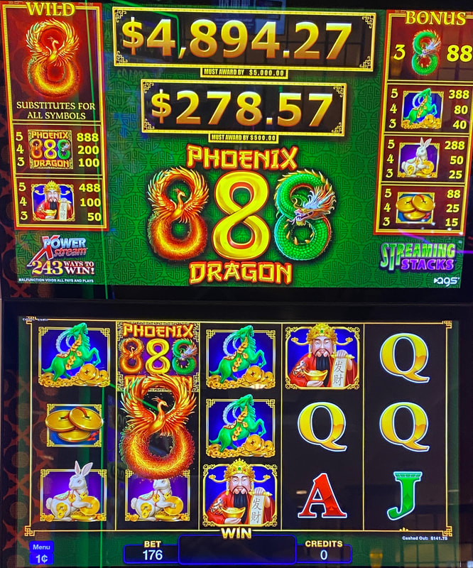

## Thumbnail

## Gameplay Images

### Image 1

### Image 2

**Description:** The bottom MHB $500 progressive usually hits at a random point between $490 and $499.99, so it is likely to hit soon.

### Image 3

## How The Advantage Works

Phoenix 888 Dragon features **two must-hit-by progressive jackpots**:

| Jackpot | Must Hit By | Resets To | Realistic Chance At |
|---------|-------------|-----------|---------------------|
| Mini | $500 | $200 | $490+ |
| Major | $5,000 | $4,000 | $4,990+ |

**Weighted to Top:** Jackpots almost always hit near maximum. Hitting early is exceedingly rare.

---

## PLAY WHEN

| Progressive | Play At (Conservative) |
|-------------|------------------------|
| $500 MHB | ≥ <strong>$481</strong> |
| $5,000 MHB | ≥ <strong>$4,929</strong> |

⚠️ **CRITICAL:** Always **min bet** to reduce variance.

---

## DO NOT PLAY WHEN

- $500 below <strong>$481</strong>
- $5,000 below <strong>$4,929</strong>
- Max betting (too much variance)
- Bankroll below <strong>5x</strong> jackpot value

---

## STOP WHEN

- Jackpot hits
- Progressive resets

---

## COMMON MISTAKES

- Max betting (can lose thousands on bad run)
- Taking play too early hoping to get lucky
- Playing $5,000 without considering taxes
- Not using player's card (losing points)
- Insufficient bankroll

---

## BANKROLL REQUIREMENTS

| Jackpot | Recommended Bankroll |
|---------|---------------------|
| $500 | <strong>$2,500</strong> (5x) |
| $5,000 | <strong>$25,000</strong> (5x) |

**Why 5x:** Bad runs happen. Nothing worse than going bankrupt without getting jackpot.

---

## Additional Notes

**Conservative vs Aggressive:**
- Numbers above are conservative (account for lower RTP)
- Most APs jump at $475 / $4,900
- Some take early to block other hustlers
- Waiting higher = More profit

**Min Bet Strategy:**
- Reduces variance significantly
- Avoids handpays (no W-2G waiting)
- Smooths out ups and downs
- Max bet = More "gambling"

**Ploppy Warning:**
- High progressives attract casual players
- Watch play more closely as numbers approach threshold

**Tax Consideration ($5,000):**
- Factor in taxes on large jackpot
- May need to wait for higher numbers

**RTP:** 86% to 95%

**Player's Card:**
- Use it—especially for $5,000 chase
- Points can lead to lucrative freeplay offers