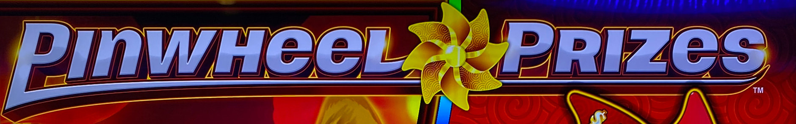
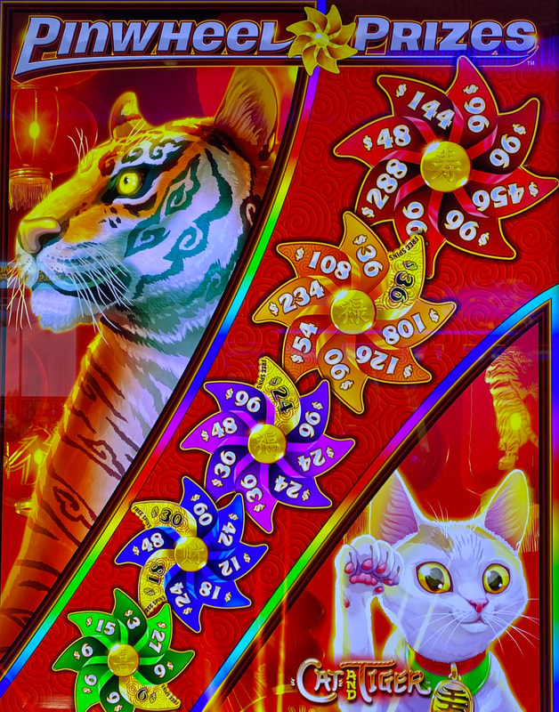
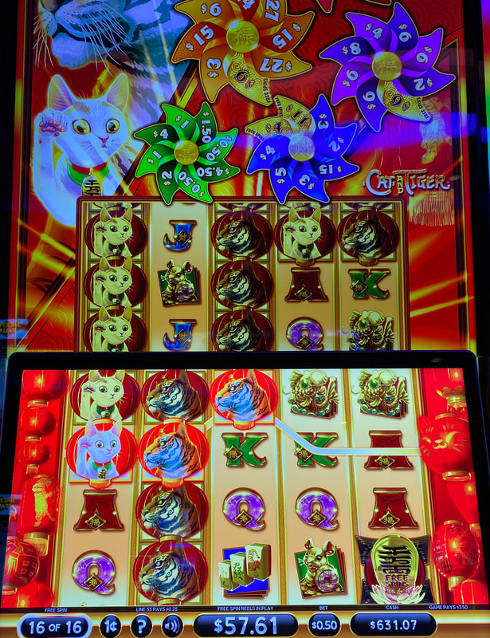

## Thumbnail

## Gameplay Images

### Image 1

### Image 2

### Image 3

**Description:** This free spins bonus retriggered to 16 games, which gave me a win of over 100x my bet.

## How The Advantage Works

Pinwheel Prizes (Cat & Tiger / Majestic Oasis) features **five pinwheels** with wedges:

**Pinwheel Colors (Left to Right):**
| Color | Reel | Trigger Difficulty |
|-------|------|-------------------|
| Green | 1 | Easiest |
| Blue | 2 | Easy |
| Purple | 3 | Medium |
| Orange | 4 | Hard |
| Red | 5 | Hardest |

**Mechanic:**
- Each pinwheel has 8 wedges (credit prizes or golden wedges with free spins)
- Scatter lands → Increases credit value on wedge, may upgrade to golden
- <strong>3</strong> same-color scatters → Spins that pinwheel, win a wedge
- Wedge won → Resets to default

**Golden Wedges:**
- Always contain <strong>8</strong> free spins (all colors same)
- Transform randomly (not based on credit size)

---

## PLAY WHEN (ANY ONE)

**Option A — Green + Blue Focus:**
- <strong>10+</strong> golden wedges in green + blue combined
- (Green and blue are easiest to trigger)

**Option B — Total Golden Wedges:**
- <strong>15+</strong> golden wedges anywhere

**How to Check:**
- Look directly on bet pad for golden wedge count
- ⚠️ Number alone doesn't always indicate play—check distribution

---

## DO NOT PLAY WHEN

- Fewer than <strong>10</strong> golden wedges in green + blue
- Fewer than <strong>15</strong> golden wedges total
- Golden wedges concentrated in purple/orange/red (hard to trigger)

---

## STOP WHEN

- Golden wedge prize awarded (wedge resets)
- Remaining golden wedges fall below threshold

---

## COMMON MISTAKES

- Playing any golden wedges without considering color distribution
- Wasting money on non-+EV states (common hustler mistake)
- Chasing purple/orange/red golden wedges (hard to trigger)
- Relying only on bet pad number without checking colors

---

## Additional Notes

**Not Very Lucrative:**
- Rare to find in playable state
- Many hustlers waste money playing when not +EV

**Pinwheel Behavior:**
- Top pinwheels have larger default credit prizes
- Green/blue reset values are not lucrative
- Enhancing golden wedge increases credit but NOT free spins

**Free Spins Bonus:**
- Reels expand (more scatter chances)
- Retriggers: 2 scatters = +4 spins, 3 scatters = +8 spins
- Winning golden wedge during bonus also retriggers

**RTP by Version:**
| Version | RTP Range |
|---------|-----------|
| Cat & Tiger | 88.14% – 98.15% |
| Majestic Oasis | 85.13% – 94.14% |