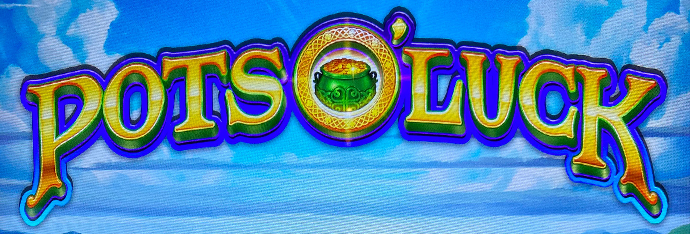
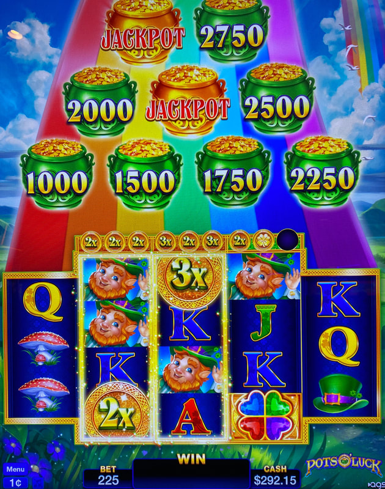
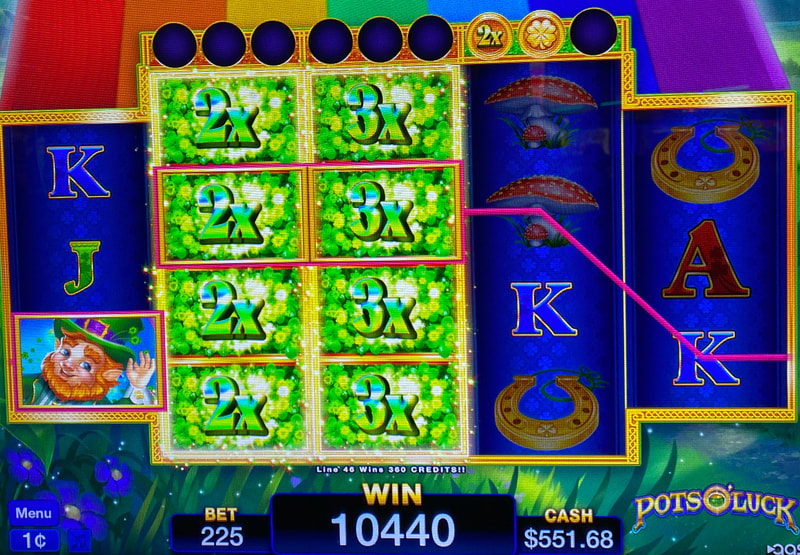
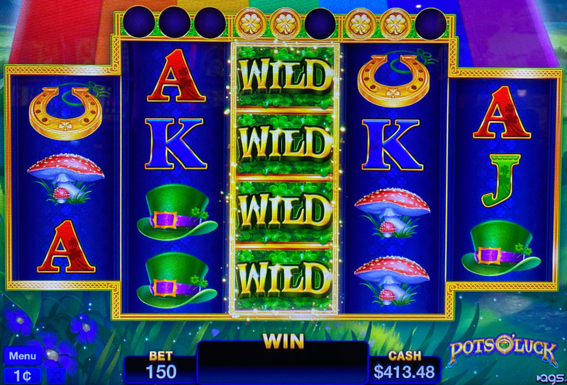

## Thumbnail

## Gameplay Images

### Image 1

### Image 2

### Image 3

**Description:** The glowing gold borders (and 2x and 3x symbols) stay on the reels when switching between bet levels. This makes the game difficult to hustle.

### Image 4

**Description:** The middle reel here looks like it has two wild spins remaining. But look closely and you will notice the background behind the coins is green (rather than orange), so this is not a play.

## How The Advantage Works

Pots O' Luck features **coin collection for wild reels**:

**Mechanic:**
- Coin holders above reels 2, 3, and 4
- <strong>3</strong> coins collected → Reel turns wild for <strong>3</strong> spins
- Coins can be plain (1x) or multipliers (2x, 3x)

---

## ⚠️ BORDERLINE AP TRAP

**Understand the anti-hustling features before playing:**
- First 2 coins land very quickly
- 3rd coin is MUCH harder to get
- Game tricks players into thinking 2 coins = profitable (it's not)
- Gold borders DON'T change between bet levels (can be faked)

---

## CRITICAL: Verify Active Wilds

**The gold border alone is NOT reliable.**

| Background Color | Wilds Active? |
|------------------|---------------|
| **ORANGE** | ✅ Yes - Actually active |
| **GREEN** | ❌ No - NOT active (trap!) |

**Always check the background color behind the coins!**

---

## PLAY WHEN (ANY ONE)

**Option A — Multiplier Setup:**
- Multipliers in reels 2 + 3 totaling <strong>10x+</strong>
- Count plain coins as 1x
- Examples: 3x + 3x + 2x + 2x = 10x ✅

**Option B — Active Wilds (Reels 2-3):**
- Active wilds in reels 2 OR 3
- **VERIFY:** Orange background behind coins

**Option C — Active Wilds (Reel 4):**
- Active wilds in reel 4
- AND multiplier coins (2x or 3x) above reel
- **VERIFY:** Orange background behind coins

---

## DO NOT PLAY WHEN

- Green background behind coins (NOT active)
- Only plain coins without meeting 10x threshold
- Two coins above reel (extremely common, NOT +EV)

---

## STOP WHEN

- Wild reel spins deplete (coins above reel empty)

---

## COMMON MISTAKES

- Trusting gold border without checking background color
- Playing 2-coin setups (game is rigged to reach 2 coins quickly)
- Thinking pots of gold display matters (it doesn't)
- Not verifying orange vs green background

---

## Additional Notes

**Hustler Sabotage Warning:**
- Other hustlers can switch bet levels after playing wilds
- Gold border stays but wilds aren't active
- ALWAYS verify orange background

**Two Coins = Trap:**
- Extremely common to find 2 coins on all reels
- First 2 coins land very quickly
- 3rd coin is much harder to get
- If it were always +EV, everyone would know

**Pots of Gold Display:**
- Just for show
- Jackpot bonus NOT more likely with more revealed

**Free Check Method:**
- Tap bet level on main touchscreen
- No money required