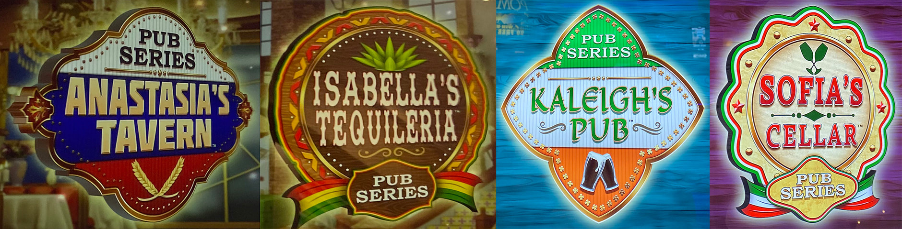
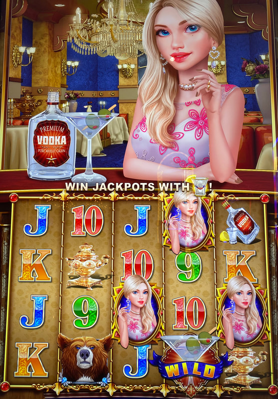
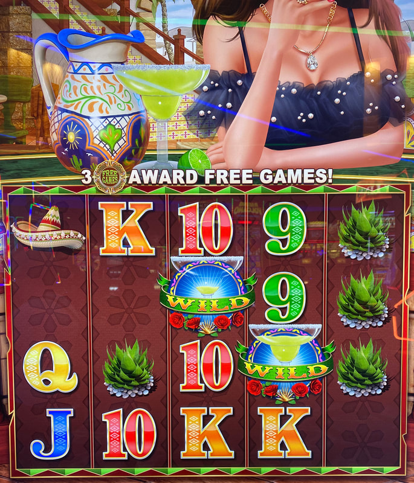
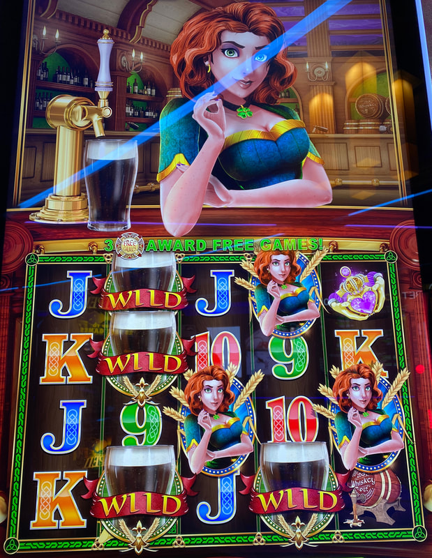
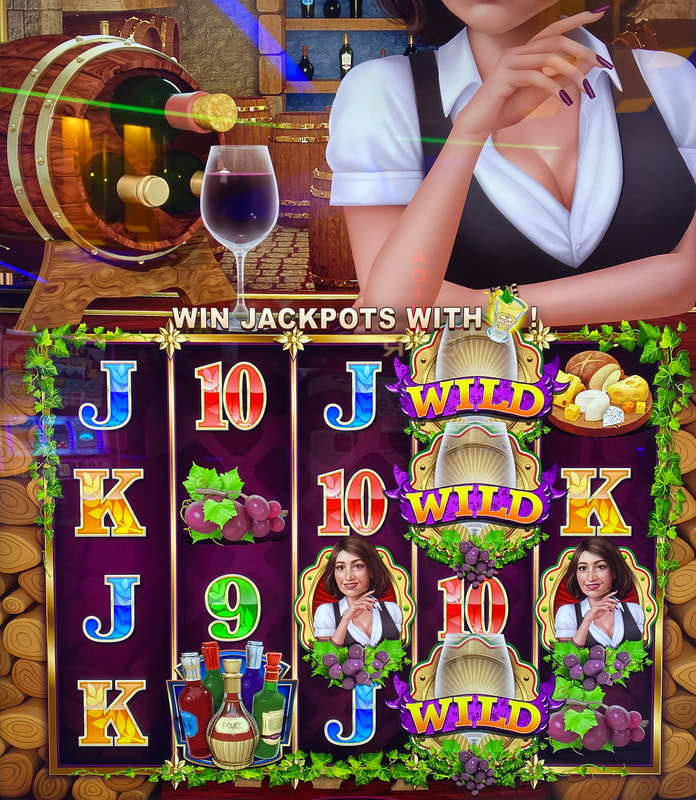

## Thumbnail

## Gameplay Images

### Image 1

### Image 2

**Description:** On Anastasia’s Tavern, the sticky wild at the bottom of reel four will be around for one more spin.

### Image 3

**Description:** On Isabella’s Tequileria, the wild in reel three will disappear next spin, while the wild in reel four will last for one more spin.

### Image 4

**Description:** This is a solid play on Kaleigh’s Pub—each wild will persist for two additional spins.

### Image 5

**Description:** On Sofia’s Cellar, the wilds in reel four will disappear next spin, so don’t play in this situation.

## How The Advantage Works

The Pub Series features **sticky wilds + on-the-house meter**:

**Game Variants:**
- Anastasia's Tavern
- Isabella's Tequileria
- Kaleigh's Pub
- Sofia's Cellar

**Mechanic:**
- Drink wilds appear in reels 2, 3, and 4
- Wilds stay for <strong>2</strong> additional spins after landing
- "On-the-house" meter triggers free games when full

**Reading the Drinks:**
| Glass Level | Spins Remaining | Action |
|-------------|-----------------|--------|
| Full | <strong>2</strong> spins | ✅ Play |
| Half-full | <strong>1</strong> spin | ✅ Play |
| Empty/near-empty | <strong>0</strong> spins | ❌ Skip (disappears next spin) |

---

## PLAY WHEN (ANY ONE)

**Option A — Active Wilds (Reels 2-3):**
- Full or half-full drink wilds in reels 2 OR 3

**Option B — Active Wilds (Reel 4):**
- <strong>3</strong> or more active drink wilds in reel 4

**Option C — On-The-House Meter:**
- Meter halfway into last full segment
- Look for red showing in final segment
- Located on bet pad

| Setup | Action |
|-------|--------|
| Active wilds in reel 2 or 3 | ✅ **Play** |
| 3+ active wilds in reel 4 | ✅ **Play** |
| Meter in last segment (red showing) | ✅ **Play** |
| Empty/near-empty glasses only | ❌ Skip |

---

## DO NOT PLAY WHEN

- Glass looks empty or has tiny amount in bottom (disappears next spin)
- Only wilds in reel 4 without meeting 3+ threshold
- Meter not yet in last segment

---

## STOP WHEN

- All drink wilds empty and disappear from reels
- Free games bonus triggers (if playing meter)

---

## COMMON MISTAKES

- Playing empty/near-empty glasses (they disappear next spin)
- Not checking glass fill level carefully
- Missing that meter feature doesn't exist on older versions
- Confusing wild appearance with actual spins remaining

---

## Additional Notes

**Not All Versions Have Meter:**
- On-the-house meter is newer software update
- Some older machines don't have this feature
- Check bet pad for meter presence

**Free Check Method:**
- Tap menu icon in lower left
- Use up/down arrows to cycle bet levels
- Wilds show on top of symbols when present
- Symbols underneath won't change

**Meter Fill Rate:**
- Increments randomly on any spin
- Usually fills quickly from last segment