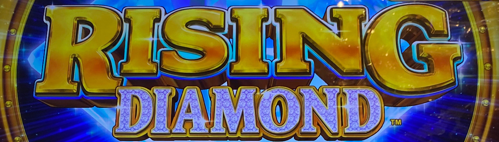
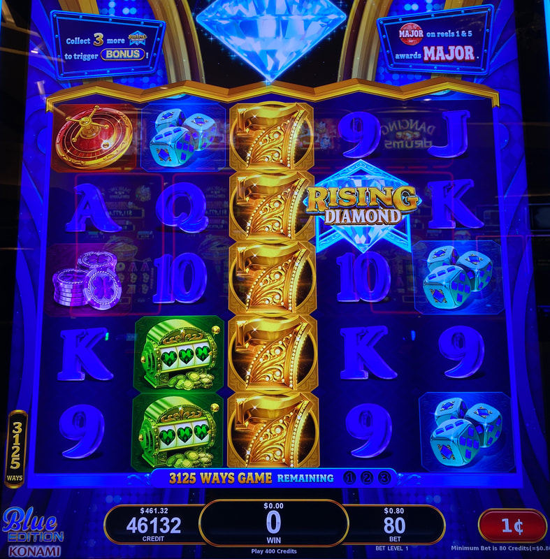
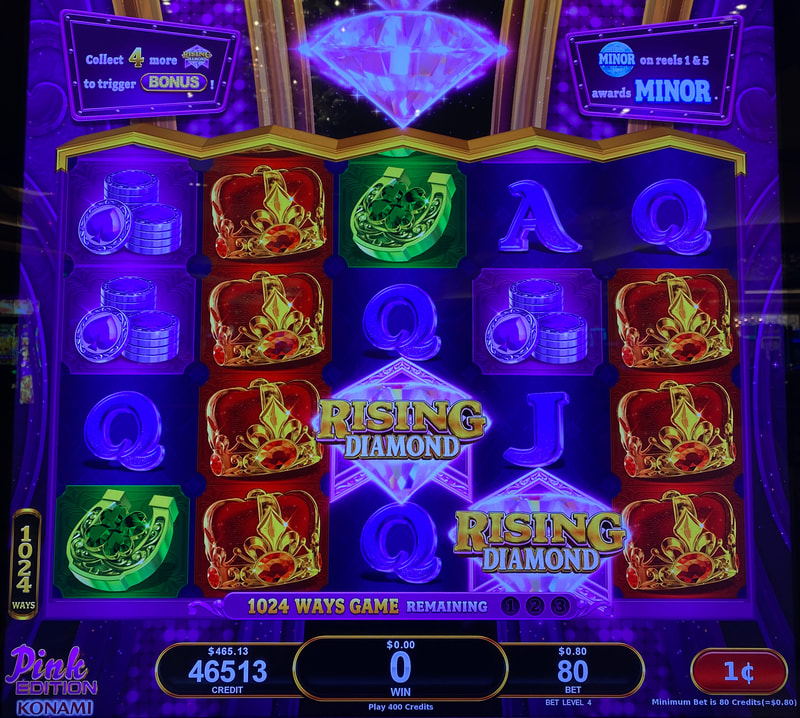
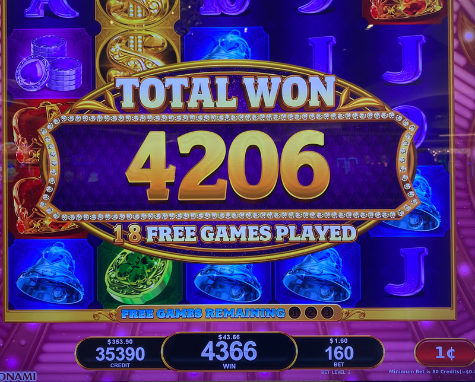

## Thumbnail

## Gameplay Images

### Image 1

### Image 2

### Image 3

### Image 4

**Description:** This is also a play, even with the ways at 1024 and zero spins remaining. The two diamond symbols will expand the reels two levels on the next spin, all the way to 7776.

### Image 5

**Description:** The bonus feature is fairly volatile, but it can lead to nice wins, especially with multiple retriggers (which are easy to get).

## How The Advantage Works

Rising Diamond features **expanding reels with diamond wilds**:

**Mechanic:**
- Diamond symbols land in reels 2, 3, and 4
- Diamond lands → Reels expand one level NEXT spin
- Player gets <strong>3</strong> spins to land more diamonds
- No diamond within 3 spins → Reels drop one level
- Max height triggers bonus feature

**Reel Heights (Ways-to-Win):**
| Level | Ways | Notes |
|-------|------|-------|
| 1 | 243 | Starting level |
| 2 | 1,024 | |
| 3 | 3,125 | |
| 4 | 7,776 | |
| 5 | 16,807 | Triggers bonus |

**Key Insight:**
- Diamonds expand on NEXT spin, not current spin
- Zero spins remaining + diamond on reel = Still a play

---

## PLAY WHEN

**Always Play:**
- <strong>16,807</strong> ways (always play)

**With Spins Remaining:**
- <strong>7,776</strong> ways with <strong>1+</strong> spins remaining

**With Diamonds Visible (even at 0 spins):**

| Current Ways | Diamonds on Reels | Action |
|--------------|-------------------|--------|
| 7,776 | <strong>1+</strong> | ✅ **Play** |
| 3,125 | <strong>1+</strong> | ✅ **Play** |
| 1,024 | <strong>2+</strong> | ✅ **Play** |
| 243 | <strong>3</strong> | ✅ **Play** (rare) |

---

## DO NOT PLAY WHEN

- 7,776 ways with 0 spins and no diamonds visible
- Lower ways without enough diamonds to compensate
- Below playable thresholds

---

## STOP WHEN

- Bonus feature triggers at max height (16,807 ways)

---

## COMMON MISTAKES

- Not knowing diamonds expand on NEXT spin
- Ignoring machines at 0 spins with diamonds visible
- Not counting diamonds on reels at lower way levels
- Forgetting reels only drop ONE level (not reset)

---

## Additional Notes

**Diamonds = Wilds:**
- Diamond symbols also function as wild symbols
- Up to 3 diamonds can land at once (multi-level expansion)

**Drop Behavior:**
- Reels only drop ONE level without a diamond
- Can drop from 16,807 → 7,776 and still be a play

**Game Variants:**
- Pink and Blue themes available
- Same AP strategy for both

**RTP Range:**
- 87.09% to 94.06%