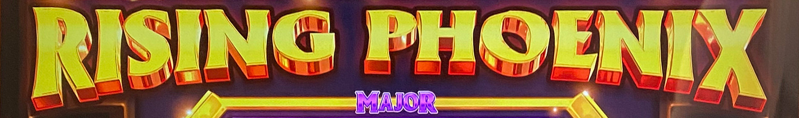
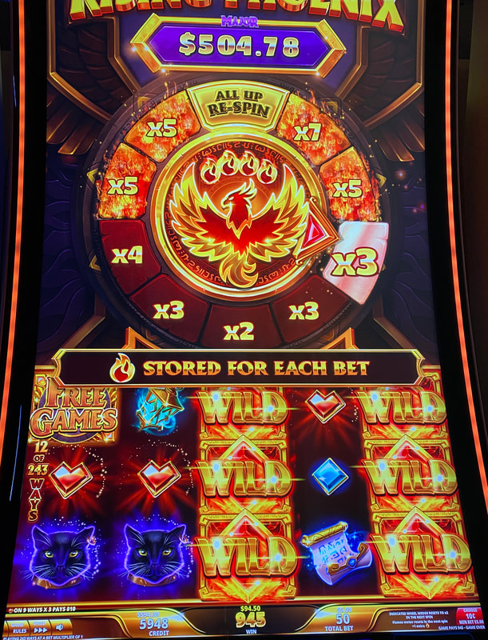
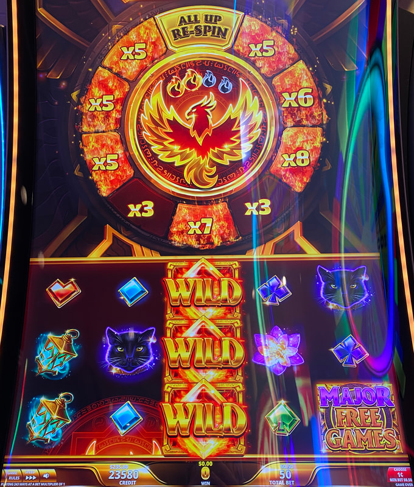
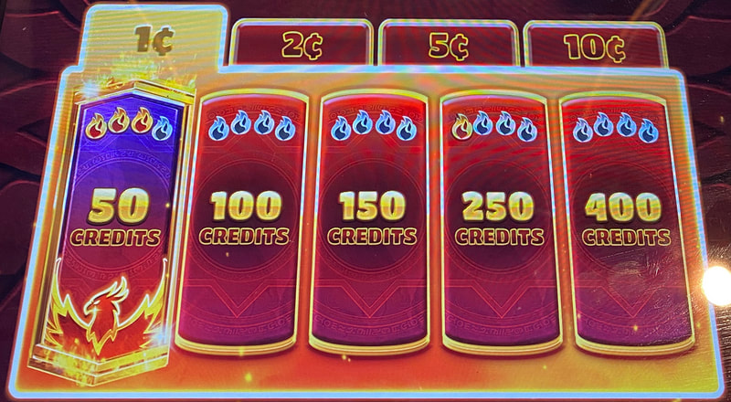

## Thumbnail

## Gameplay Images

### Image 1

### Image 2

### Image 3

**Description:** The total multipliers on the wheel add up to 47x here, so this is a play even with two flames collected.

### Image 4

**Description:** You can look directly on the bet pad to see the flames collected for each bet level.

## How The Advantage Works

Rising Phoenix features a **multiplier wheel** with flame meter:

**Mechanic:**
- Phoenix lands → Reel turns wild, fills 1 flame spot
- <strong>4</strong> flames filled + line hit → Wheel spins, multiplier applied
- No line hit at 4 flames → Up to 3 wedges increase by 1x
- After 4th flame fills → Meter clears (line hit or not)

**Wedge Values:**
- Start at <strong>2x</strong>
- Flames appear at <strong>5x+</strong>
- Max value: <strong>20x</strong> (rare)
- After triggered: Resets to <strong>2x</strong>

---

## PLAY WHEN

**Check bet pad for flame count, then add all wedge multipliers:**

| Flames | Required Total Multipliers |
|--------|---------------------------|
| 3 | ≥ <strong>24x</strong> (or 2+ wedges on fire) |
| 2 | ≥ <strong>36x</strong> |
| 1 | ≥ <strong>48x</strong> |
| 0 | ≥ <strong>60x</strong> |

**Wedge on Fire = 5x or higher (yellow flames visible)**

---

## DO NOT PLAY WHEN

- Multiplier totals below thresholds above
- Only looking at flames without checking multipliers

---

## STOP WHEN

- Flame meter fills and wheel spins
- Triggered wedge resets to <strong>2x</strong>
- Remaining multipliers fall below threshold

---

## COMMON MISTAKES

- Only playing 3 flames without checking multipliers
- Missing plays with 2/1/0 flames but high multipliers
- Expecting 3-of-a-kind to pay well (need 5-of-a-kind)
- Not recognizing flaming wedges (5x+)

---

## Additional Notes

**Hidden Plays:**
- Most APs only look at flame count
- Common to find 2/1/0 flame plays others passed over
- Always check multiplier totals, not just flames

**Variance:**
- Lower variance: Smaller multipliers spread across more wedges
- Higher variance: Large multipliers in few wedges
- Need 5-of-a-kind for good payout (3-of-a-kind pays poorly)

**All Up Re-Spin Wedge:**
- Increases ALL wedge multipliers by 1x
- Wheel spins again
- Cannot trigger twice in a row

**Free Games Feature:**
- Wedge multipliers carry over
- Feathers replaced with phoenix symbols
- Wheel triggers more frequently
- Major/Grand jackpot replaces All Up wedge

**Big Wins:**
- Multiple phoenix symbols at once
- Possible handpays on $4 bets when things work out