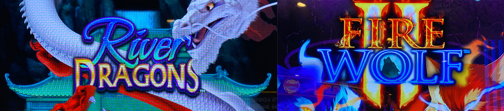
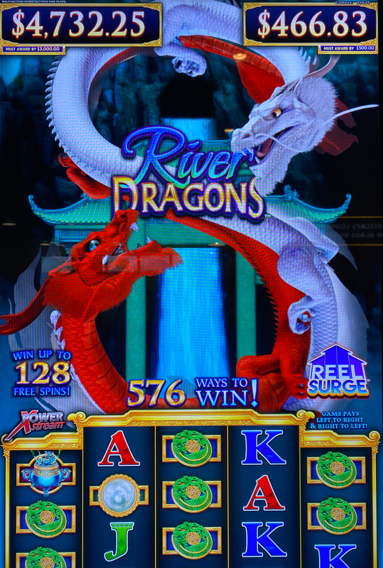
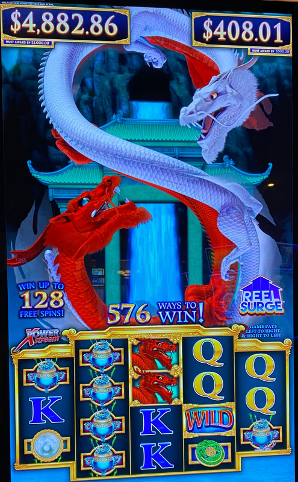
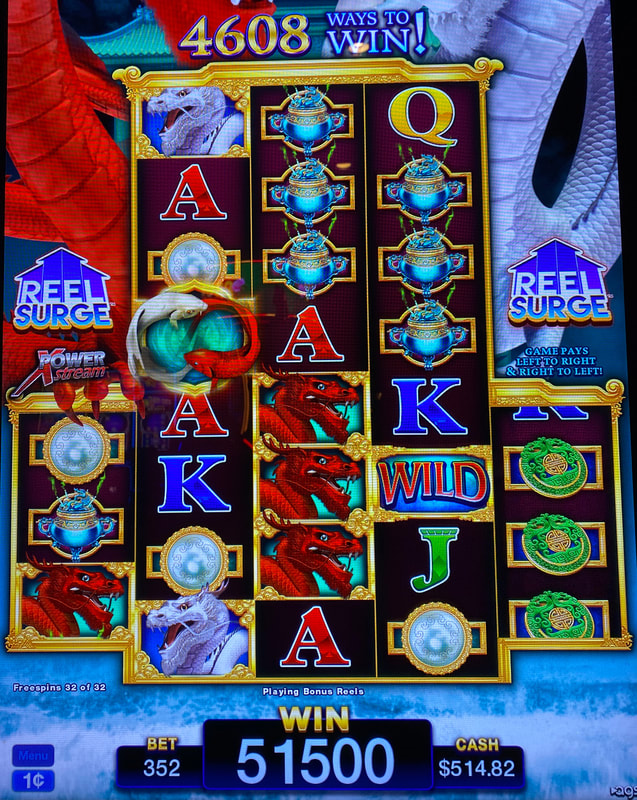
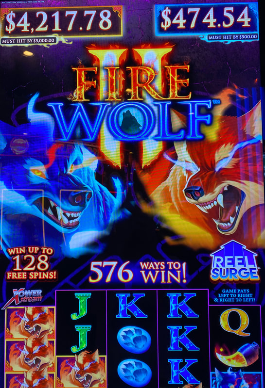

## Thumbnail

## Gameplay Images

### Image 1

### Image 2

**Description:** Neither of these numbers are even close to playable.

### Image 3

**Description:** The MHB $5k is still far away from a profitable number, but I wouldn’t be surprised if another AP jumps on this soon just to build up their player’s card.

### Image 4

**Description:** River Dragons can be fairly volatile—the amount of profit you make often comes down to how many good bonuses like this that you hit.

### Image 5

**Description:** Fire Wolf 2 plays just like River Dragons.

## How The Advantage Works

River Dragons series features **two MHB progressive jackpots**:

**Game Variants:**
- River Dragons
- Fire Wolf 2
- Forest Dragons
- Winter of the Dragons
- Wolf Queen

**Progressive Structure:**
| Jackpot | MHB | Resets To |
|---------|-----|-----------|
| $500 | $500 | $200 |
| $5,000 | $5,000 | $2,000 or $4,000 |

**Jackpot Weighting:**
- Weighted to hit at the VERY TOP
- Realistic chance starts at $490 / $4,990
- Always assume they will go to the end

---

## ⚠️ HIGH STAKES WARNING

**Bankroll Requirements:**
| Jackpot | Recommended Bankroll |
|---------|---------------------|
| $500 | <strong>$2,500</strong> (5x) |
| $5,000 | <strong>$25,000</strong> (5x) |

**Tax Consideration:**
- $5,000 jackpot may have significant tax liability
- Factor this into your play decision

---

## PLAY WHEN

| Progressive | Play At | Notes |
|-------------|---------|-------|
| $500 MHB | <strong>$486+</strong> | Conservative threshold |
| $5,000 MHB | <strong>$4,920+</strong> | Conservative threshold |

**Note:** These thresholds account for lower RTP settings. Wait higher for more profit.

---

## DO NOT PLAY WHEN

- Below threshold amounts
- Without adequate bankroll
- "Xtreme Jackpots" variants (no MHB)
- Max betting without understanding variance

---

## STOP WHEN

- MHB jackpot hits and resets

---

## COMMON MISTAKES

- Max betting (increases variance dramatically)
- Taking play too early ($480 / $4,900)
- Not having adequate bankroll
- Expecting early hits (rare)
- Missing tax implications on $5,000

---

## Additional Notes

**Min Bet Strategy:**
- Always spin at lowest bet within time constraints
- Higher bets = more "gambling"
- Min bet avoids handpays and W-2Gs
- Smooths variance over time

**Competition Warning:**
- Many APs jump at $480 / $4,900
- Some take early for card points
- Watch closely as numbers approach playable

**Time Estimates ($500 from $486):**
| Bet | Estimate |
|-----|----------|
| $0.88 | ~2 hours |
| $1.76 | ~1 hour |
| $3.52 | ~30 min |

**Time Estimates ($5,000 from $4,920):**
| Bet | Estimate |
|-----|----------|
| $0.88 | ~16 hours |
| $1.76 | ~8 hours |
| $3.52 | ~4 hours |

**Forest Dragons Note:**
- Rumored to NOT be weighted to hit at top
- Unconfirmed - play at standard thresholds

**RTP Range:**
- 86% to 95%