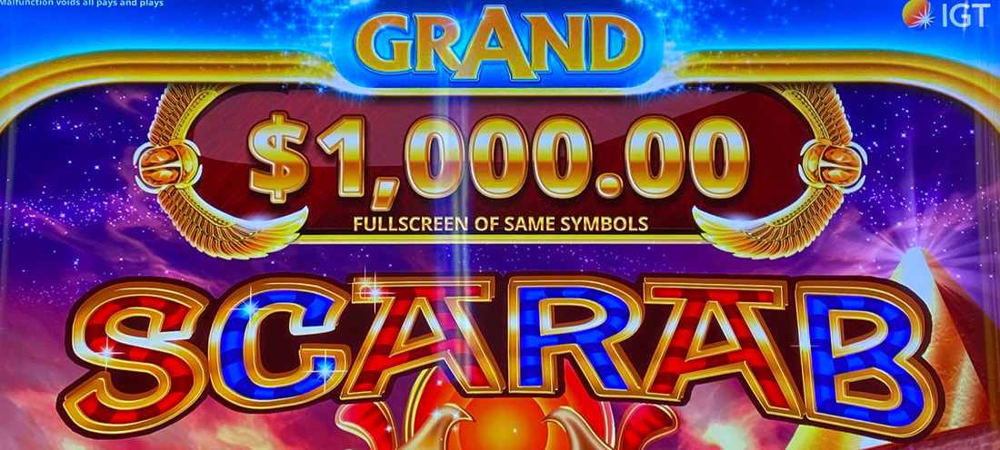
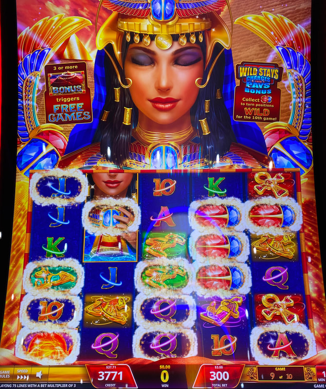
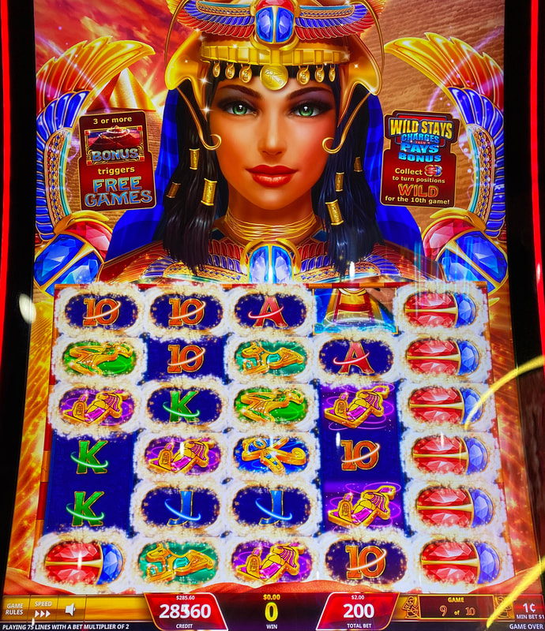

## Thumbnail

## Gameplay Images

### Image 1

### Image 2

### Image 3

**Description:** The next spin will lead to a huge win with this many locked frames.

## How The Advantage Works

Scarab Grand operates on a **10-game cycle** with frame collection:

**Mechanic:**
- Locked frames accumulate through 10-game cycle
- Spin 10 → All accumulated frames turn WILD
- Full board of frames = <strong>1000x</strong> bet payout
- Taller reelset than original Scarab (+2 rows)

**Goal:** Frames in first 3 reels, aligned horizontally for 4/5-of-a-kind

---

## PLAY WHEN

### ❌ NEVER: Game 10 of 10

---

### Game 9 of 10
- <strong>2+</strong> frames in first three reels

### Game 8 of 10 / Game 7 of 10
- <strong>3+</strong> frames in first three reels
- **All on same row**

### Game 6 of 10 / Game 5 of 10
**Either:**
- <strong>5+</strong> frames in first three reels
- OR <strong>3+</strong> frames in first four reels, all same row

### Game 4 of 10 / Game 3 of 10
**Either:**
- <strong>6+</strong> frames in first three reels
- OR <strong>4+</strong> frames, all on same row

### Game 2 of 10 / Game 1 of 10
**Either:**
- <strong>7+</strong> frames in first three reels
- OR <strong>4+</strong> frames, all on same row

---

## DO NOT PLAY WHEN

- Game <strong>10</strong> of 10 (NEVER)
- Frames not aligned horizontally (late in cycle)
- Only 3-of-a-kind possible (pays poorly)

---

## STOP WHEN

- Spin 10 completes
- All frames turn wild
- Board resets

---

## COMMON MISTAKES

- Playing game 10 of 10
- Expecting 3-of-a-kind to pay well (aim for 4+ of a kind)
- Not prioritizing horizontal alignment late in cycle

---

## Additional Notes

**Simplified Rule:**
- Lots of frames on left side
- Preferably connected horizontally
- Further in cycle = Better value

**Strategy Logic:**
- Mid-cycle plays: Getting 10-cycle return for partial cost
- Earlier in cycle = More gambling (outcome less known)
- Game 9 abandoned = Almost always worth playing

**Free Games Bonus:**
| Option | Free Games | Random Wilds | Volatility |
|--------|------------|--------------|------------|
| A | 20 | 7 | Low |
| B | 12 | 10 | Medium |
| C | 5 | 15 | High |

All options pay same on average—choose 20 games to lower variance.

**RTP:** 85% to 96%