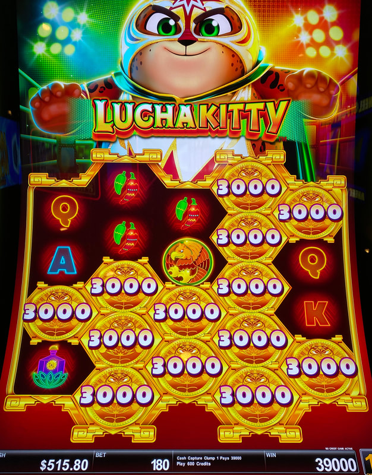
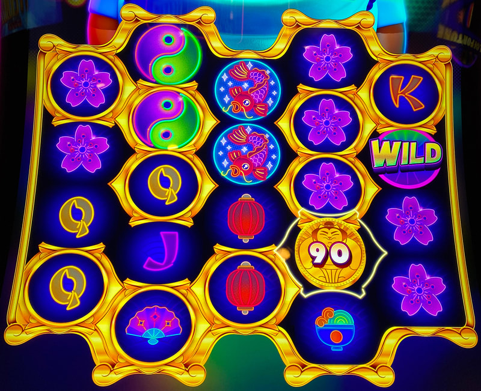
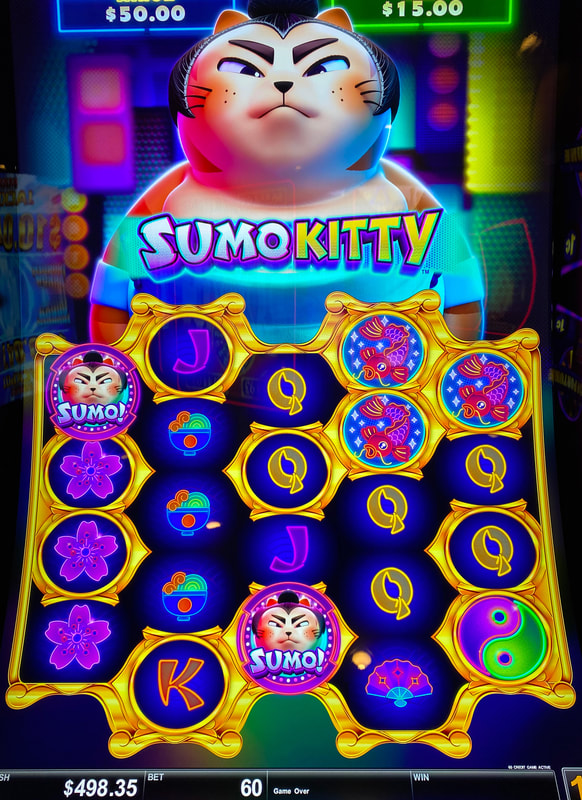

## Thumbnail

## Gameplay Images

### Image 1

### Image 2

**Description:** A $390 win on a $1.80 bet. This would have been a $7.80 win if a 60 credit coin had landed instead of a 3000 credit coin. So expect a lot of losses with the occasional big win.

### Image 3

### Image 4

## How The Advantage Works

Sumo Kitty / Lucha Kitty features **persistent gold frames with credit multiplication**:

**Game Variants:**
- Sumo Kitty
- Lucha Kitty

**Mechanic:**
- Gold frames lock in place and persist
- Coin lands in frame → Credit amount transfers to ALL connected frames
- Total of all connected frames awarded to player
- Frames disappear next spin after payout

**Credit Prize Range:**
- Low: ~1/3 of bet size
- High: Mini or minor jackpot

---

## PLAY WHEN

| Setup | Action |
|-------|--------|
| <strong>6+</strong> connected gold frames (empty) | ✅ **Play** |
| Frames already contain credit values | ❌ Skip (already triggered) |

**Note:** Location doesn't matter - frames can be anywhere as long as connected.

---

## DO NOT PLAY WHEN

- Fewer than 6 connected frames
- Frames already contain credit values (will disappear)
- Frames not connected to each other

---

## STOP WHEN

- Coin lands in connected frames and credit value is awarded
- Frames disappear next spin

---

## COMMON MISTAKES

- Playing frames that already have credit values inside
- Not counting connected frames accurately
- Expecting consistent payouts (very volatile)

---

## Additional Notes

**High Volatility:**
- Much more volatile than Zodiac Lion
- Small coin = loss
- Large coin (jackpot) = huge win
- Example: $390 win vs $7.80 win possible on same setup

**Multiple Coins:**
- If 2 coins land within connected frames
- Coins combine and multiply throughout all frames

**Comparison to Zodiac Lion:**
- Similar frame mechanic
- Less predictable (credit amounts vs wilds)
- Frame location doesn't matter (unlike Zodiac Lion)