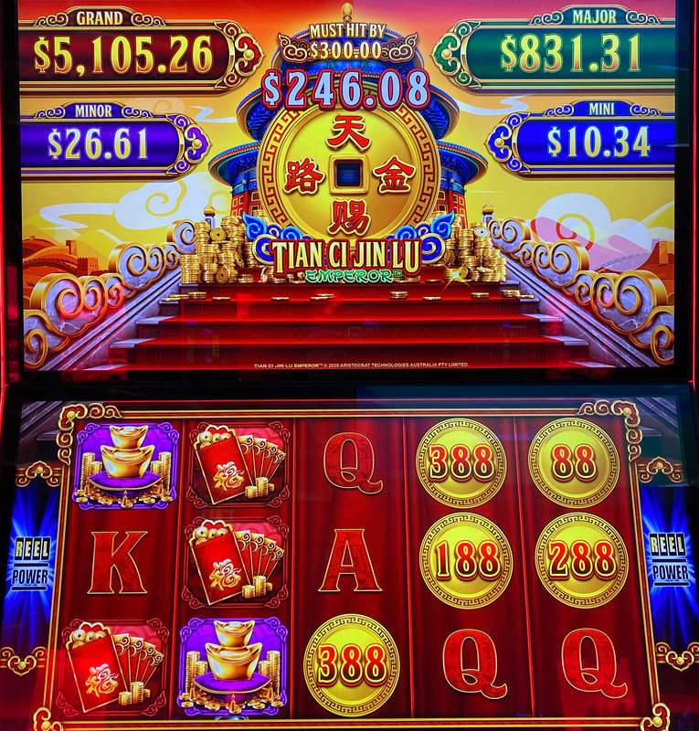
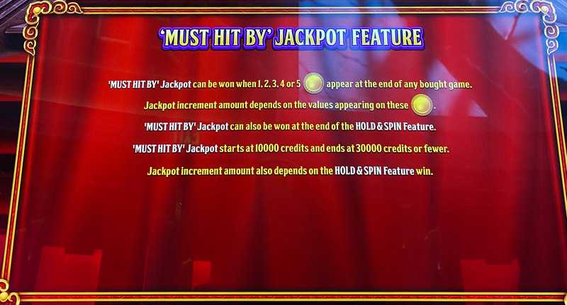

## Thumbnail

## Gameplay Images

### Image 1

### Image 2

**Description:** The jackpot to pay attention to is the $246.08 one at the top of the screen in the middle (this particular number is way too low to be playable).

### Image 3

**Description:** The rules screen explaining how the MHB works.

## How The Advantage Works

Tian Ci Jin Lu features **a $300 MHB progressive**:

**Game Variants:**
- Tian Ci Jin Lu: Emperor
- Tian Ci Jin Lu: Phoenix

**Progressive Structure:**
| Jackpot | MHB | Resets To |
|---------|-----|-----------|
| Middle meter | $300 | $100 |

**Meter Increment:**
- Does NOT increment at fixed rate per spin
- Based on coin symbol amounts landed
- Slow and inconsistent progression

---

## PLAY WHEN

| Progressive | Play At |
|-------------|---------|
| Middle meter (above large coin) | <strong>$292+</strong> |

**Location:** Look at the progressive in the MIDDLE of the screen (above the large coin at top)

---

## DO NOT PLAY WHEN

- Middle meter below $292
- Grand/Major/Minor/Mini jackpots high (not MHB)
- Coin stacks displayed on background (decoration only)

---

## STOP WHEN

- MHB jackpot hits

---

## COMMON MISTAKES

- Watching wrong jackpot (only middle meter is MHB)
- Thinking coin stacks on background matter (they don't)
- Not understanding the meter increments inconsistently

---

## Additional Notes

**Rare Plays:**
- Only ~4% of resets reach playable territory
- Plays are rare but easy to check
- Worth glancing at during rounds

**What to Ignore:**
- Grand, Major, Minor, Mini jackpots (NOT MHB)
- Coin stack animations on background (presentation only)

**Min Bet Strategy:**
- Play at lowest bet within time constraints
- Reduces variance

**Easy to Check:**
- Quick glance at middle meter
- Add to your rotation for occasional finds