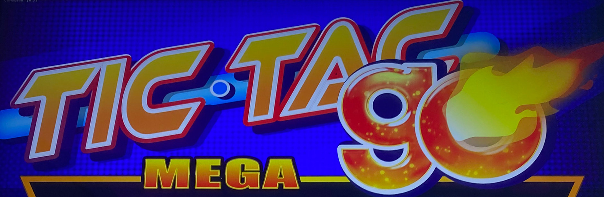
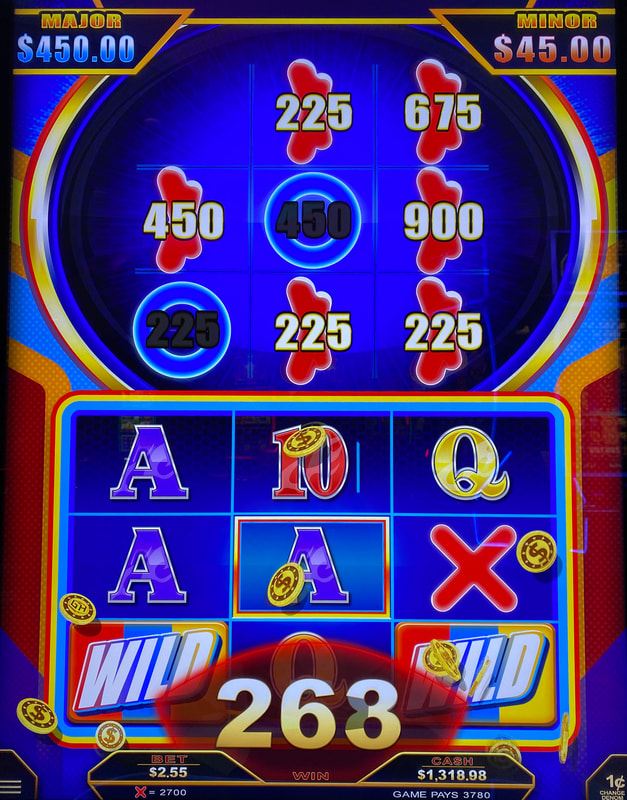
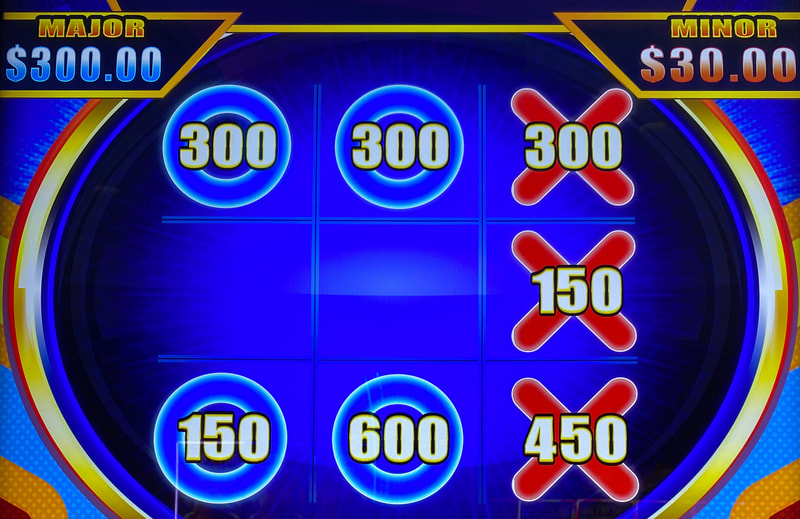
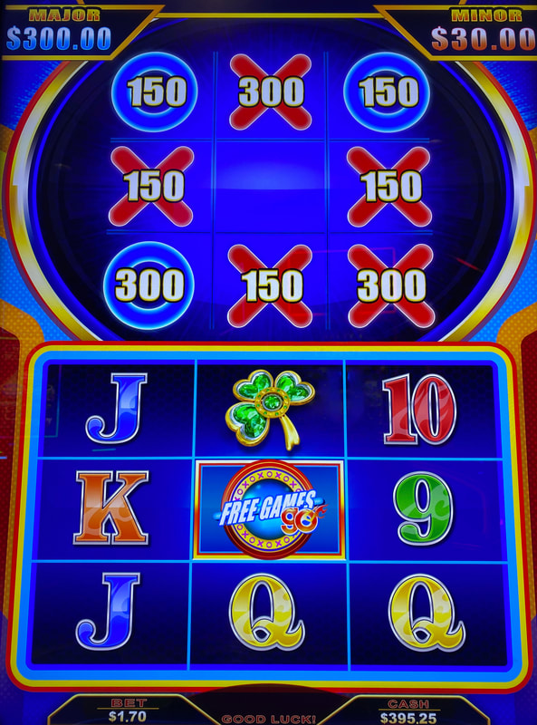
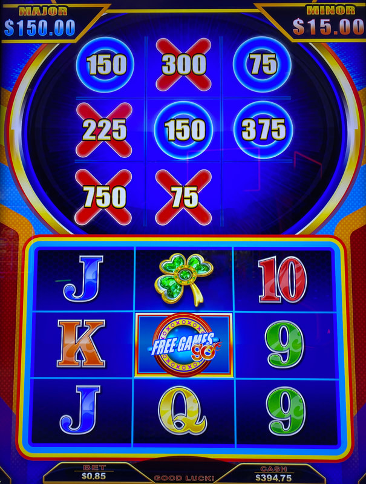
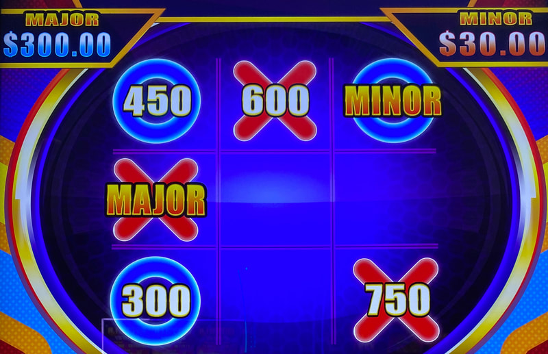
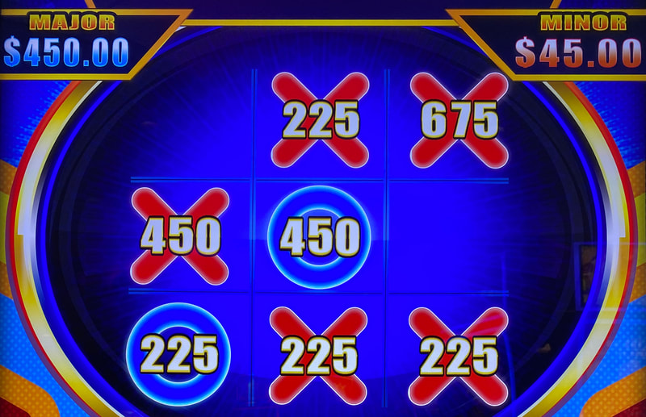

## Thumbnail

## Gameplay Images

### Image 1

### Image 2

**Description:** A red X landed in reel three, which won the game for red on the board above. The total value on all of the X’s was awarded.

### Image 3

**Description:** Do not play boards like this. Red won on the previous game and the entire board will clear out next spin.

### Image 4

### Image 5

**Description:** This is a much better play because the total equity here is 28x.

### Image 6

**Description:** This is an excellent play with both the major and minor jackpots on the board.

### Image 7

## How The Advantage Works

Tic Tac Go features **a tic-tac-toe board with accumulated prizes**:

**Mechanic:**
- 3x3 reelset with 3x3 tic-tac-toe board above
- Red X's and blue O's land on reels → Move to board
- X's/O's contain prizes (1x-10x bet) or jackpots
- 3 in a row → Win ALL prizes of that color (not just the row)
- Draw → Color with most symbols wins

**Prize Range:**
- Credit prizes: 1x to 10x bet size
- Jackpots: Minor, Major, Mega

---

## ⚠️ COMMON AP TRAP

**Most APs play too aggressively and get wrecked:**
- Nearly-full boards are tempting but NOT profitable
- X's/O's harder to land as board fills (fewer spots)
- Base game has huge drain
- Need exceptionally large values to be profitable

---

## PLAY WHEN

**Primary Requirement:**
- Total X + O values ≥ <strong>27x</strong> bet size
- Add ALL prizes on the board

**Rocket Rollup Version:**
- Use bet pad amount (NOT main screen)
- Main screen includes progressive contribution
- Example: $0.75 bet pad → Entry point = $20.25 (27x)

| Setup | Action |
|-------|--------|
| Total board value ≥ 27x bet | ✅ **Play** |
| Full board (9 filled) | ❌ Skip (resets next spin) |
| 3 in a row showing | ❌ Skip (resets next spin) |

---

## DO NOT PLAY WHEN

- Full board (all 9 positions filled) - resets next spin
- 3 in a row already showing - resets next spin
- Total value below 27x threshold
- Large values concentrated on blocked/losing color

---

## STOP WHEN

- Tic-tac-toe game won (3 in a row or draw)
- Board resets next spin

---

## COMMON MISTAKES

- Playing nearly-full boards (seems good, usually loses)
- Not adding ALL values (both X's and O's)
- Playing when 3 in a row already exists (will reset)
- Using main screen bet amount on Rocket Rollup version
- Ignoring blocked color situations

---

## Additional Notes

**Blocked Colors:**
- Some setups make one color impossible to win
- Don't play if large values are on blocked color
- Play more aggressively if large values guaranteed to win

**Go Symbol:**
- Lands in center of reels
- Awards ALL prizes (both X's and O's) immediately

**Major Jackpot:**
- Appears fairly frequently
- Usually ~50/50 shot of hitting when found

**Spot Mechanics:**
- X's/O's can't land in same spot twice
- Filled board position = Can't land in corresponding reel position

**Free Games:**
- Triggers fairly frequently
- Collected X's/O's do NOT transfer in or out

**Rocket Rollup Version:**
- Play same strategy, ignore progressives
- Small loss percentage, evens out over time

**Free Check Method:**
- Tap menu icon in lower left
- Use up/down arrows to cycle bet levels

**RTP Range:**
- 85% to 96%