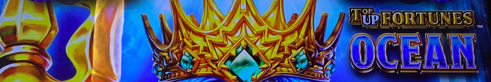
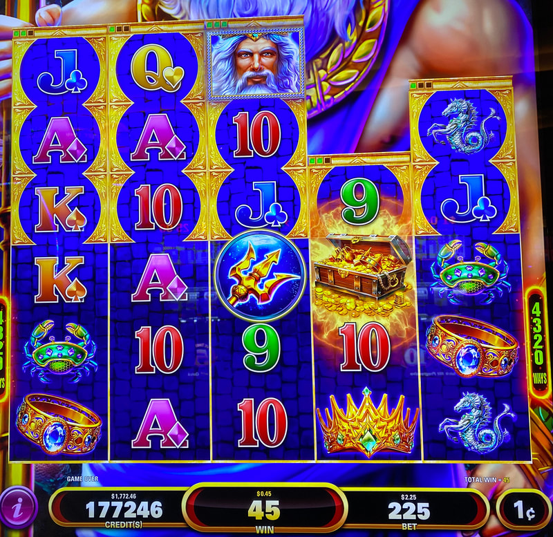
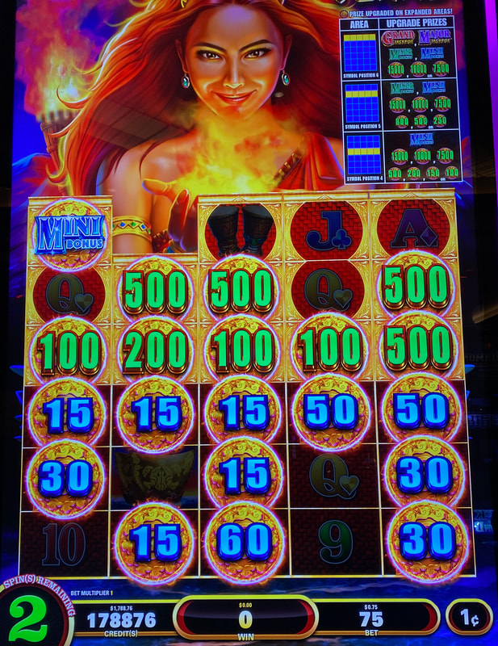
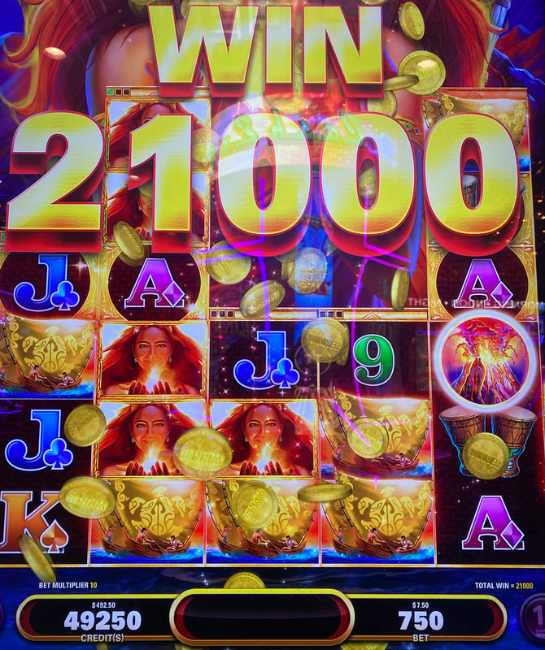
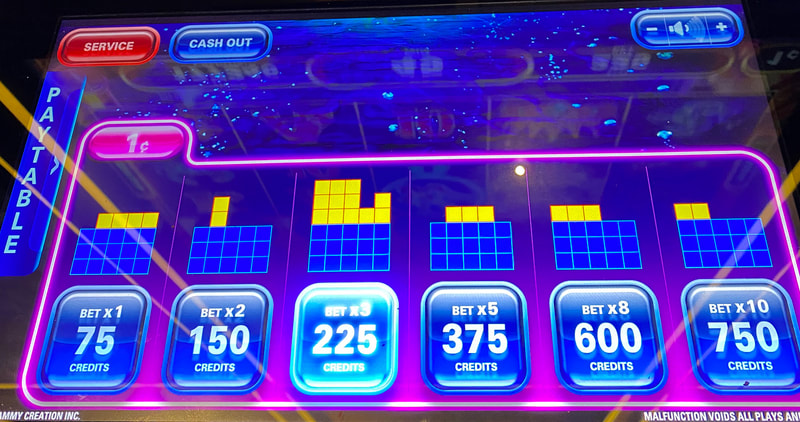

## Thumbnail

## Gameplay Images

### Image 1

### Image 2

### Image 3

### Image 4

**Description:** Landing a volcano symbol in the fifth reel (which was already max height) triggered the Add Wild feature. Sega Sammy games are known for having massive line hits like this.

### Image 5

**Description:** The yellow squares represent the expanded reels (you may need to tap the Paytable button on the left if you aren’t seeing this screen displayed).

## How The Advantage Works

Top Up Fortunes features **expanding reels with Add Wild opportunity**:

**Game Variants:**
- Top Up Fortunes: Flame (volcano symbols)
- Top Up Fortunes: Ocean (trident symbols)

**Mechanic:**
- Volcano/trident lands → Reel expands one level
- Reels: 3 symbols tall → max 6 symbols tall
- Green counter shows spins remaining at current height
- After 3 spins → Reel drops one level

**Add Wild Feature (Key Hidden Value):**
- Land volcano/trident on MAX height reel
- Adds 2+ wilds to reels 2-5
- Can result in massive line hits
- Resets spin counter back to 3

---

## PLAY WHEN (ANY ONE)

**Reading Yellow Squares:**
- Bet pad shows yellow squares = expanded positions
- 3 vertical squares = 6-symbol tall reel (max)
- Tap "Paytable" on bet pad if not showing
- **CRITICAL:** Only count squares with spins remaining
- 3 vertical at 0 spins = counts as 2

**Entry Points:**

| Setup | Action |
|-------|--------|
| <strong>8+</strong> yellow squares total | ✅ **Play** |
| <strong>6+</strong> yellow squares in first 3 reels | ✅ **Play** |
| <strong>3</strong> vertical squares above any reel | ✅ **Play** (Add Wild opportunity) |

---

## DO NOT PLAY WHEN

- Fewer than 8 total squares (without concentrated setups)
- Squares at 0 spins without accounting for drop
- No Add Wild opportunities visible

---

## STOP WHEN

- Free games bonus triggers
- Hold & spin feature triggers

---

## COMMON MISTAKES

- Not knowing about Add Wild feature
- Counting squares at 0 spins as full value
- Not tapping Paytable to see yellow squares
- Missing 3-vertical setups (low cost, huge upside)

---

## Additional Notes

**Add Wild Strategy:**
- Many APs don't know about this feature
- 3 vertical squares = Low cost play + massive potential
- Volcano/trident on max reel = Add Wild + reset to 3 spins

**Multiple Symbols:**
- Multiple volcano/trident can land on same reel
- Each raises reel one level

**Checking Method:**
- Glance at bet pad for yellow squares
- Tap Paytable if not visible
- Denomination buttons broken on bet pad (use main screen)

**Volatility:**
- Free games and hold & spin are feast-or-famine
- Typical Sega Sammy variance