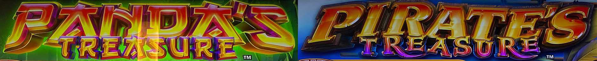
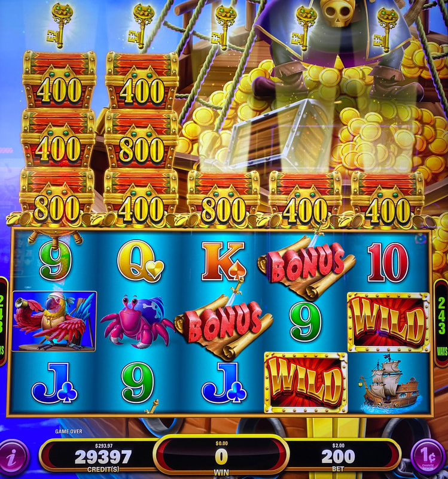
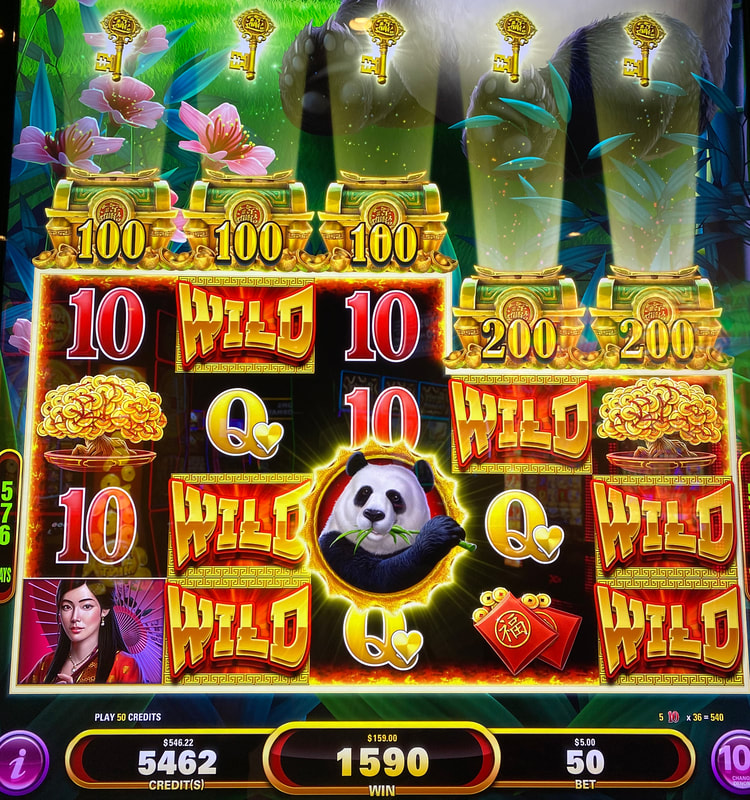
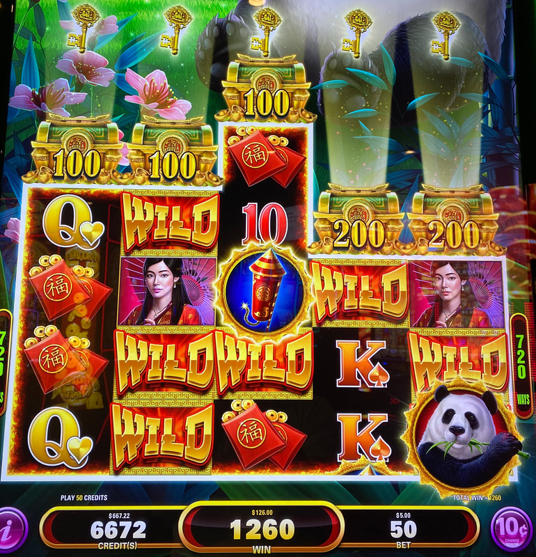
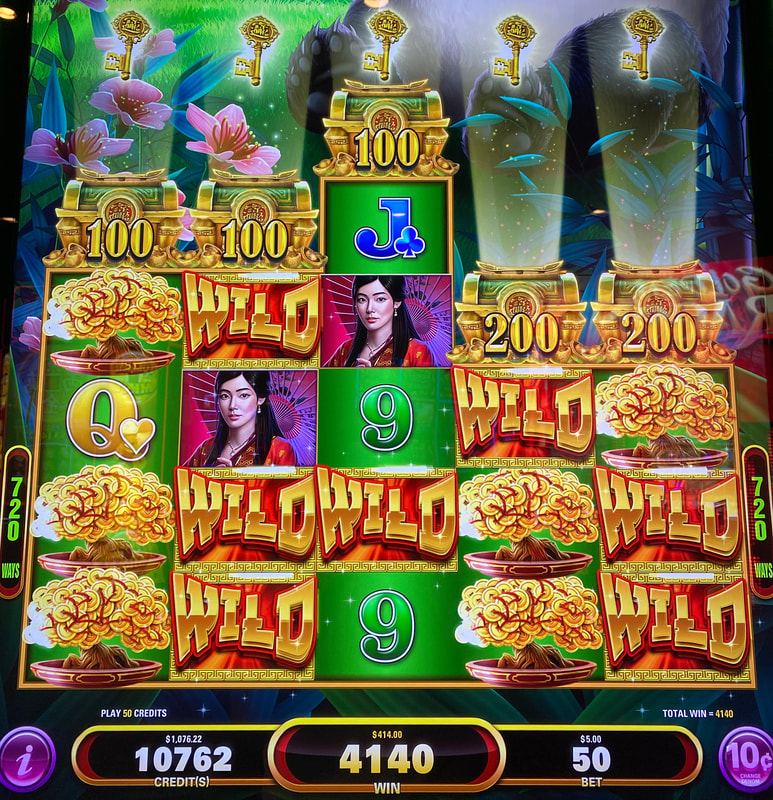
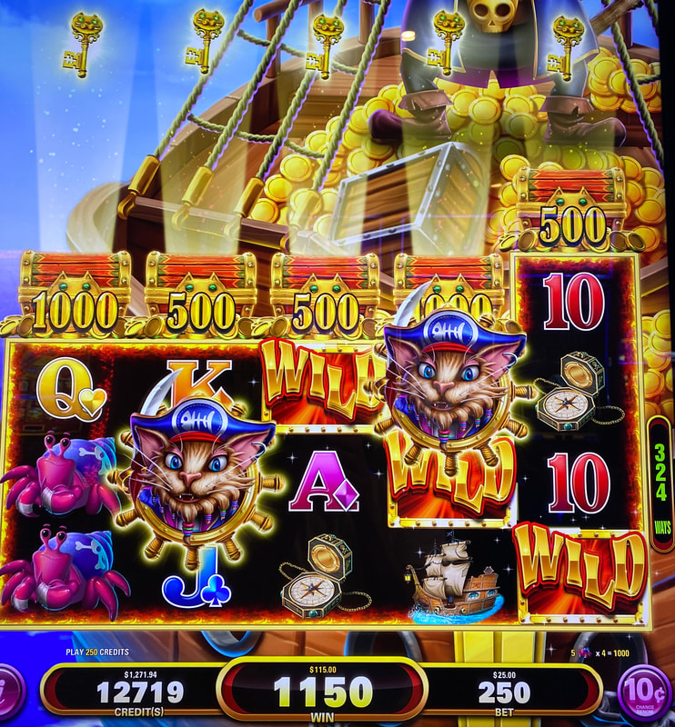
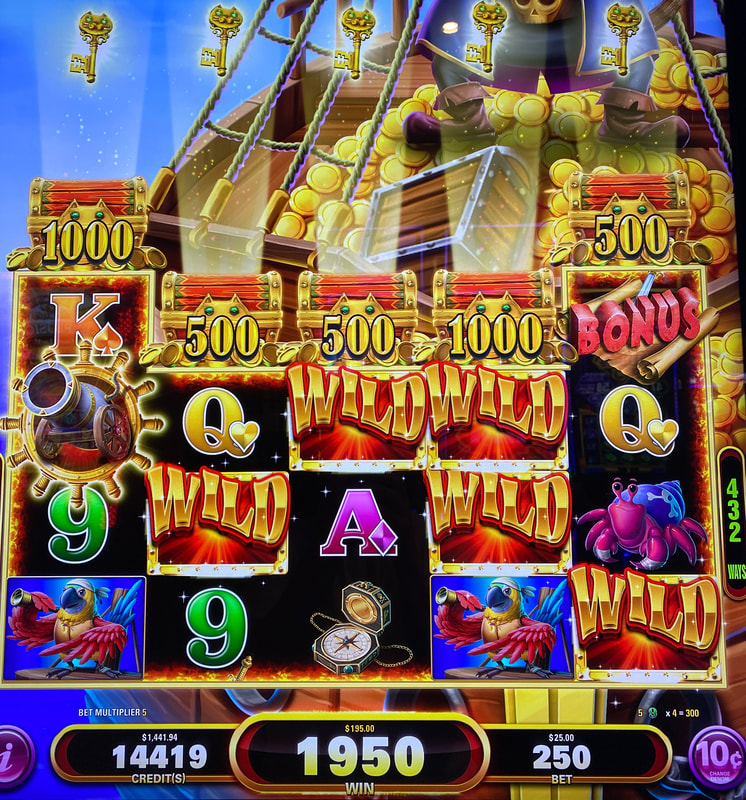
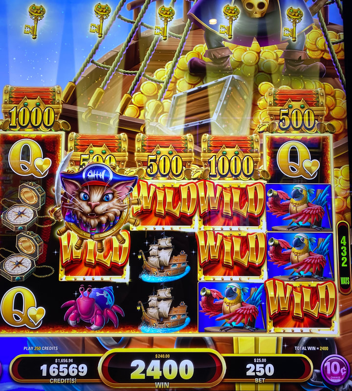
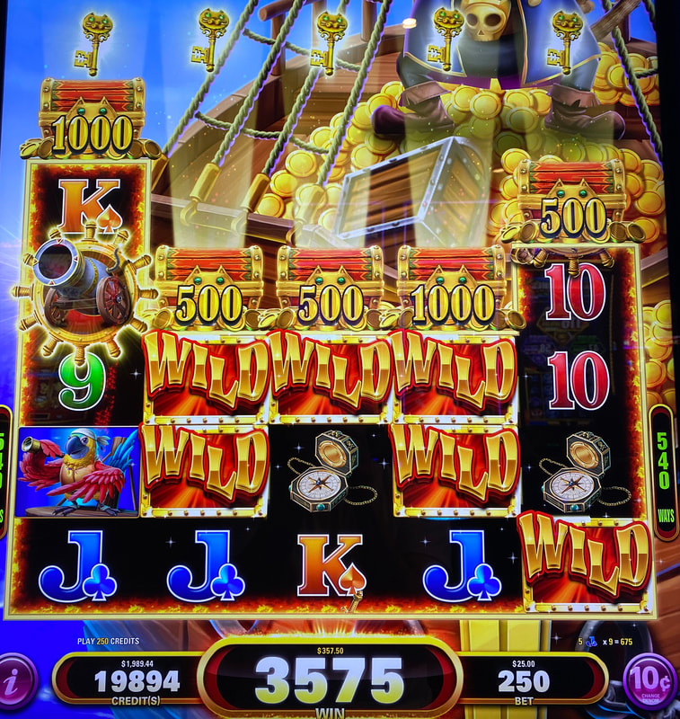
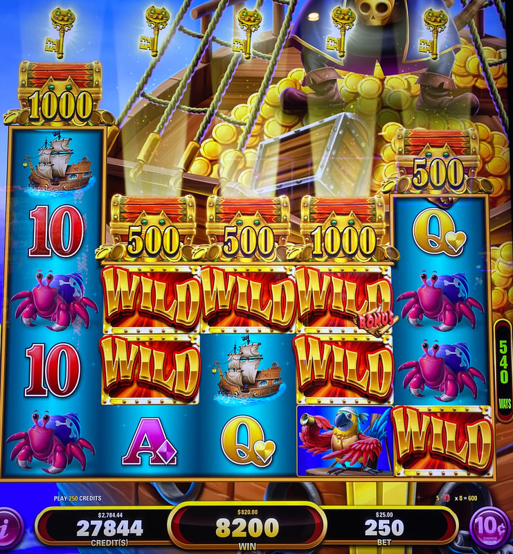

## Thumbnail

## Gameplay Images

### Image 1

### Image 2

### Image 3

**Description:** Spin 1 of 3: The panda symbol counts as a wild on the spin it lands and will stay as a persistent wild on the next spin (along with the other red wild symbols).

### Image 4

### Image 5

### Image 6

**Description:** Spin 1 of 5: The pirate symbols will turn into persistent wild symbols on the next spin.

### Image 7

**Description:** Spin 2 of 5: A cannon symbol landed in the first reel to keep the streak going.

### Image 8

**Description:** Spin 3 of 5: A pirate symbol landed to continue the streak.

### Image 9

**Description:** Spin 4 of 5: Another cannon symbol landed to continue the streak. Having taller reels like this gives you more chances to land subsequent symbols to keep the play alive.

### Image 10

**Description:** Spin 5 of 5: No more cannon or pirate symbols landed, so the play is now dead (notice the blue background). I made a profit of $1,602 on this play (without a W-2G).

## How The Advantage Works

Treasure features **persistent wilds with background state indicator**:

**Game Variants:**
- Panda's Treasure (rocket symbols, green background when reset)
- Pirate's Treasure (cannon symbols, blue background when reset)

**Mechanic:**
- Rocket/cannon lands → Reel expands one symbol
- Panda/pirate symbols → Turn into persistent wilds next spin
- Treasure chests pushed toward keys → Win credit prize
- Ways: 243 → up to 7,776

**CRITICAL - Background Color:**
| Background | State |
|------------|-------|
| **BLACK** | ✅ State persists next spin |
| **GREEN** (Panda's) | ❌ Resets next spin |
| **BLUE** (Pirate's) | ❌ Resets next spin |

---

## ⚠️ THE REAL VALUE

**Many APs skip this game thinking it's a trap.**

The treasure chests are NOT the value - **persistent wilds are**.
- Build up wilds across multiple reels
- Massive line hits possible
- All-ways-pay = No symbol alignment needed
- Streaks of consecutive huge wins

---

## PLAY WHEN

**REQUIRED:** Background must be BLACK

**Plus ANY of the following:**

| Setup | Action |
|-------|--------|
| 1+ wild/panda/pirate in reels 1-3 | ✅ **Play** |
| Wild in BOTH reels 4 AND 5 | ✅ **Play** |
| 400+ ways displayed | ✅ **Play** |
| Treasure chest 1 space from key | ✅ **Play** |

---

## DO NOT PLAY WHEN

- Background is GREEN (Panda's) or BLUE (Pirate's) - RESETS
- No wilds/panda/pirate symbols visible
- Below 400 ways without meeting other criteria

---

## STOP WHEN

- Background turns green (Panda's) or blue (Pirate's)
- State resets next spin

---

## COMMON MISTAKES

- Playing when background is green/blue (everything resets)
- Focusing on treasure chests instead of wilds
- Writing off the game as an AP trap
- Missing frequent black background opportunities

---

## Additional Notes

**Low Cost, High Upside:**
- Plays usually only a few spins investment
- Losses minimal
- Plays are common (black background frequent)

**Symbol Mechanics:**
- Rocket/cannon disappear after every spin
- Only wilds persist (when black background)
- Wilds don't block other symbols (sub-symbol appears in corner)

**Treasure Chests:**
- Only win chest that touches key (not entire stack)
- Reels don't shrink after triggering
- 3-stack chests = Only 1 rocket/cannon needed

**Free Check Method:**
- 6 bet levels + multiple denominations
- Many opportunities to find plays
- No money needed to check