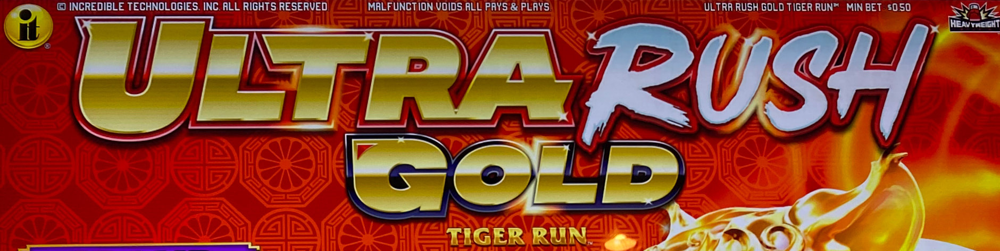
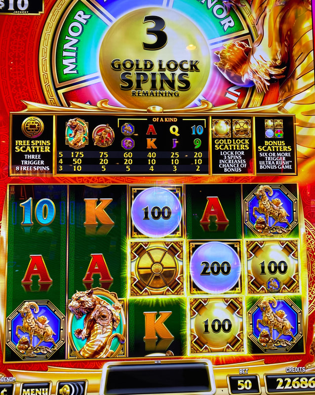
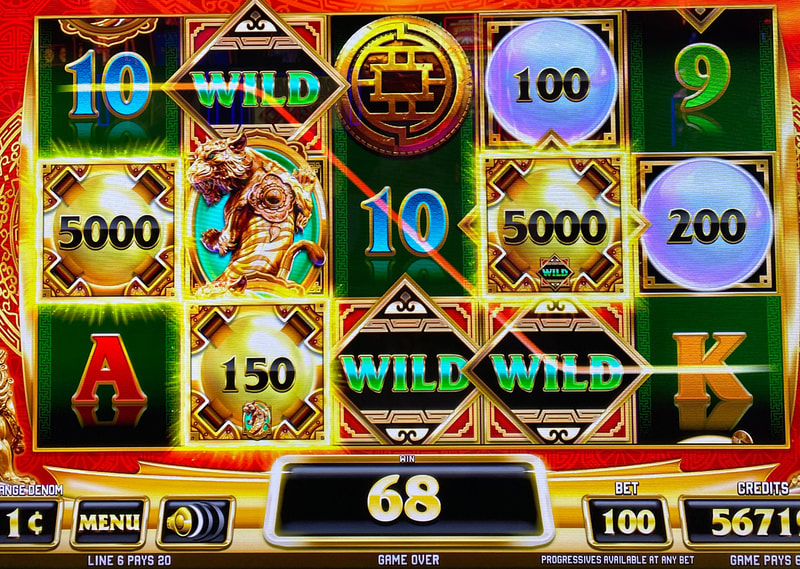
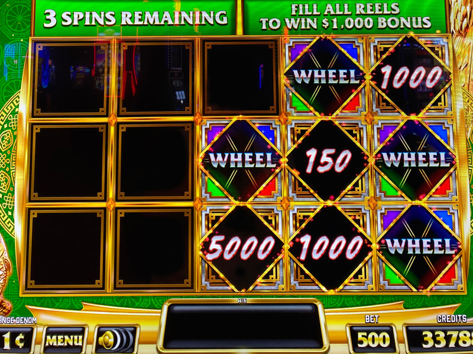

## Thumbnail

## Gameplay Images

### Image 1

### Image 2

**Description:** The gold wheel scatter symbol (shown in the middle reel) awards the player a wheel spin in the bonus, so it is more valuable than the credit value gold scatter symbols (shown in reels four and five).

### Image 3

**Description:** These two $50 gold scatter symbols are exceptionally large for a $1 bet.

### Image 4

**Description:** The bonus usually pays very well, especially if you can land a wheel spin.

## How The Advantage Works

Ultra Rush Gold (Panda's Treasure / Pirate's Treasure) features **gold scatter locking**:

**Mechanic:**
- <strong>6</strong> total scatters needed → Triggers Hold & Spin bonus
- Gold scatter lands → Locks for <strong>3</strong> spins
- Another gold lands → Spin count resets to <strong>3</strong>
- Need 6 of ANY scatter (gold + blue bubbles both count)

**Scatter Types:**
| Type | Persists? | Value |
|------|-----------|-------|
| Gold credit | ✅ Locks 3 spins | Credit amount |
| Gold wheel | ✅ Locks 3 spins | Wheel spin in bonus (valuable) |
| Blue bubble | ❌ Doesn't lock | Credit or wheel |

---

## PLAY WHEN (ANY ONE)

**Option A — Two Gold Scatters:**
- <strong>2+</strong> gold scatters locked
- Check bet pad

**Option B — Single Valuable Gold:**
- <strong>1</strong> gold scatter if:
  - Wheel symbol type, OR
  - Credit value ≥ <strong>20x</strong> bet

**How to Check:**
- Glance at bet pad for gold scatter count
- Tap bet pad buttons to check other denominations

---

## DO NOT PLAY WHEN

- Only 1 gold scatter with small credit value (below 20x)
- Gold scatter lock about to expire (0 spins left)
- Just triggered bonus

---

## STOP WHEN

- Hold & Spin bonus triggers (<strong>6</strong> total scatters)
- All gold scatters expire

---

## COMMON MISTAKES

- Thinking you need 6 gold scatters (only need 6 total, blue counts)
- Ignoring wheel symbol gold scatters (more valuable than credit)
- Not checking all denominations via bet pad buttons
- Playing single small credit gold scatter

---

## Additional Notes

**Scatter Counting:**
- Gold scatters don't block symbols behind them
- Symbol behind shown as small icon on bottom of gold scatter

**Random Bonus:**
- When gold lock reaches 0 → Lion/panther/phoenix/tiger may grant +3 spins
- Can also happen during Hold & Spin bonus

**Gold Wheel vs Gold Credit:**
- Wheel symbol = More valuable (wheel spin in bonus)
- Large credit (20x+) = Also worth playing

**Game Variants:**
- Panda's Treasure ✅
- Pirate's Treasure ✅

**RTP:** 85% to 94%