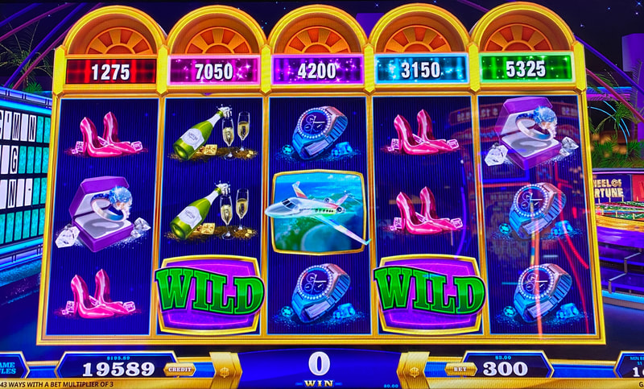

## Thumbnail

## Gameplay Images

### Image 1

### Image 2

**Description:** This is a solid play with the total prizes equal to 70x the bet level (or 50x when you use the weighted values method).

## How The Advantage Works

WOF 4D Collector's Edition features **credit prizes with Collect trigger**:

**Mechanic:**
- Credit prize above each reel
- Coins land → Prize above that reel increases
- Collect symbol lands → Awards prize above that reel

**Reel Difficulty to Trigger:**
| Reel | Difficulty | Weight |
|------|------------|--------|
| 4 | Easiest | 1.0 |
| 2 | Easy | 0.9 |
| 1 | Medium | 0.7 |
| 3 | Hard | 0.5 |
| 5 | Hardest | 0.33 |

---

## PLAY WHEN

**Simple Method:**
- Total prizes above all 5 reels ≥ <strong>70x</strong> bet
- Prefer values spread across reels (not concentrated)
- Best: Values in reels 2 and 4 (easiest to trigger)
- Worst: Values mostly in reel 5 (avoid)

**Advanced Method (More Accurate):**
- Multiply each reel's value by its weight:
  - Reel 1 × 0.7
  - Reel 2 × 0.9
  - Reel 3 × 0.5
  - Reel 4 × 1.0
  - Reel 5 × 0.33
- Weighted total ≥ <strong>45x</strong> bet

| Method | Threshold |
|--------|-----------|
| Simple (total prizes) | <strong>70x</strong> bet |
| Advanced (weighted) | <strong>45x</strong> bet |

---

## DO NOT PLAY WHEN

- Total below 70x (simple) or 45x weighted (advanced)
- Majority of equity concentrated in reel 5
- Values not spread across reels

---

## STOP WHEN

- Collect symbol triggers and prizes are awarded

---

## COMMON MISTAKES

- Not accounting for reel difficulty differences
- Playing when equity concentrated in reel 5
- Not spreading value across reels 2 and 4

---

## Additional Notes

**Free Games = Big Wins:**
- Credit prizes stay locked during entire bonus
- Don't reset after collecting
- Collect symbols land much more frequently

**Visual Indicator:**
- Background behind prizes sparkles at 10x+ bet level

**Coin Stacking:**
- Coins can land in stacks
- Collect symbol can be at bottom of stack

**RTP Range:**
- 88% to 96%