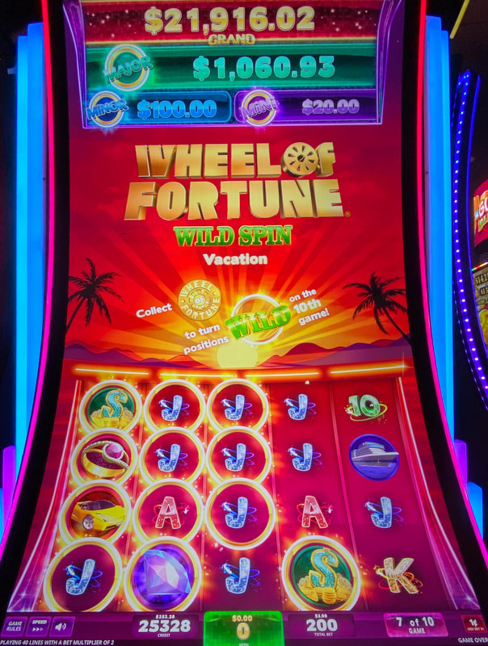

## Thumbnail

## Gameplay Images

### Image 1

### Image 2

### Image 3

**Description:** This walk-up play resulted in a $66 win on a $2 investment. Five-of-a-kind wilds, like on the top two rows, pay very well.

## How The Advantage Works

Wheel of Fortune Wild Spin operates on a **10-game cycle with locking frames**:

**Game Variants:**
- Vacation
- Night Life

**Mechanic:**
- Frames lock during <strong>10</strong> game cycle
- Spin 10: ALL locked frames turn wild
- Board resets after spin 10

**Key Difference from Scarab:**
- More payout in wheel bonus and progressives
- Line hits with wilds slightly less lucrative
- Wheel bonus can act as line hit blocker

---

## PLAY WHEN

**Simplified Rule:**
- Lots of frames on the LEFT (reels 1-3)
- Preferably connected HORIZONTALLY
- Further in cycle = Better

**Detailed Thresholds:**

| Spin | Frames Needed | Location |
|------|---------------|----------|
| 10 of 10 | ❌ **NEVER** | N/A |
| 9 of 10 | <strong>1+</strong> | First 3 reels |
| 8-7 of 10 | <strong>2+</strong> same row | First 3 reels |
| 6-5 of 10 | <strong>3+</strong> same row | First 4 reels |
| 4-3 of 10 | <strong>5+</strong> OR <strong>4</strong> same row | First 3 reels |
| 2-1 of 10 | <strong>6+</strong> OR <strong>4</strong> same row | First 3 reels |

---

## DO NOT PLAY WHEN

- Spin 10 of 10 (wilds activate THIS spin, too late)
- Frames not connected horizontally (early in cycle)
- Frames have gaps (wheel bonus blocks line hits)

---

## STOP WHEN

- Spin 10 completes (frames turn wild, board resets)

---

## COMMON MISTAKES

- Playing spin 10 of 10 (no value left)
- Focusing on 3-of-a-kind setups (pays poorly)
- Not prioritizing horizontal connections
- Missing that wheel bonus can block line hits

---

## Additional Notes

**Spin 9 Opportunity:**
- Almost always worth playing
- Additional frames can land on spin 10 (instantly wild)
- Low-cost +EV play

**Horizontal > Vertical:**
- Frames tend to land in vertical stacks
- Horizontally aligned much better for line hits
- Connected frames better than frames with gaps

**Popular Game:**
- Check frequently - very popular in casinos
- Plays can develop quickly

**Why Mid-Cycle is Valuable:**
- Payout based on full 10-game cycle average
- Starting mid-cycle = Same return, half the cost