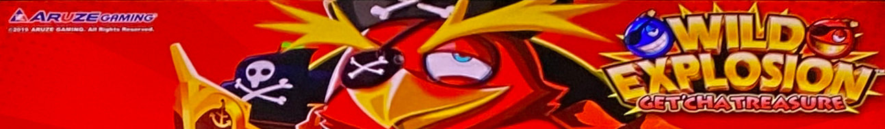
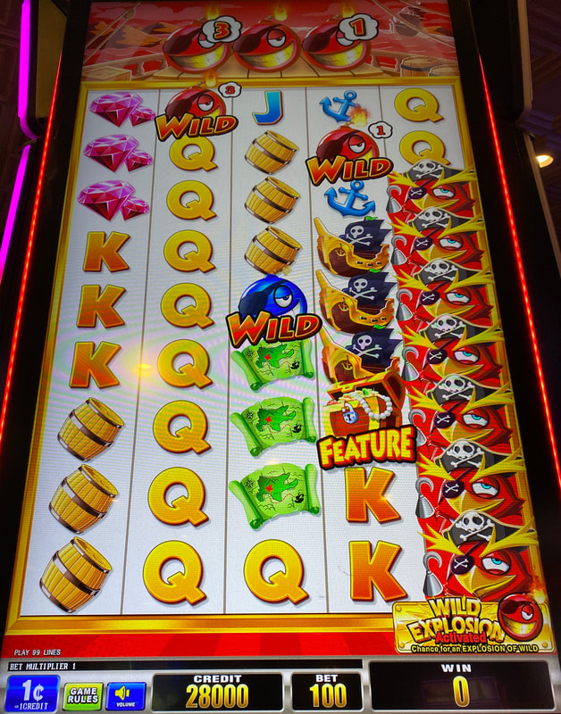
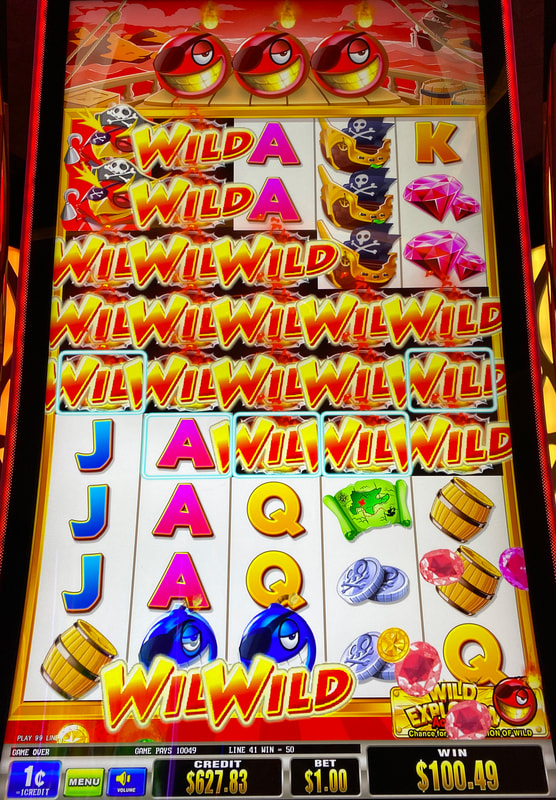
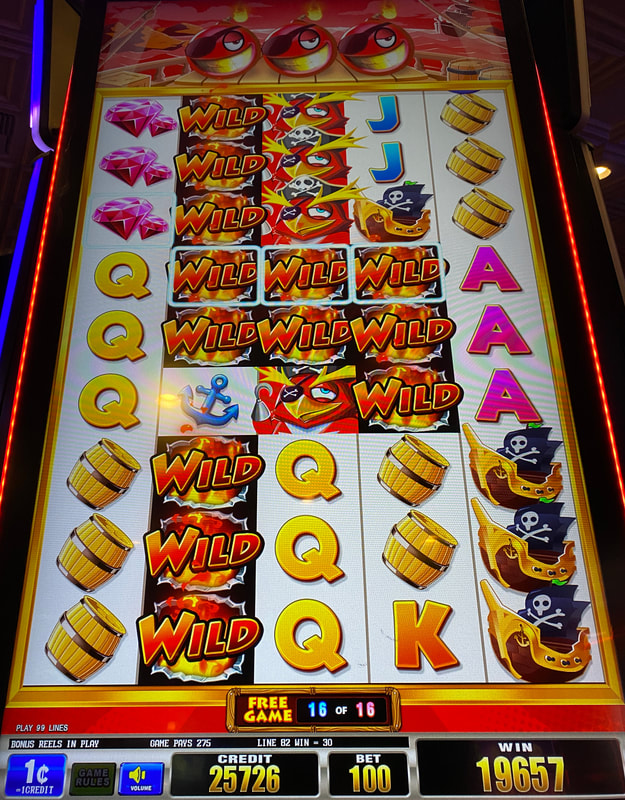
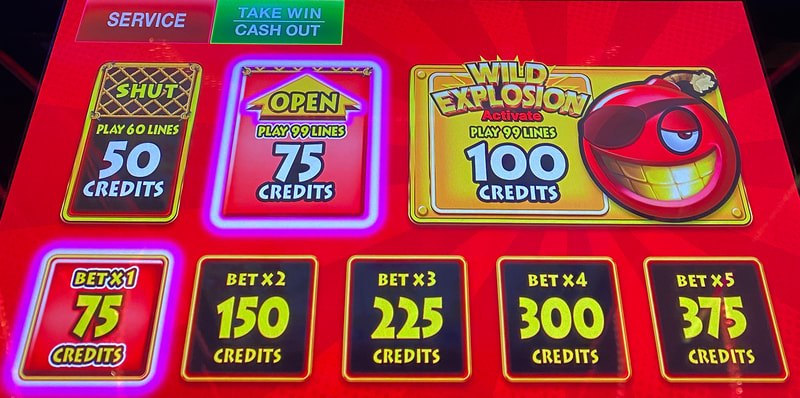
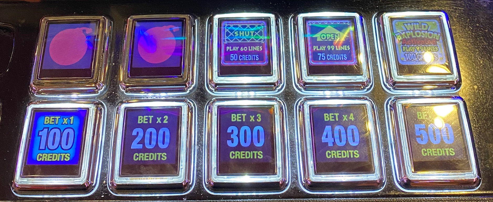

## Thumbnail

## Gameplay Images

### Image 1

### Image 2

**Description:** The number next to the red wilds in reels two and four shows how many spins remain before the bomb may explode, releasing up to nine adjacent wilds.

### Image 3

**Description:** When the red wilds explode and add a bunch of wilds in a horizontal manner like this, you can get huge line hits.

### Image 4

**Description:** During the free games feature, the red wilds always explode when one reaches 0. Therefore, you can get big wins like this nearly 200x bonus.

### Image 5

**Description:** You only need to check the bet levels under the Wild Explosion bets on the bet pad.

### Image 6

**Description:** The older versions of the game have physical buttons on the bet pad, but they play the same.

## How The Advantage Works

Wild Explosion features **red wilds with countdown timers that explode**:

**Game Variants:**
- Get'Cha Gold
- Get'Cha Money
- Get'Cha Reward
- Get'Cha Treasure

**Mechanic:**
- Red wilds land with countdown timer (starts at 3)
- Timer counts down each spin
- Timer reaches 0 → Usually (not always) explodes
- Explosion releases up to <strong>9</strong> wilds around it
- One explosion → ALL red wilds explode (chain reaction)

**Audio Cue:**
- Ticking sound = Active countdown timers

---

## PLAY WHEN

**Red wilds only under "Wild Explosion" bet levels on bet pad.**

| Red Wild Location | Countdown | Action |
|-------------------|-----------|--------|
| Reels 2 or 3 | Any (1, 2, or 3) | ✅ **Play** |
| Reel 4 | 2 or 3 | ✅ **Play** (chance to land reel 2-3 wild) |
| Reel 4 | 1 | ❌ Skip (not enough spins) |

---

## DO NOT PLAY WHEN

- No red wilds with countdown timers
- Reel 4 wild with countdown of 1 only
- Only blue wilds visible (not persistent)

---

## STOP WHEN

- All red wild countdowns reach 0 and explode or fizzle
- No red wilds remaining

---

## COMMON MISTAKES

- Playing non-Wild Explosion bet levels (no red wilds)
- Confusing blue wilds with red wilds (blue disappear)
- Not listening for ticking sound
- Expecting consistent explosions (can fizzle)

---

## Additional Notes

**Low Cost, Huge Upside:**
- At most a few spins investment
- 100x and 200x line hits not uncommon
- Multiple horizontal explosions = Massive wins

**Explosion Behavior:**
- Unpredictable - can fizzle instead of explode
- Wilds can spread vertically OR horizontally
- Horizontal spread = Best payouts
- Very volatile

**Symbol Types:**
- Red wilds (countdown) = Persistent
- Blue wilds (no countdown) = Disappear next spin
- Red wilds appear as bombs or dynamite (version dependent)

**Reel Locations:**
- Red countdown wilds only appear in reels 2, 3, or 4
- New red wilds can land on same spin timer reaches 0

**Free Games:**
- Red wilds ALWAYS explode when reaching 0 during bonus
- Can lead to 200x+ payouts

**Cabinet Versions:**
- Old version: Physical buttons on bet pad
- New version: Touchscreen bet pad
- Same strategy for both