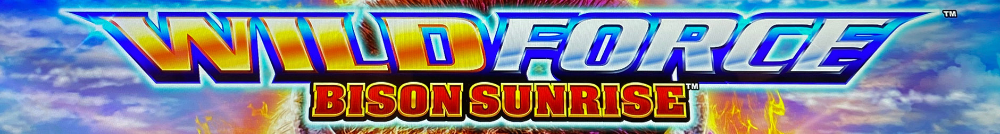
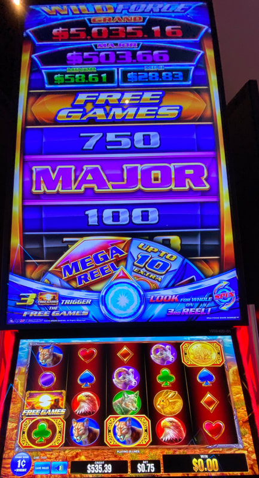
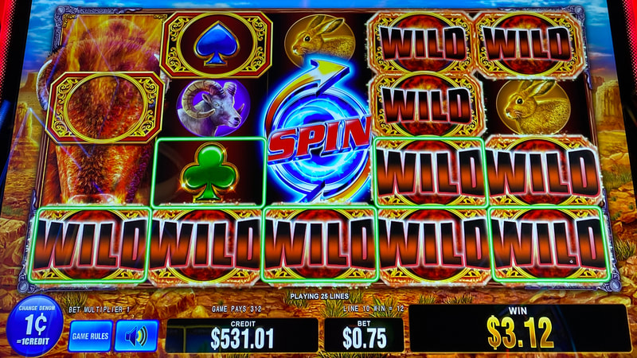
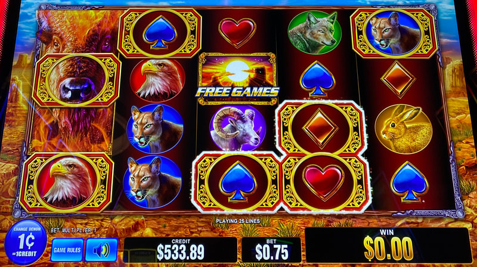
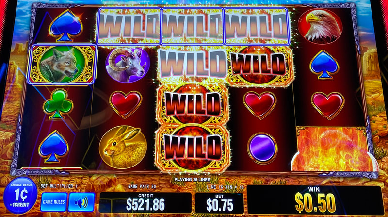
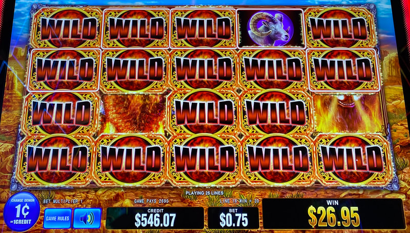
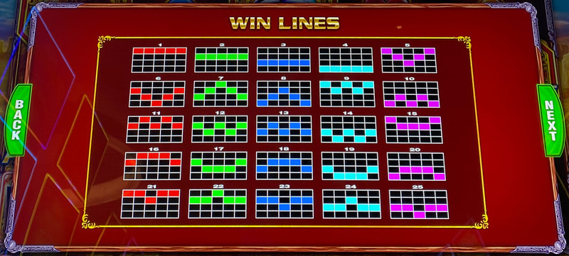

## Thumbnail

## Gameplay Images

### Image 1

### Image 2

**Description:** The game comes in a tall cabinet with a huge wheel at the top, so it is easy to spot inside casinos.

### Image 3

**Description:** The Spin symbol landed in the middle reel, which triggered the Wild Spark feature on the selector wheel. All of the frames connected horizontally and vertically turned wild.

### Image 4

**Description:** Setups like this might look tempting to play, but I would pass on this. Unless you connect many more frames, the payout just won’t cover the cost to trigger the Wild Spark feature.

### Image 5

**Description:** This was a bad play that I took. Even with the three wilds across the top row, it paid less than the bet amount.

### Image 6

**Description:** These are the kind of boards you need to get a nice win.

### Image 7

**Description:** You need to form a payline with five wilds to get a decent payout.

## How The Advantage Works

Wild Force features **locked frames that turn wild on Wild Spark**:

**Game Variants:**
- Bison Sunrise
- Midnight Wolf

**Mechanic:**
- Frames lock on reels (glowing borders when connected)
- Spin symbol in middle reel → Selector wheel spins
- Wild Spark on wheel → Connected frames turn wild
- Only frames connected horizontally/vertically turn wild

**Selector Wheel Options:**
| Result | Effect |
|--------|--------|
| Wild Spark | Triggers wilds on connected frames |
| Up to 10 frames | Adds 3-10 extra locked frames |
| Up to 15 frames | Adds 5-15 extra locked frames |
| Up to 20 frames | Adds 7-20 extra locked frames |
| Mega Reel | Credit prizes, jackpots, or free games |

---

## ⚠️ IGNORE "WILD" FRAMES

**DO NOT count frames that say "Wild" on them:**
- These will disappear next spin
- Only count blank locked frames

---

## PLAY WHEN

| Setup | Action |
|-------|--------|
| <strong>5+</strong> frames connected horizontally starting from reel 1 | ✅ **Play** |
| <strong>13+</strong> frames anywhere (regardless of connections) | ✅ **Play** |

**General Guidelines (5-13 frames):**
- Look for connected frames starting in reel 1
- Avoid frames concentrated on right side
- Need 5 wilds in a payline for good payout
- Paylines can be shaped, not just straight

---

## DO NOT PLAY WHEN

- Frames showing "Wild" (disappear next spin)
- All frames concentrated on right side
- Fewer than 5 connected or 13 total

---

## STOP WHEN

- Wild Spark triggers and connected frames turn wild

---

## COMMON MISTAKES

- Counting "Wild" frames (they disappear)
- Playing without 5+ connected or 13+ total
- Not prioritizing left-side connections
- Expecting strong line hits (they're weak on this game)

---

## Additional Notes

**Weaker Line Hits:**
- Need many MORE frames vs Star Goddess/Wu Dragon/Zodiac Lion
- Line hits are very weak on this game
- 5 wild payline required for good payout

**"REELS CHANGED" Message:**
- Appears under reel 1 every 3 spins
- Wild Spark becomes more likely each time
- Won't get down very deep before triggering

**Free Games Value:**
- Locked frames carry over into bonus
- Become wild for entire feature
- Extra wilds + multipliers available
- Large frame count = Massive payout potential

**Trigger Requirement:**
- FULL Spin symbol needed in middle reel
- Partial symbols do NOT count

**Easy to Spot:**
- Tall cabinet with huge wheel at top
- Visible from across casino