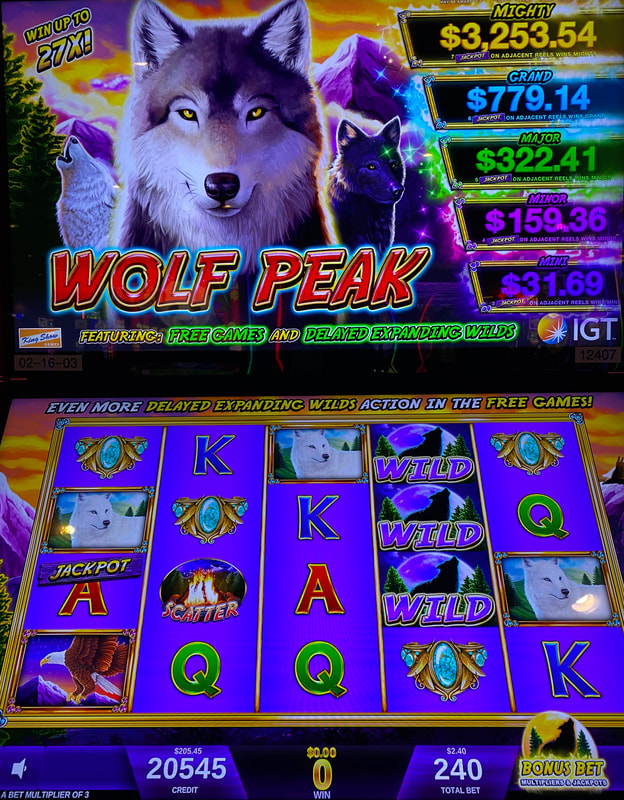
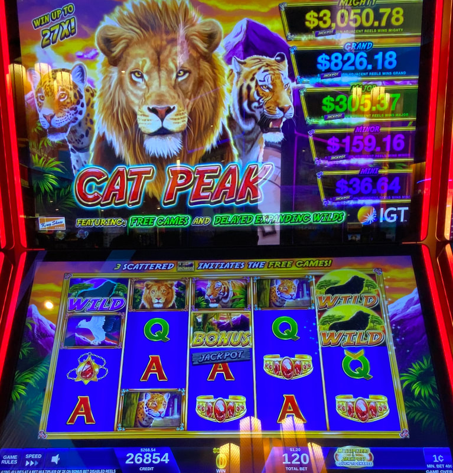
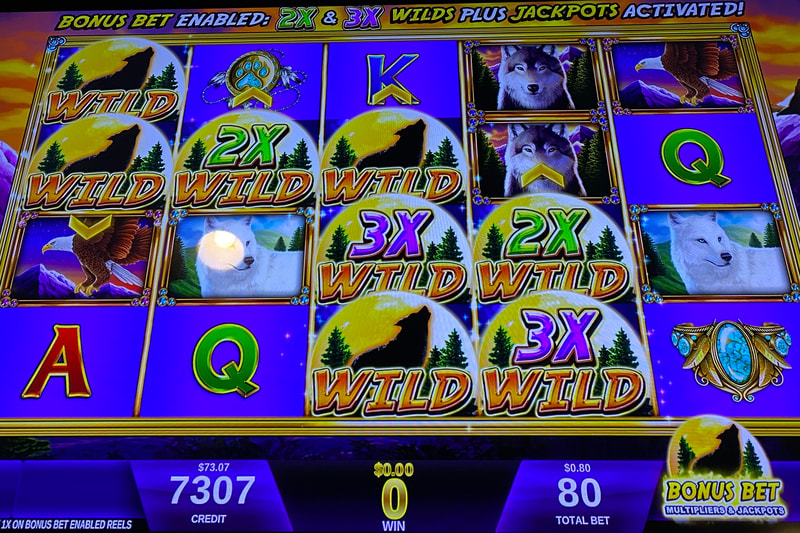
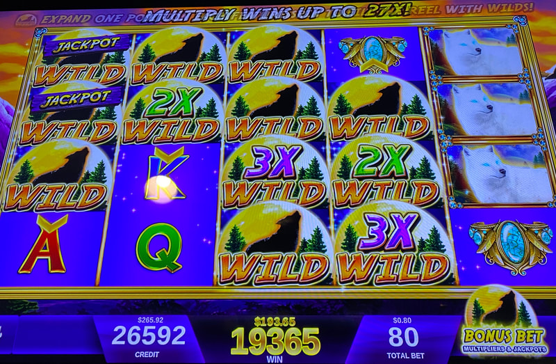
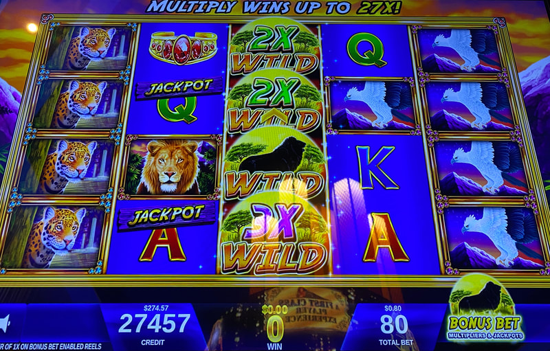

## Thumbnail

## Gameplay Images

### Image 1

### Image 2

**Description:** Do not play the purple wilds that look like this—they don’t stick around like the yellow ones.

### Image 3

**Description:** The expanding wilds in reel five aren’t worth playing.

### Image 4

**Description:** This was an amazing walk-up play that I found.

### Image 5

**Description:** The next spin after finding this play was a $193.65 win (on only an $0.80 bet).

### Image 6

### Image 7

**Description:** Fu Ren Wu is an Asian-themed clone of Wolf Peak.

## How The Advantage Works

Wolf Peak features **expanding wilds that persist for 4 spins**:

**Game Variants:**
- Wolf Peak
- Cat Peak
- Fu Ren Wu (Asian theme)

**Mechanic:**
- Yellow wilds with chevron arrows (up/down) = Active
- Expand one row each spin until covering entire reel (4 tall)
- Stay for <strong>4</strong> spins total
- Disappear after fully expanding

**Wild Types:**
| Color | Persistence |
|-------|-------------|
| **YELLOW** (with chevron arrow) | ✅ Expands and persists |
| **PURPLE** | ❌ Disappears next spin |

---

## PLAY WHEN

| Setup | Action |
|-------|--------|
| Yellow wilds in reels 1-3 (any size) | ✅ **Play** |
| Reel 4 yellow wilds with 2x/3x multiplier | ✅ **Play** |
| Reel 4 yellow wilds without multiplier | ❌ Skip |
| Reel 5 wilds only | ❌ Skip |
| Purple wilds only | ❌ Skip |

**CRITICAL:** Check full wild rows for hidden arrow inside - new wild can land on existing full row.

---

## DO NOT PLAY WHEN

- Only purple wilds visible (not persistent)
- Yellow wilds only in reel 5
- Reel 4 wilds without multipliers

---

## STOP WHEN

- All yellow wilds fully expand and disappear

---

## COMMON MISTAKES

- Playing purple wilds (they don't persist)
- Missing arrows hidden inside full wild rows
- Playing reel 4 wilds without multipliers
- Not checking carefully (requires money in machine)

---

## Additional Notes

**Chevron Direction:**
- Arrow points up OR down
- Direction doesn't indicate final height
- ALL yellow wilds expand to full reel (4 spaces)

**Checking Difficulty:**
- Must insert money to check
- Slightly harder than other games
- Worth the effort - plays are common

**Common Plays:**
- Players don't understand expanding mechanics
- Frequently abandoned mid-expansion
- Worth checking regularly

**Massive Win Potential:**
- Multiple active wilds = Huge payouts
- 2x and 3x multipliers = Even bigger
- Back-to-back handpays possible